export const Highlight = ({ children }) => (
  
    {children}
  
);

export const Boxed = ({ children }) => (
  

    &#9888; {children}
  

);

Sie haben die Möglichkeit, Teile Ihrer eigenen Profilangaben und Ihr Passwort zu ändern sowie Ihren Ratsuchenden eine Abwesenheitsnachricht zu hinterlassen.

Um zum Menüpunkt „Profil“ zu gelangen, klicken Sie auf den zugehörigen Button in der Navigationsleiste am linken Rand.

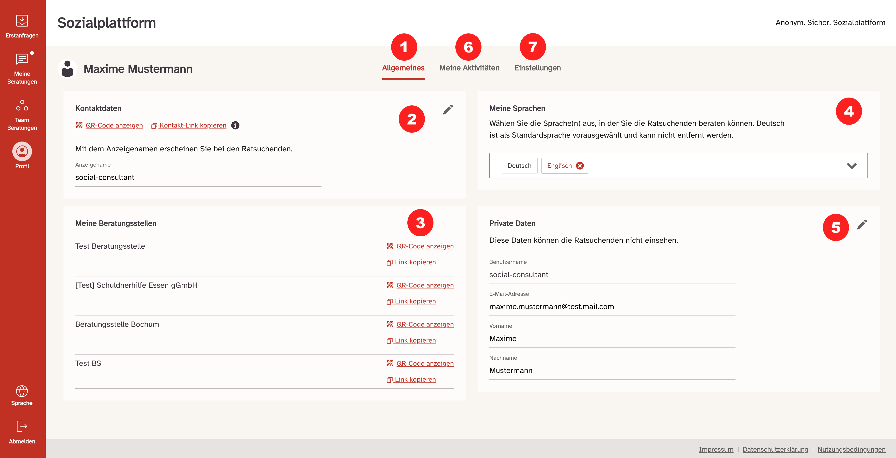

Unter dem Menüpunkt „Profil“ finden Sie drei Reiter:

- Allgemeines <Highlight>(1)</Highlight>
- Meine Aktivitäten <Highlight>(6)</Highlight>
- Einstellungen <Highlight>(7)</Highlight>

## Allgemeines <Highlight>(1)</Highlight>

Im Menüpunkt „Allgemeines“ <Highlight>(1)</Highlight> finden Sie allgemeine Profilinformationen, wie Ihren Benutzernamen und Ihre Beratungsstelle.

  Unter dem Menüpunkt „Kontaktdaten“ haben Sie die Möglichkeit, einen Link zu
  ihrem persönlichen Beratungsprofil <Highlight>(2)</Highlight> oder zu dem
  Profil Ihrer Beratungsstelle <Highlight>(3)</Highlight> zu kopieren und an
  Ratsuchende weiterzuleiten.

- <strong>Ihr persönlicher Link</strong> ermöglicht es Ratsuchenden, direkt mit Ihnen
  eine Online-Beratung zu beginnen (die erste Nachricht des Ratsuchenden wird direkt
  in „Meine Nachrichten“ geleitet).{" "}
- <strong>Der Link Ihrer Beratungsstelle</strong> ermöglicht es den Ratsuchenden,
  eine Online-Beratung bei der jeweiligen Beratungsstelle zu beginnen (falls mehrere
  Beratungsstellen vorhanden sind).{" "}

<strong>In Private Daten</strong> <Highlight>(5)</Highlight> sehen Sie ihre persönlichen
Daten, Sie können diese verändern und anpassen. Ihre Emailadresse und Ihr Vor- und
Nachname werden den Ratsuchenden nicht angezeigt. Nur die anderen Berater_innen können
Ihren Vor- und Nachnamen einsehen. Wenn Sie Ihre Emailadresse in private Daten ändern,
müssen Sie sich ab sofort mit der neuen Emailadresse einloggen.{" "}

Außerdem haben Sie die Möglichkeit, die von Ihnen gesprochenen <strong>Sprachen</strong> <Highlight>(4)</Highlight>, in denen Sie die Ratsuchenden beraten können unter „Meine Sprachen“ auszuwählen. Die Sprachen werden den Ratsuchenden dann angezeigt und diese haben die Möglichkeit Ihnen Nachrichten in den von Ihnen ausgewählten Sprachen zu schreiben.

Alle Sprachen, die von den Beratern vorausgewählt wurden, werden zukünftig bei der ausgewählten Beratungsstelle im Registrierungsprozess angezeigt.

Außerdem steht neben jeder Erstanfrage die vom Ratsuchenden vorausgewählte Sprache. So kann die Berater_in sofort erkennen ob sie die vom Ratsuchenden ausgewählte Sprache spricht, und ihm in dieser antworten kann.

## Meine Aktivitäten <Highlight>(6)</Highlight>

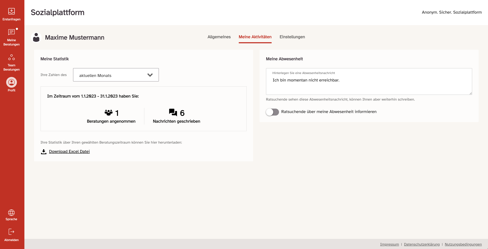

  Um zum Menüpunkt „Meine Aktivitäten“ zu gelangen, klicken Sie im Menü „Profil“
  auf den Reiter „Meine Aktivitäten“.

- In „Meine Aktivitäten“ gibt es die Möglichkeit die eigenen Statistiken einzusehen. Dabei stehen die Daten aus den folgenden Zeiträumen zur Verfügung: der aktuelle Monat, der letzte Monat, das aktuelle Jahr und das letzte Jahr. Die erhobenen Zahlen aus diesen Zeiträumen sind:

  - die Anzahl der angenommenen Beratungen
  - die Anzahl der geschriebenen Nachrichten

  Des Weiteren steht eine Excel Datei zum Download, über den gewählten Zeitraum zur Verfügung. Diese Datei beinhaltet zusätzlich die erhobenen Werte zu:

  - den aktiven Beratungen (eine Beratung gilt als aktiv sofern mindestens eine Nachricht im gewählten Zeitraum geschrieben wurde)
  - der Dauer von Videoanrufen in Minuten:Sekunden.

- Unter „Abwesenheit“ können Sie eine Abwesenheitsnachricht verfassen. Um diese Funktion zu aktivieren, muss im der Schalter „Ratssuchende über meine Abwesenheit informieren“ aktiviert werden. Dann können Sie eine Nachricht in das Textfeld schreiben., Danach. wird ihren Ratsuchenden die von Ihnen verfasste Nachricht angezeigt wenn sie sich einloggen.
- Sobald Sie sich einloggen und zuvor ihren Status auf „abwesend“ gestellt haben, erhalten Sie keine Info-E-Mails über neu eingegangene Anfragen oder wenn Ihnen ihr Klient wieder geschrieben hat.

<Boxed>
  {" "}
  <strong>Wichtig:</strong> Die Abwesenheitsfunktion greift nur bei Bestandsklient_innen,
  nicht bei Erstanfragen, hier werden die Abwesenheitshinweise bewusst nicht eingeblendet,
  da andere Kollegen der Beratungsstelle die Erstanfrage annehmen können.{" "}
</Boxed>

Nach erfolgreicher Einstellung einer Abwesenheitsnachricht erscheint folgender Bestätigungshinweis:

Wenn Sie sich bei aktivierter Abwesenheitsnachricht erneut einloggen, sehen Sie folgenden Hinweis nach der Anmeldung:

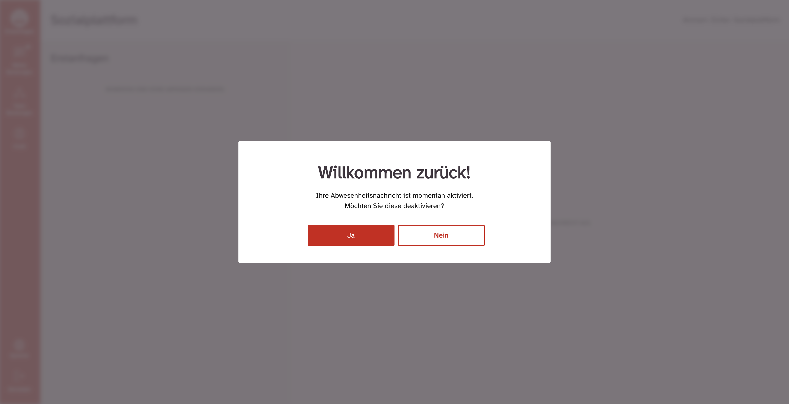

Soll die Abwesenheitsnachricht weiterhin aktiv bleiben, klicken Sie auf „Nein“. Möchten Sie die Beratungen wieder aufnehmen und die Abwesenheitsnachricht deaktivieren, klicken Sie auf „Ja“.

## Einstellungen <Highlight>(3)</Highlight>

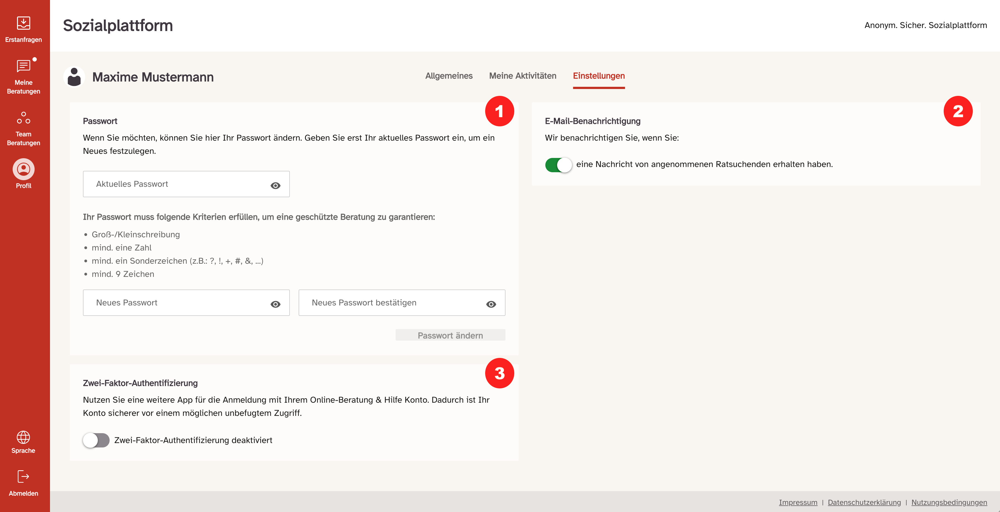

  {" "}
  Im Bereich Einstellungen können Sie verschiedenste Einstellungen vornehmen.{" "}

- Passwort ändern <Highlight>(1)</Highlight>
- E-Mail-Benachrichtigung aktivieren / deaktivieren <Highlight>(2)</Highlight>
- Zwei-Faktor-Authentifizierung aktivieren / dekativieren <Highlight>(3)</Highlight>

<Highlight>(1)</Highlight> Vergeben Sie ein neues Passwort.{" "}

Hierzu müssen Sie zuerst ihr aktuelles Passwort noch einmal eingeben, danach 2-mal das neue Passwort gemäß der Passwortrichtlinien. Ob ihr Passwort die Passwortrichtlinien erfüllt, wird ihnen während der Eingabe direkt angezeigt.

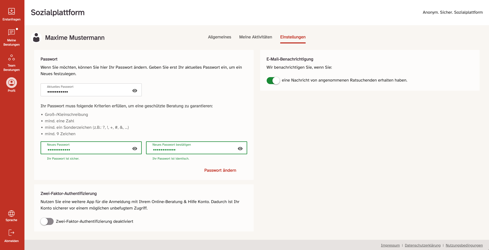

Anschließend wird der „Passwort ändern“ Button aktiviert und rot dargestellt. Durch einen Klick auf diesen Button wird bestätigt, dass das Passwort geändert wurde und Sie werden zur Login Seite weitergeleitet, auf welcher Sie sich mit Ihrem neu gesetzten Passwort einloggen können.

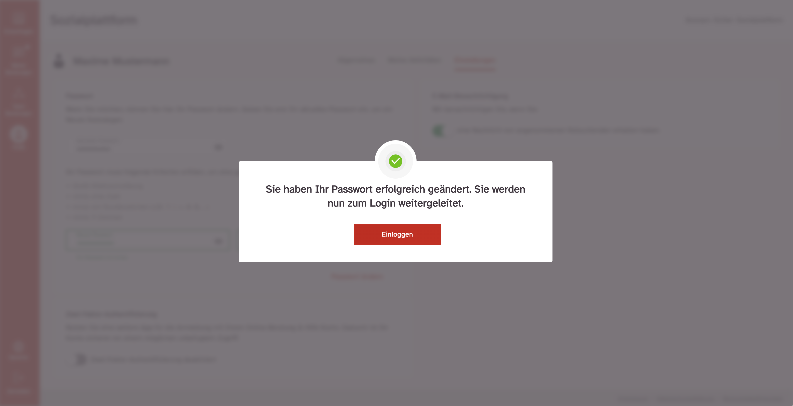

  <Highlight>(2)</Highlight> Wählen, ob Sie die E-Mail-Benachrichtigungen, die
  Sie zu verschiedenen Ereignissen erhalten, AUS oder EIN schalten möchten:{" "}

- wenn eine neue Erstanfrage in Ihrer Beratungsstelle eingeht
- wenn alte Erstanfragen noch nicht angenommen wurden (täglich)
- wenn die Ratsuchende, mit der Sie in Kontakt stehen, auf Ihre Nachricht antwortet
- wenn ein anderer Berater Ihnen einen Fall zuweist
- Standardmäßig ist die Einstellung auf EIN gestellt.

<Highlight>(3)</Highlight> 2-Faktor-Authentifizierung: Im nächsten Schritt haben
Sie die Möglichkeit, den von Ihnen bevorzugten 2-Faktor auszuwählen. Entweder eine
App, oder Sie hinterlegen eine E-Mail Adresse.{" "}

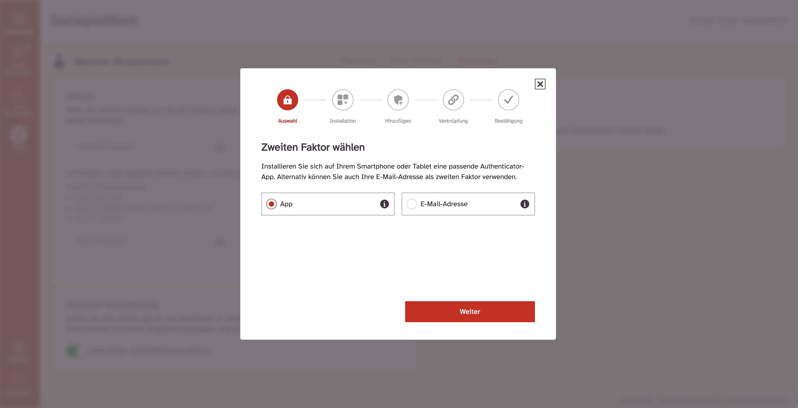

Wenn Sie sich für eine der Apps entschieden haben, laden Sie die von Ihnen gewählte App aus dem App-Store ihres jeweiligen Gerätes herunter. Ein Klick auf den Link führt sie direkt in den App-Store ihres Gerätes mit der App bereits ausgewählt.

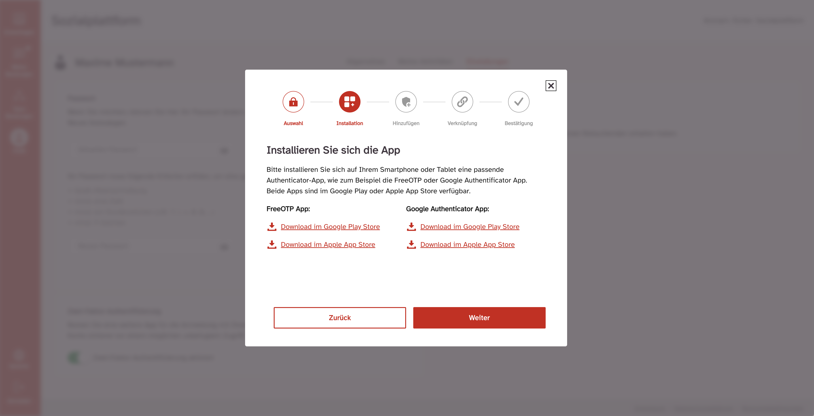

Wenn Sie die App geladen haben, scannen sie den QR-Code oder geben Sie den 32-stelligen Schlüssel manuell ein.

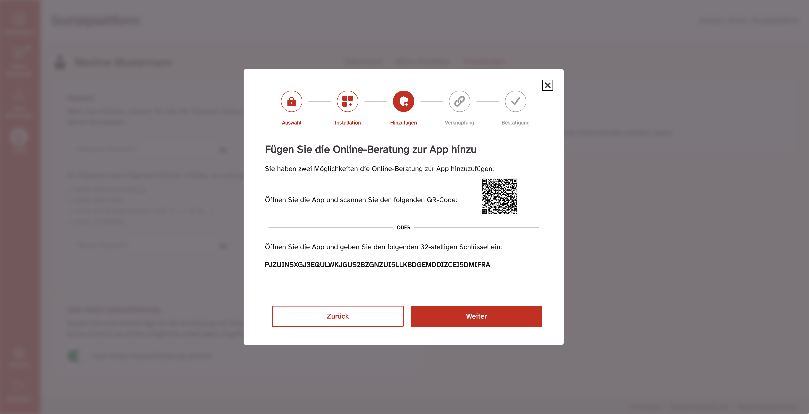

Im Anschluss wird in der App ein Code generiert, den Sie auf der Website ins passende Feld eintippen. Klicken Sie anschließend auf „Speichern“, um die Einrichtung abzuschließen.

Wenn Sie sich für die E-Mail-Adresse entschieden haben:

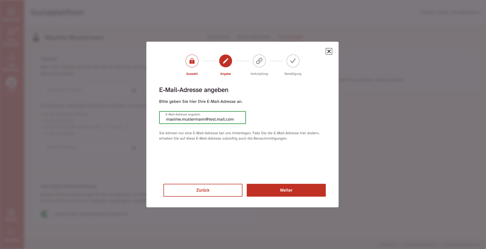

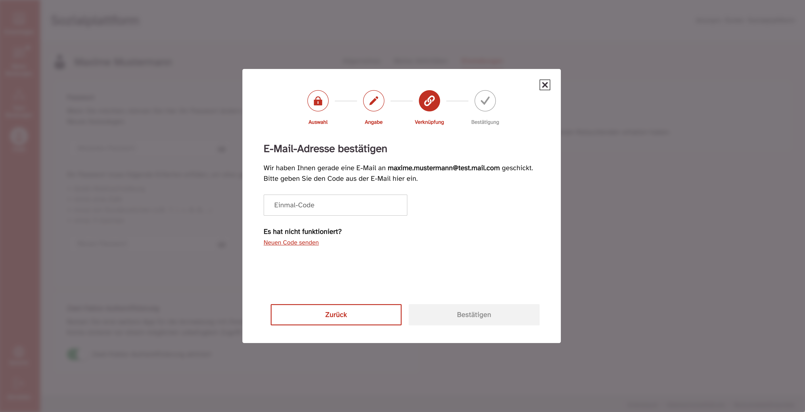

Nach erfolgreicher Aktivierung der 2-Faktor-Authentifizierung erscheint diese in „Sicherheit“ <Highlight>(3)</Highlight> grün. Dadurch ist Ihr Konto sicherer vor einem möglichen unbefugten Zugriff.

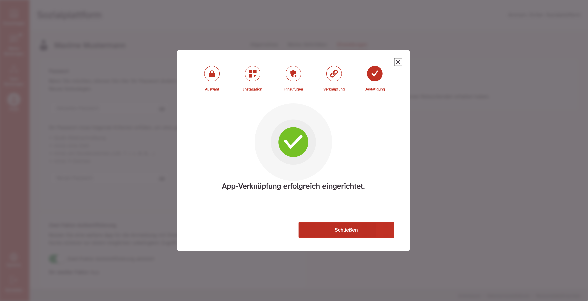

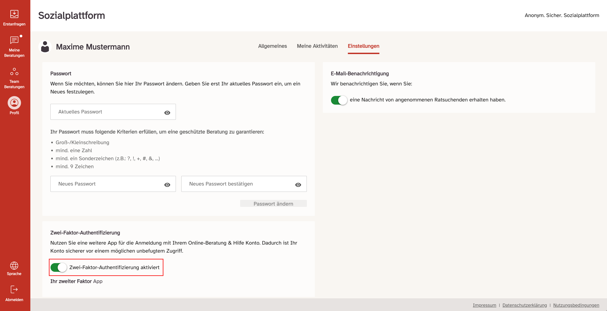
