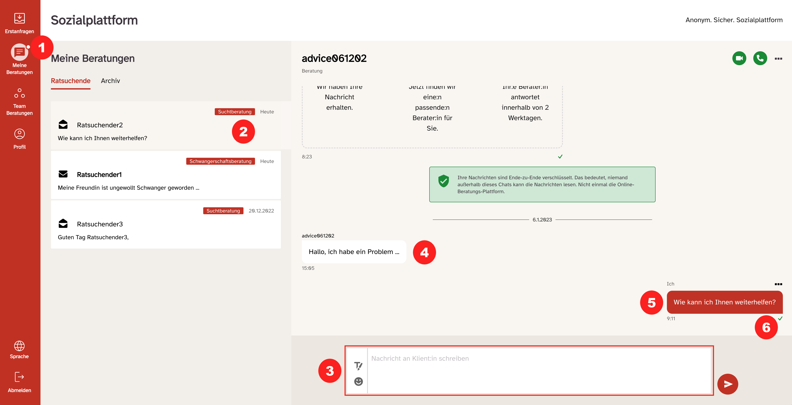
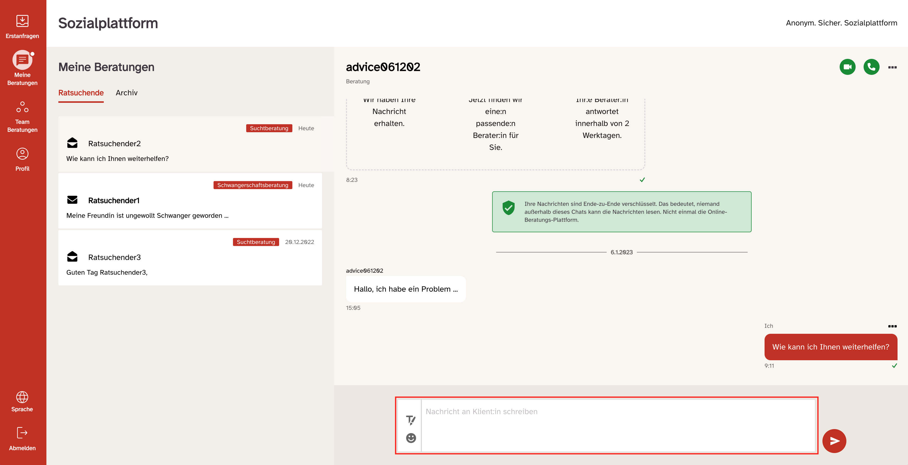
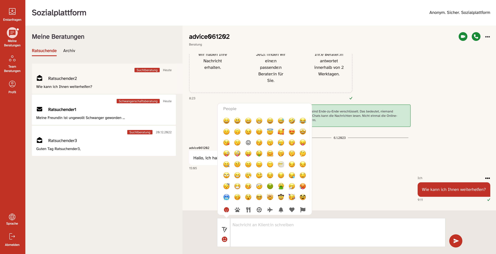
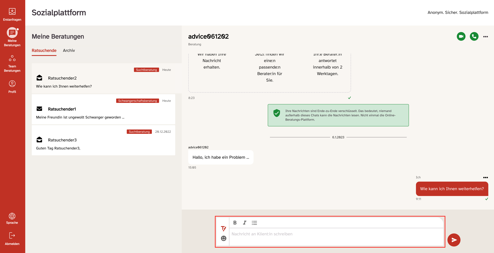

export const Highlight = ({ children }) => (
  
    {children}
  
);

Nachdem Sie die Anfrage angenommen haben, werden Sie direkt in den Bereich „Meine Nachrichten“ weitergeleitet.

Sie können auch ohne Weiterleitung jederzeit in den Bereich „Meine Nachrichten“ gelangen, indem sie auf den zugehörigen Button links auf der Navigationsleiste <Highlight>(1)</Highlight> klicken. Sobald „Meine Nachrichten geöffnet ist, wird der Button auf der Navigationsleiste optisch hervorgehoben.

Im Bereich „Meine Nachrichten“ sehen sie folgende Elemente:

- Übersicht über die angenommenen Beratungen. Ein offenes Briefsymbol bedeutet, dass die letzte Nachricht gelesen wurde. Das geschlossene Briefsymbol vor einer Nachricht zeigt an, dass eine Folgeanfrage vom Ratsuchenden vorliegt, die Sie noch nicht geöffnet und gelesen haben <Highlight>(2)</Highlight>.
- Mithilfe des Textfelds <Highlight>(3)</Highlight> können Sie eigene Nachrichten verfassen. Klicken Sie auf den Absendebutton rechts daneben, um die Nachricht abzusenden.
- Einmal abgesendet erscheinen Ihre Nachrichten und die der Ratsuchenden im Bereich oberhalb des Textfeldes.
- Die Nachrichten der Ratsuchenden <Highlight>(4)</Highlight> werden weiß und auf der linken Seite des Bereiches angezeigt.
- Ihre eigenen Nachrichten <Highlight>(5)</Highlight> werden rechts und in roter Farbe angezeigt.
- Das Häkchen <Highlight>(6)</Highlight> rechts unterhalb Ihrer Nachrichten zeigt den Status Ihrer Nachrichten an. Ein graues Häkchen bedeutet, dass Ihre Nachricht erfolgreich versendet wurde und nun im Postfach des Ratsuchenden liegt. Ein grünes Häkchen zeigt an, dass der Ratsuchende die Nachricht gelesen hat.
- Hinweis: Das Bestätigungshäkchen funktioniert nur bei Regel-Standardberatungsstellen, nicht bei Teamberatungsstellen.

Im Texteingabefeld finden Sie einen sog. Emoji-Picker und einen Texteditor

Beim Verfassen von Nachrichten können Sie sich den Emoji-Picker nutzen. Wenn Sie auf den Smiley klicken, öffnet sich eine Auswahl an verschiedensten Emojis, die Sie dann durch Doppelklicken in Ihre Nachricht einfügen können.

Daneben steht ein Texteditor zur Verfügung, mit dem Sie Ihre Nachricht formatieren können. An Funktionen sind möglich „fett“ (<strong>B</strong>), „kursiv“ (<i>I</i>) und Aufzählungszeichen. Zudem können Sie auch (klickbare) Links einfügen, die dann farblich hervorgehoben sind.

Hinweis: Mithilfe des Textfelds können Sie Nachrichten mit einer Länge von maximal 7.000 Zeichen verfassen – das entspricht in etwa drei DIN A 4 Seiten.

Zusätzlich ist die Bearbeitungsdauer einer Textnachricht auf 180 Minuten begrenzt. Aus Sicherheitsgründen werden Sie danach automatisch ausgeloggt. Ihre (Nachrichten-) Entwürfe werden 10 Sekunden nach der letzten Texteingabe bzw. Aktivität automatisch zwischengespeichert, auch wenn Sie in der Bearbeitung von mehreren Ratsuchenden Anfragen hin und her springen. Nach einem erneuten Wiedereinloggen finden Sie ihren Textentwurf wieder im Texteingabefeld der jeweiligen Beratungskommunikation.

## Ende-zu-Ende Verschlüsselung von Nachrichten

Chatnachrichten auf der Onlineberatung sind grundsätzlich Ende-zu-Ende verschlüsselt.
Dies gilt nicht für Anhänge, die über den Chat verschickt werden und auch nicht für Terminvereinbarungen. Ende-zu Ende Verschlüsselung heißt, dass die Daten nicht nur bei der Übertragung über https verschlüsselt werden, sondern zusätzlich auf den Geräten der Chatteilnehmenden direkt ver- und entschlüsselt werden, sodass nur die Chatteilnehmenden diese Nachrichten lesen können.

Unter bestimmten Umständen kann die Software Nachrichten nicht entschlüsseln, daher geben wir Ihnen hier eine Einführung, wie Ende-zu-Ende Verschlüsselung in der Onlineberatung funktioniert.

<strong>Grundsätzliches</strong>

Um eine Ende-zu-Ende verschlüsselte Nachricht lesen zu können, muss auf dem Gerät und in dem Browser, den man dafür verwendet, der nötige Schlüssel zugänglich sein, damit die Onlineberatungs-Software die Nachrichten der anderen Chatteilnehmenden entschlüsseln kann. Im Normalfall händelt die Onlineberatungs-Software das Management dieser Schlüssel im Hintergrund für Sie, sodass Sie nichts weiter tun müssen, als sich einzuloggen, um ihre Chats zu lesen.

<strong>Verschlüsselte Nachrichten entschlüsseln</strong>

Es gibt zwei Fälle in denen man keinen gültigen Schlüssel hat:

- Sie kommen als neue_r Beratende_r in eine existierende Beratungsstelle und wollen Chats lesen, die VOR der Erstellung Ihres Accounts erstellt wurden. (Erstanfragen oder Teamchats)
  - Chats die NACH ihrer Accounterstellung erstellt werden sind für Sie sofort lesbar.
- Sie ändern das Passwort zu ihrem Account und löschen dabei auch Ihren Browser Cache ODER ändern das Passwort und wechseln dabei den Browser oder das Endgerät.

In beiden Fällen ist es möglich, dass Sie mit Hilfe der anderen Chatteilnehmer einen gültigen Schlüssel für die Konversation bekommen.

Nachrichten werden grundsätzlich entschlüsselt, wenn ein_e Teilnehmer_in mit einem gültigen Schlüssel den Chat öffnet. Sie müssen dafür nicht gleichzeitig Online sein. Teilnehmer_innen sind im 1:1 Chat Berater_innen und Ratsuchende. Wenn Sie in einer Teamberatungsstelle arbeiten, dann sind Teilnehmer_innen auch Ihre Kolleg_innen in der Beratungsstelle mit einem Account. Um Nachrichten (wieder) für Sie lesbar zu machen muss ein_e andere_r Teilnehmer_in den jeweiligen Chat einmal anklicken. Dann werden die Nachrichten in diesem Chat für Sie wieder entschlüsselt angezeigt, wenn Sie das nächste Mal den Chat öffnen.

Chats sind nicht mehr zu entschlüsseln, wenn ALLE Teilnehmer des Chats zur selben Zeit ihre Schlüssel verloren haben.
