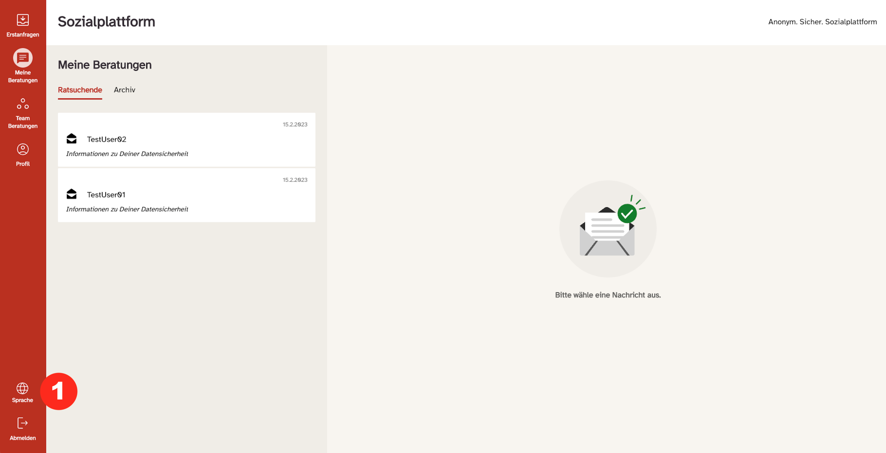
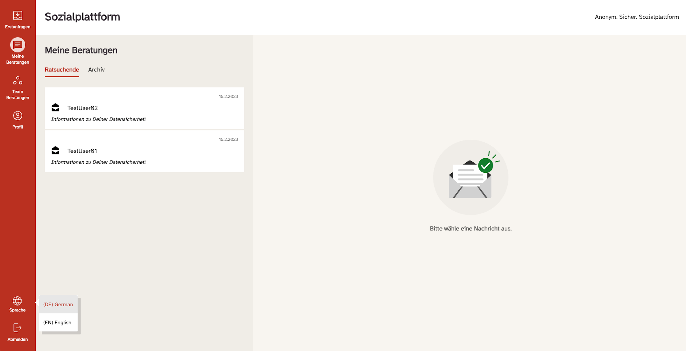

Die Teamberatung ist eine Zusatzfunktion, die über die Adminkonsole je Beratungsstelle aktiviert werden kann. Wenn sie vorhanden ist, funktioniert sie folgendermaßen:

Wenn Nutzende auf den Button Sprache klicken öffnet sich ein Dropdownmenü aus dem eine verfügbare Sprache ausgewählt werden kann.

Die Spracheinstellung nutzt als Default die Sprach-Einstellung des Browsers. Wenn im Browser keine verfügbare Sprache hinterlegt ist, dann wird die Applikation auf Deutsch angezeigt.

Wenn nur eine Sprache in der Applikation hinterlegt ist, dann wird die Sprachauswahl nicht angezeigt.
