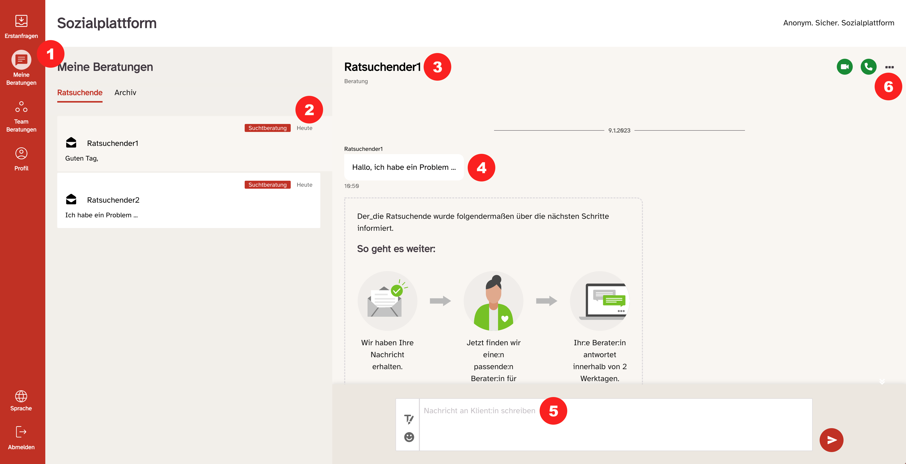

export const Highlight = ({ children }) => (
  
    {children}
  
);

Nach erfolgreichem Login gelangen Sie auf die zentrale Arbeitsübersicht.

  Am linken Bildschirmrand befindet sich die Navigationsleiste mit verschiedenen
  Reitern. Je nach Konfiguration (aktivierten Funktionen) ihrer Beratungsstelle,
  sind nicht alle davon für Sie Verfügbar <Highlight>(1)</Highlight>:

- Erstanfragen
- Meine Nachrichten
- Profil
- Abmelden

bei der mobilen Version befinden sich diese am unteren Rand des Bildschirms – siehe Abbildung.

Rechts befindet sich eine Liste der Gespräche mit Ratsuchenden, im folgenden Beratungskommunikation genannt <Highlight>(2)</Highlight>: Dort werden alle aktuell aktiven Beratungsvorgänge mit Ratssuchenden dargestellt. Neben einem Auszug aus der jeweils aktuellsten Nachricht der Kommunikation ist hier auch der Benutztername des Ratssuchenden und das Thema zu dem dieser Beraten wird ersichtlich.

Beim Klick auf eine Beratungskommunikation erscheint (durch graue Farbe verbunden) der Nachrichtenverlauf am rechten Bildschirmrand <Highlight>(3)</Highlight>.

Links (in Weiß) befindet sich die Anfrage der Ratsuchenden, rechts in Rot Ihre eigenen Berater_innen- Nachrichten <Highlight>(4)</Highlight>.

Das Textfeld zum Verfassen der Nachrichten <Highlight>(5)</Highlight>, vergrößert sich, abhängig von der Länge der Nachricht, die verfasst wird. Ganz rechts befindet sich der rote Absende-Button.

<Highlight>(6)</Highlight> Hier gibt es mehrere Optionen:{" "}

- Das Impressum, die Datenschutzerklärung und die Nutzungsbedingungen können durch das Menü erreicht werden, welches sich hinter den 3 Punkten in der rechten oberen Ecke verbirgt.
- Im „Ratsuchendenprofil“ können Sie alle öffentlich zugänglichen Informationen über den RS einsehen, welche folgende sind: Sein gewählter Nutzername, das Thema zu dem er Beraten wird und (falls vom Nutzer angegeben) seine Postleitzahl.
- Darüber hinaus kann in dieser Ansicht die Anfrage des Ratsuchenden an einen anderen Berater weiterleiten
  - Wenn Sie einen Fall einem anderen Betreuer zuweisen:
    - Die Ratsuchenden erhalten eine Nachricht im Chat, in der sie aufgefordert werden, dem Wechsel des Beraters zuzustimmen. Die Ratsuchenden können entweder zustimmen oder ablehnen.
    - Erst wenn der Ratsuchende dem Wechsel des Beraters zustimmt, hat der neue Berater Zugang zum Ratsuchenden-Chat mit dem bisherigen Berater.
- Sie können die Konversation <strong>archivieren</strong> oder <strong>löschen</strong>. Eine archivierte Konversation erscheint automatisch wieder in „Meine Nachrichten“ sobald der User erneut eine Nachricht an Sie sendet.

