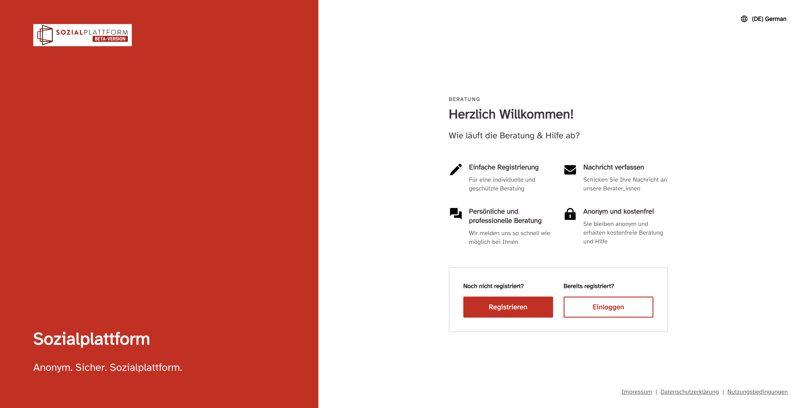
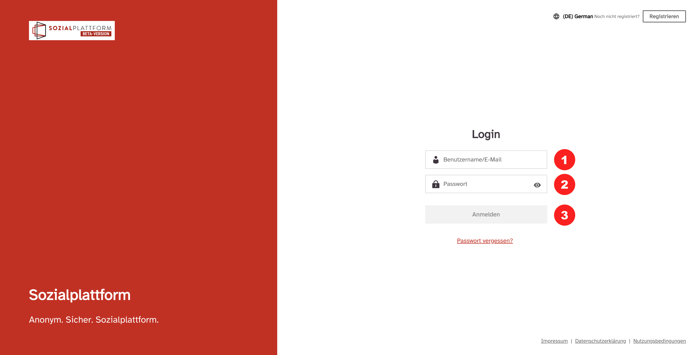

export const Highlight = ({ children }) => (
  
    {children}
  
);

export const Bold = ({ children }) => (
  

    {children}
  

);

export const Boxed = ({ children }) => (
  

    &#9888; {children}
  

);

Der einfachste und direkte Zugang zur Plattform ist: <Highlight>onlineberatung.sozialplattform.de.</Highlight> Dann erscheint das nachfolgende Start-Fenster.

Hier sehen Sie die beiden Buttons „Zur Registrierung“ und „Zum Login.“

<Boxed>
  Die Beratungsplattform funktioniert auch auf Smartphones und Tablets, sie wird
  dabei immer in einem Webbrowser aufgerufen und ist keine eigenständige App die
  installiert werden muss. Im Folgenden sehen sie auch immer die entsprechenden
  Ansichten in der Mobilversion. Die Bedienung erfolgt analog zur Desktopversion
  und enthält dieselben Funktionen.
</Boxed>

Der „Zum Login“ Button führt Sie zur Login Seite.

Um sich anzumelden, tragen Sie Ihre Login-Daten ein:

- Geben Sie Ihre E-Mailadresse oder Ihren Benutzernamen ein <Highlight>(1)</Highlight>.
- Geben Sie Ihr Passwort ein <Highlight>(2)</Highlight>.
- Klicken Sie dann auf „ANMELDEN“ <Highlight>(3)</Highlight>

<Boxed>
  <strong>Erster Login auf der Beratungsplattform</strong>

Um sich das erste Mal in Ihrem Account einzuloggen, klicken Sie bitte auf „Passwort vergessen?“. Anschließend öffnet sich ein neues Fenster, in dem Sie dann bitte Ihre E-Mail-Adresse eingeben. Anschließend bekommen Sie per E-Mail einen Link zugesandt.

{" "}

  <strong>
    Dieser Link ist 120 Minuten gültig. Achtung: es kann sein, dass diese E-Mail
    im Spamordner landet. Überprüfen Sie dies bitte.
  </strong>

{" "}

  Anschließend können Sie sich ein Passwort geben. Aus Gründen des Datenschutzes
  müssen folgende Anforderungen an das Passwort erfüllt sein:

- Mindestens 9 Zeichen
- Groß- und Kleinschreibung
- mind. eine Zahl
- ein Sonderzeichen (z. B. +, \*, !, etc.)

</Boxed>
