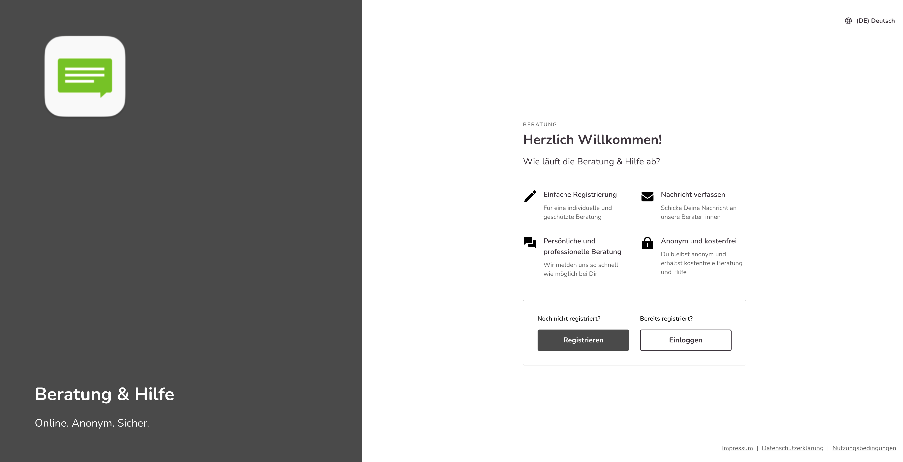
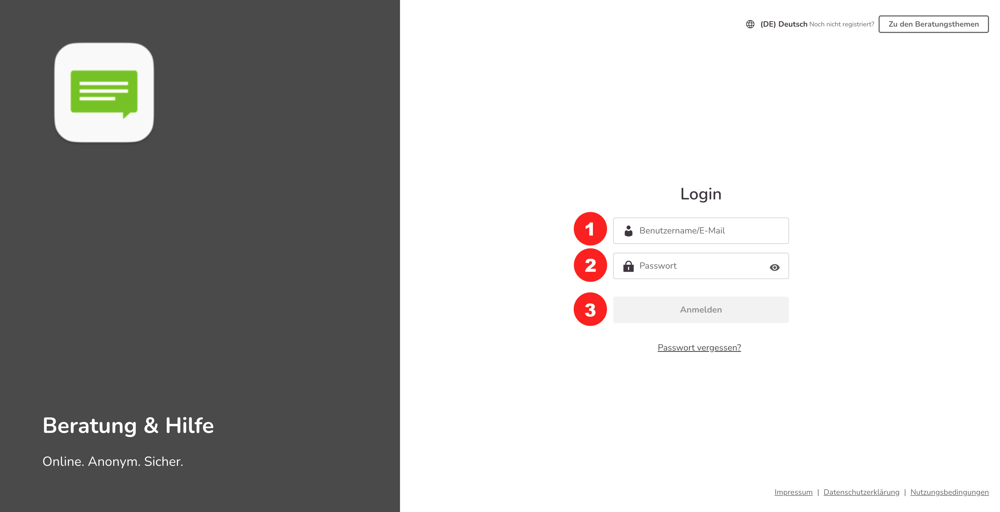

import { PrimaryNote, Bold, UIElement } from "../../components.jsx";
import useBaseUrl from "@docusaurus/useBaseUrl";

<PrimaryNote>
  Die Beratungsplattform funktioniert auch im Browser auf Smartphones und
  Tablets, sie wird dabei immer in einem Webbrowser aufgerufen und ist keine
  eigenständige App, die installiert werden muss. Im Folgenden sehen Sie auch
  immer die entsprechenden Ansichten in der Mobil-Version. Die Bedienung erfolgt
  analog zur Desktopversion und enthält dieselben Funktionen.
</PrimaryNote>

Der einfachste und direkte Zugang zur Plattform ist: <Bold>abc.onlineberatung.net</Bold>, wobei abc für den Namen Ihrer Subdomain steht, dann erscheint das nachfolgende Login-Fenster.

Hier sehen Sie die beiden Buttons <UIElement>Zur Registrierung</UIElement> und <UIElement>Zum Login</UIElement>.

  

Der <UIElement>Einloggen</UIElement> Button führt Sie zur Login-Seite. Um sich anzumelden,
tragen Sie Ihre Login-Daten ein:

<ul>
  <li>
    Geben Sie Ihre E-Mail-Adresse oder Ihren Benutzernamen ein <Bold>(1)</Bold>
  </li>
  <li>
    Geben Sie Ihr Passwort ein <Bold>(2)</Bold>
  </li>
  <li>
    Klicken Sie dann auf <UIElement>Anmelden</UIElement> <Bold>(3)</Bold>
  </li>
</ul>

  

