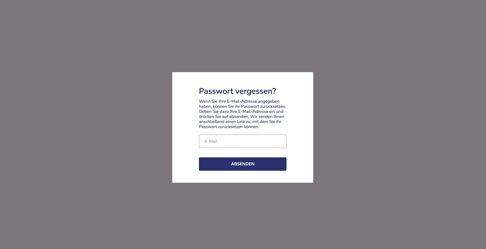
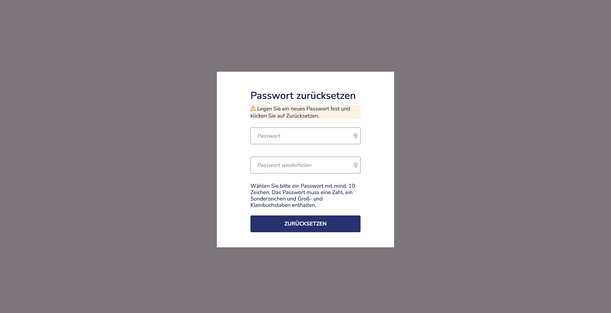
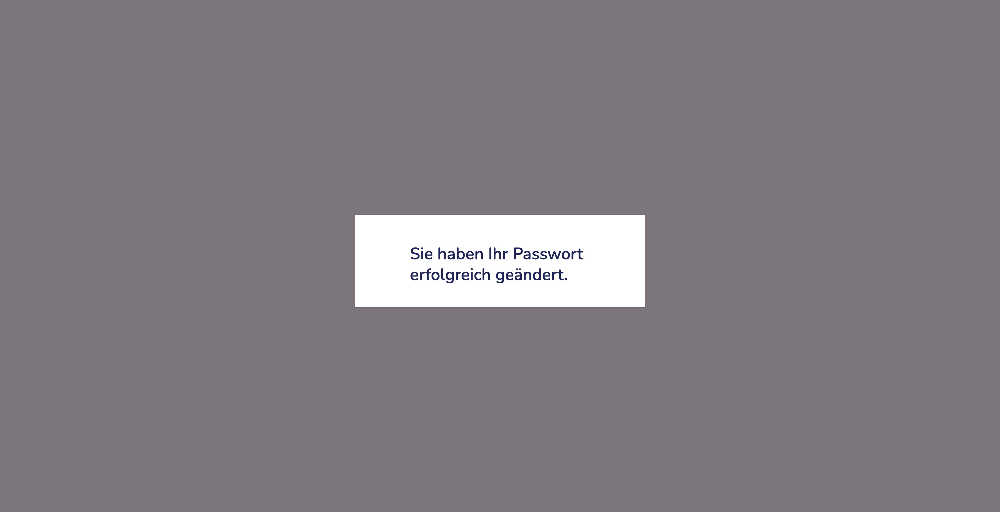

import { PrimaryNote, Bold, UIElement } from "../../components.jsx";

Falls Sie Ihr Passwort vergessen haben oder Ihr Passwort erstmalig setzen möchten, können Sie es ganz einfach selbst zurücksetzen. Klicken Sie einfach auf den Link <UIElement>Passwort vergessen?</UIElement> auf der Login-Seite. Danach öffnet sich folgendes Fenster auf Ihrem Screen:

Geben Sie Ihre E-Mail-Adresse ein und klicken Sie auf <UIElement>Absenden</UIElement>. Anschließend erhalten Sie per E-Mail einen Link, über den Sie folgende Seite erreichen:

<PrimaryNote>
  Der Link den Sie per E-Mail erhalten ist <Bold>120</Bold> Minuten gültig.
  Überprüfen Sie bitte, ob diese E-Mail in Ihrem Spamordner gelandet ist.
</PrimaryNote>

Um das Passwort erfolgreich zurückzusetzen, sind die folgenden Schritte notwendig:

<ul>
  <li>Denken Sie sich ein neues Passwort aus. Die Anforderungen sind:</li>
  <ul>
    <li>mind. 9 Zeichen</li>
    <li>Groß- und Kleinschreibung</li>
    <li>mind. eine Zahl</li>
    <li>ein Sonderzeichen (z. B. *, +, #, etc.)</li>
  </ul>
  <li>
    Geben Sie das Passwort in den Feldern „Passwort“ und „Passwort wiederholen“
    ein.
  </li>
  <li>
    Mit Klick auf den Zurücksetzen-Button wird das neue Passwort gespeichert.
  </li>
</ul>

Nach erfolgreicher Änderung Ihres Passworts erscheint folgender Hinweis:

Nun können Sie sich mit dem neuen Passwort anmelden.
