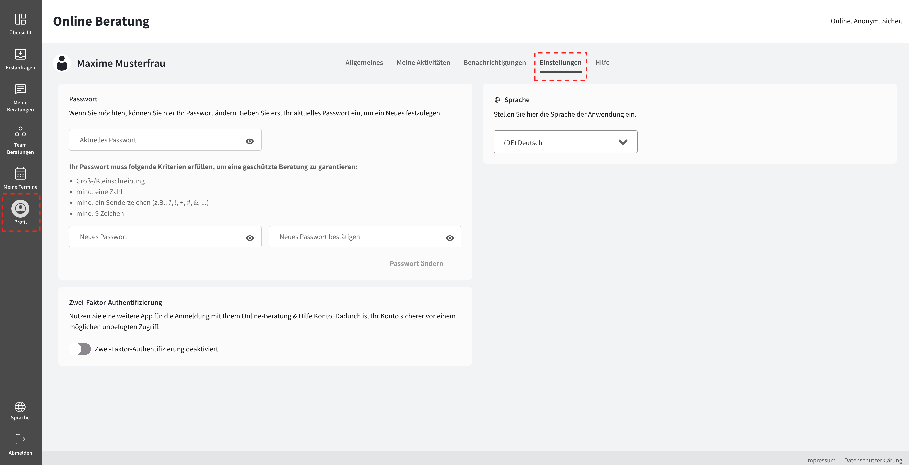
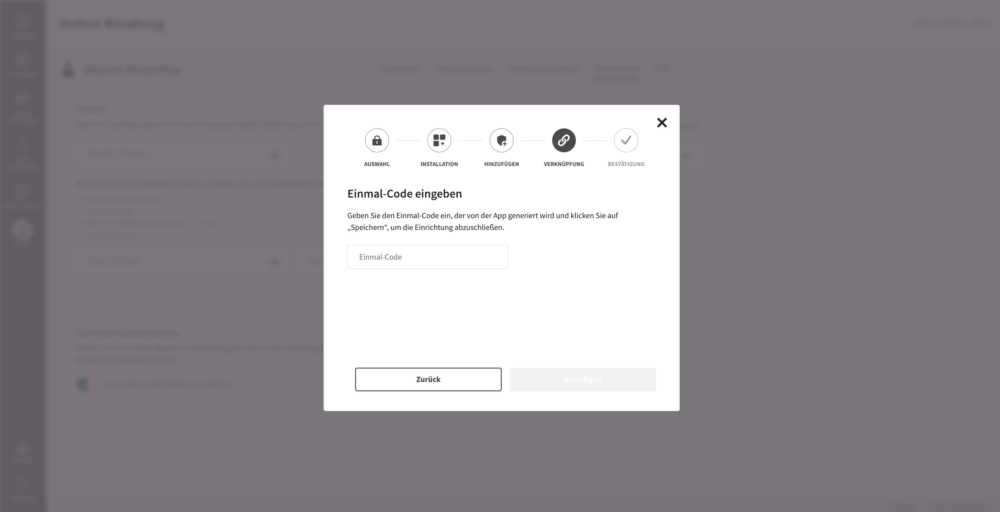

import { PrimaryNote, Bold, UIElement } from "../../components.jsx";

Um unbefugten Zugriff auf Ihr Profil zu verhindern, können Sie eine Zwei-Faktor-Authentifizierung aktivieren und somit die Sicherheit Ihres Profils erhöhen.

Um die Zwei-Faktor-Authentifizierung zu aktivieren, müssen Sie sich mit Ihrem Berater-Account anmelden. Die Zwei-Faktor-Authentifizierungsfunktion befindet sich im Profil eines Beraters / einer Beraterin. Um zum Menüpunkt <UIElement>Profil</UIElement> zu gelangen, klicken Sie auf den zugehörigen Button in der Navigationsleiste und anschließend auf den Tab <UIElement>Einstellungen</UIElement>:

Um die Zwei-Faktor-Authentifizierung zu aktivieren, müssen Sie zunächst die Umschalttaste in dem entsprechenden Abschnitt <UIElement>Zwei-Faktor-Authentifizierung</UIElement> klicken. Im nächsten Schritt haben Sie die Möglichkeit, den von Ihnen bevorzugten zweiten Faktor auszuwählen. Hierzu können Sie entweder eine App verwenden oder Sie hinterlegen eine E-Mail-Adresse:

## App

Wenn Sie dafür entschieden haben, eine App als zweiten Faktor zu verwenden, erhalten Sie im nächsten Schritt einige Vorschläge, welche Apps sich hierfür eignen. Ein Klick auf den Link führt Sie direkt in den App-Store Ihres Gerätes, mit der App bereits ausgewählt. Laden Sie nun die von Ihnen gewählte App aus dem App-Store Ihres jeweiligen Gerätes herunter.

Wenn Sie die App geladen haben, scannen Sie mit dieser den QR-Code ein oder geben Sie den 32-stelligen Schlüssel manuell ein:

Im Anschluss wird in der App ein Zahlencode generiert, den Sie auf der Website ins passende Feld eintippen. Klicken Sie anschließend auf <UIElement>Bestätigen</UIElement>, um die Einrichtung abzuschließen.

## E-Mail

Wenn Sie dafür entschieden haben, Ihre E-Mail als zweiten Faktor zu verwenden, bekommen Sie, nachdem Sie Ihre E-Mail mit <UIElement>Weiter</UIElement> bestätigt haben, einen Zahlencode per E-Mail zugesendet.

Diesen Zahlencode, den Sie per E-Mail erhalten haben, müssen Sie nun in das passende Feld eintippen. Klicken Sie anschließend auf <UIElement>Bestätigen</UIElement>, um die Einrichtung abzuschließen.

Nach erfolgreicher Aktivierung der 2-Faktor-Authentifizierung erscheint diese in dem Abschnitt <UIElement>Sicherheit</UIElement> grün. Dadurch ist Ihr Konto sicherer vor einem möglichen unbefugten Zugriff.

