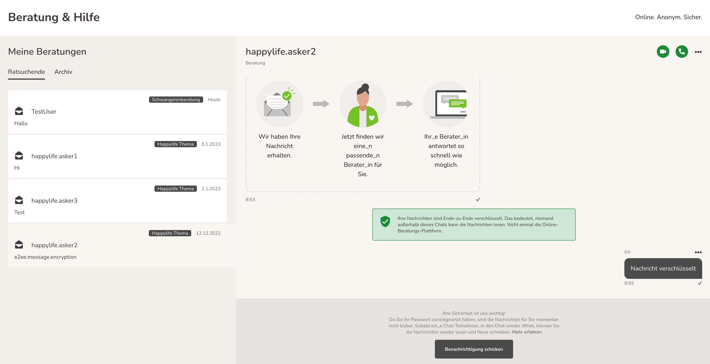

import { PrimaryNote, Bold, UIElement } from "../../components.jsx";

Chatnachrichten auf der Onlineberatung sind grundsätzlich Ende-zu-Ende verschlüsselt, um die Vertraulichkeit der Kommunikation zu gewährleisten. Dies gilt nicht für Anhänge, die über den Chat verschickt werden und auch nicht für Terminvereinbarungen.

Ende-zu-Ende-Verschlüsselung heißt, dass die Daten nicht nur bei der Übertragung über HTTPS verschlüsselt werden, sondern zusätzlich auf den Geräten der Chat-Teilnehmenden direkt ver- und entschlüsselt werden, sodass nur die Chat-Teilnehmenden diese Nachrichten lesen können.

Unter bestimmten Umständen ist die Software nicht in der Lage Nachrichten zu entschlüsseln, daher geben wir Ihnen hier eine Einführung, wie Ende-zu-Ende-Verschlüsselung in der Onlineberatung funktioniert.

## Fehlender Schlüssel zur Entschlüsselung

Um eine Ende-zu-Ende verschlüsselte Nachricht lesen zu können, muss auf dem Gerät und in dem Browser, den man dafür verwendet, der nötige Schlüssel zugänglich sein, damit die Onlineberatungs-Software die Nachrichten der anderen Chat-Teilnehmenden entschlüsseln kann. Im Normalfall händelt die Onlineberatungs-Software das Management dieser Schlüssel im Hintergrund für Sie, sodass Sie nichts weiter tun müssen, als sich einzuloggen, um ihre Chats zu lesen.
Die Entschlüsselung kann nur mit dem gültigen Schlüssel stattfinden. Dieser Schlüssel fehlt oder ist ungültig in folgenden Fällen

<ul>
  <li>Der Browser-Cache inkl. Cookies wurde seit dem letzten Login geleert</li>
  <li>
    Der Browser-Cache inkl. Cookies wird automatisch bei Schließen des Browsers
    geleert
  </li>
  <li>Der Browser wird im Inkognito-Modus ohne Cookies verwendet</li>
  <li>Ein anderer Browser auf demselben Gerät wird verwendet</li>
</ul>

Das beinhaltet folgende Szenarien:

<ul>
  <li>
    Sie kommen als neuer Beratender / neue Beraterin in eine bereits
    existierende Beratungsstelle und wollen Chats lesen, die bereits vor der
    Erstellung Ihres Accounts erstellt wurden. (Erstanfragen oder Teamchats)
  </li>
  <ul>
    <li>
      Chats die NACH ihrer Accounterstellung erstellt werden sind für Sie sofort
      lesbar.
    </li>
  </ul>
  <li>
    Sie setzen das Passwort Ihres Accounts zurück und löschen dabei auch Ihren
    Browser Cache ODER ändern das Passwort und wechseln dabei den Browser oder
    das Endgerät.
  </li>
</ul>

Wenn einer dieser Fälle eintritt, sehen die Betroffenen diese Ansicht:

Grundsätzlich werden Nachrichten entschlüsselt, wenn ein Chatteilnehmer mit einem gültigen Schlüssel den Chat öffnet. Bei diesem Chatteilnehmer kann es sich um Teamberater_innen, Berater_innen oder Ratsuchende handeln.
Es ist also möglich, dass Sie wieder Zugriff auf die Nachrichten bekommen, in dem ein_e andere_r Teilnehmer_in der Beratungskommunikation den jeweiligen Chat öffnet. Sie müssen dafür nicht gleichzeitig online sein.
Dann werden die Nachrichten in diesem Chat für Sie wieder entschlüsselt angezeigt, wenn Sie das nächste Mal den Chat öffnen.

<PrimaryNote>
  Chats sind nicht mehr zu entschlüsseln, wenn ALLE Teilnehmer des Chats zur
  selben Zeit ihre Schlüssel verloren haben.
</PrimaryNote>
