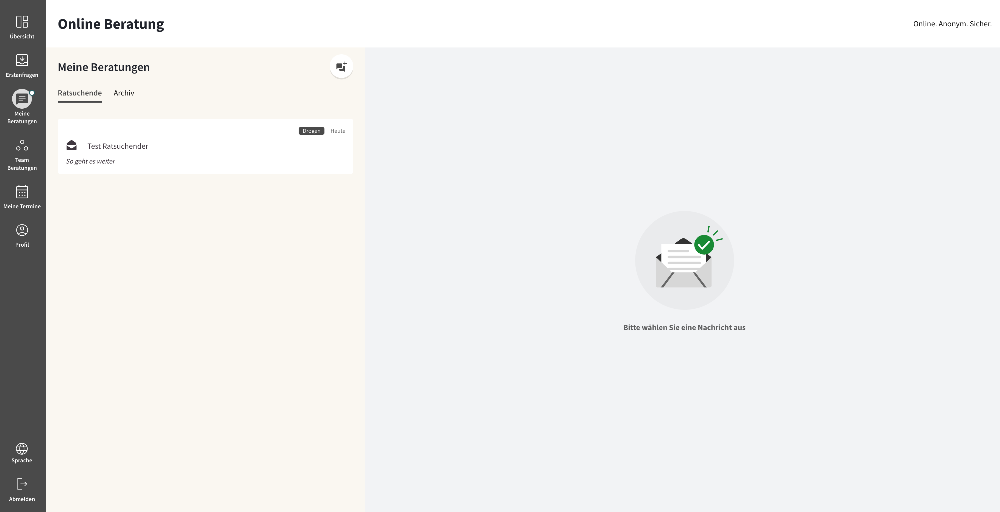
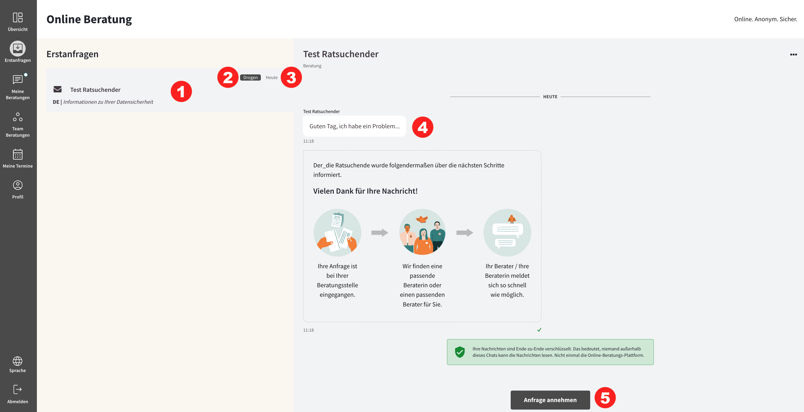
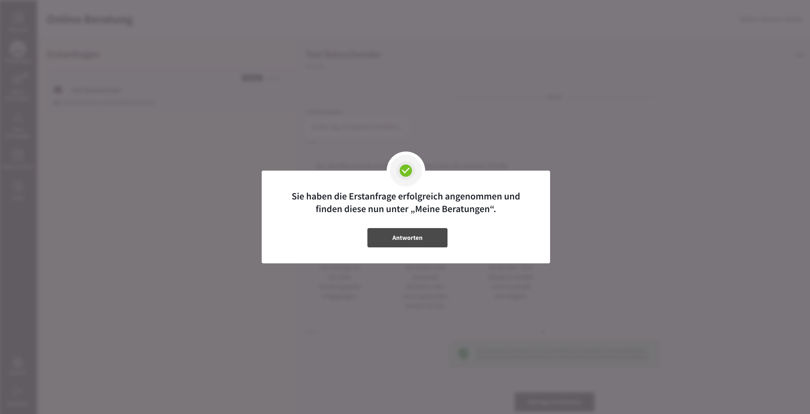

import { PrimaryNote, Bold, UIElement } from "../../components.jsx";

Um zu den Erstanfragen zu gelangen, müssen Sie in der Navigationsleiste auf den Menüpunkt <UIElement>Erstanfragen</UIElement> klicken.

Unter dem Menüpunkt <UIElement>Erstanfragen</UIElement> werden alle Anfragen von Ratsuchenden aufgelistet, die sich bei einer Beratungsstelle registriert haben, der Sie als Berater_in zugeordnet sind. Demnach handelt es sich bei den hier sichtbaren Anfragen um Ratsuchende, welche noch keinem Berater zugewiesen sind.

Die Übersicht der offenen Erstanfragen kann vom gesamten Beratungsteam Ihrer Beratungsstelle eingesehen werden. Die ältesten Anfragen stehen oben, die neuesten ganz unten, damit Sie die zuerst eingegangenen leichter finden können.

Um eine Erstanfrage zu öffnen, müssen Sie auf das entsprechende Element in der Liste klicken:

In dieser Ansicht sehen Sie folgende Elemente:

<ul>
  <li>
    Aktuelle Anfrage, die im Dialogfeld sichtbar ist <Bold>(1)</Bold>
  </li>
  <li>
    Das vom Ratsuchenden gewählten Beratungsthema <Bold>(2)</Bold>
  </li>
  <li>
    Eingangszeitpunkt der Erstanfrage <Bold>(3)</Bold>
  </li>
  <li>
    Die Nachricht des Ratsuchenden im Dialogfeld <Bold>(4)</Bold>
  </li>
  <li>
    <UIElement>Anfrage Annehmen</UIElement> – Button <Bold>(5)</Bold>
  </li>
</ul>

Durch einen Klick auf den <UIElement>Anfrage Annehmen</UIElement> – Button wird Ihnen die Erstanfrage und somit der / die Ratsuchende zugeordnet. Dies hat folgende Auswirkungen:

<ul>
  <li>
    Durch die Annahme handelt es sich um keine offene Erstanfrage mehr, wodurch
    diese Anfrage aus dem Erstanfragen-Postfach verschwindet und nicht mehr für
    andere Berater derselben Beratungsstelle unter
    <UIElement>Erstanfragen</UIElement> sichtbar ist.
  </li>
  <li>
    Es handelt sich nun um eine Beratungskommunikation, die Ihnen durch das
    Annehmen zugeordnet ist. Dadurch befindet sich diese Beratungskommunikation
    nun unter dem Menüpunkt <UIElement>Meine Nachrichten</UIElement>.
  </li>
</ul>

Sie erhalten anschließend folgenden Hinweis:

Durch einen Klick auf den <UIElement>Antworten</UIElement> – Button werden Sie automatisch in <UIElement>Meine Nachrichten</UIElement> weitergeleitet und die Anfrage kann sofort beantwortet werden.
