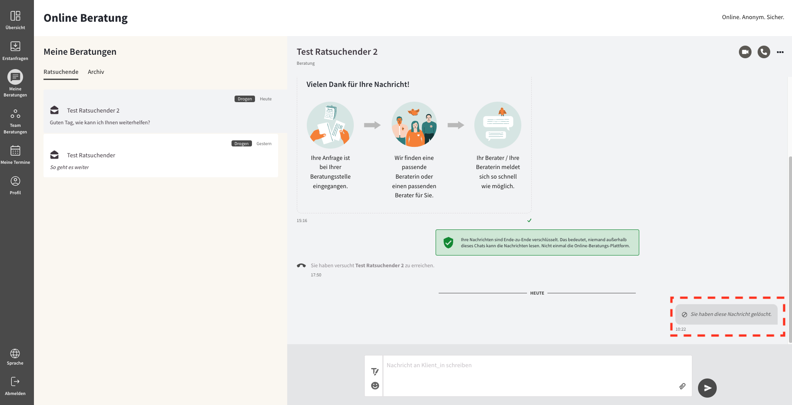

import { PrimaryNote, Bold, UIElement } from "../../components.jsx";

Um zu Ihren Beratungen zu gelangen, müssen Sie in der Navigationsleiste auf den Menüpunkt <UIElement>Meine Beratungen</UIElement> klicken.

Unter dem Menüpunkt <UIElement>Meine Beratungen</UIElement> werden alle Beratungskommunikationen mit Ratsuchenden aufgelistet, die Ihnen zugeordnet sind.

Ein Ratsuchender / eine Ratsuchende kann Ihnen zugeordnet werden, indem Sie die entsprechende Erstanfrage zuvor angenommen haben oder der Ratsuchender / die Ratsuchende Ihnen zugewiesen wurden (siehe späteres Kapitel).

In dieser Liste werden alle aktuell aktiven Beratungskommunikationen mit Ratssuchenden dargestellt.

Ein offenes Briefsymbol bedeutet, dass die letzte Nachricht gelesen wurde. Das geschlossene Briefsymbol vor einer Nachricht zeigt an, dass eine ungelesene Nachricht vom Ratsuchenden vorliegt, die Sie noch nicht geöffnet und gelesen haben.

Weitere Elemente in dieser Liste, die für jede Beratungskommunikation bereitgestellt werden, sind:

<ul>
  <li>
    Der Benutzername des Ratsuchenden <Bold>(1)</Bold>
  </li>
  <li>
    Ein Auszug aus der jeweils zuletzt gesendeten oder empfangen Nachricht der
    jeweiligen Beratungskommunikation <Bold>(2)</Bold>
  </li>
  <li>
    Das Thema, zu welchem der Ratsuchende Beratung benötigt <Bold>(2)</Bold>
  </li>
  <li>
    Das Datum, der zuletzt gesendeten oder empfangen Nachricht der jeweiligen
    Beratungskommunikation <Bold>(4)</Bold>
  </li>
</ul>

  <Bold>(1)</Bold> Beim Klick auf eine Beratungskommunikation erscheint der
  Nachrichtenverlauf am rechten Bildschirmrand (rot eingerahmt auf dem
  Bildschirmfoto).

  <Bold>(2)</Bold> Die linksbündigen Nachrichten in Weiß sind die Nachrichten,
  die von einem / einer Ratsuchenden gesendet wurde.

  <Bold>(3)</Bold> Die rechtsbündigen Nachrichten in Rot sind Ihre eigenen
  Nachrichten, die Sie als Berater_in gesendet haben.

  <Bold>(4)</Bold> Das Textfeld zum Verfassen Ihrer Nachrichten. Das Textfeld
  vergrößert sich, abhängig von der Länge der Nachricht, die verfasst wird.

  <Bold>(5)</Bold> Mit dem Absende-Button können Sie eine eingegebene Nachricht
  an Ihren Gesprächspartner senden. Sobald Sie Ihre Nachricht abgeschickt haben,
  erscheint Ihre Nachricht im Nachrichtenverlauf und Ihr Gesprächspartner kann
  die Nachricht lesen.

  <Bold>(6)</Bold> Rechts unterhalb Ihrer Nachrichten erscheint ein Häkchen,
  dass den Status Ihrer Nachrichten anzeigt. Ein graues Häkchen bedeutet, dass
  Ihre Nachricht erfolgreich versendet wurde und nun im Postfach des
  Ratsuchenden liegt. Ein grünes Häkchen zeigt an, dass der Ratsuchende die
  Nachricht gelesen hat.

<PrimaryNote>
  Das Bestätigungshäkchen funktioniert nur bei Regel-Standardberatungsstellen,
  nicht bei Teamberatungsstellen.
</PrimaryNote>

<Bold>(7)</Bold> Am rechten oberen Bildschirmrand befindet sich ein Optionenmenü,
welches mit drei Punkten dargestellt wird. Durch einen Klick auf dieses Menü öffnet
sich ein Menü mit mehreren Optionen:

## Nachrichten schreiben

Das Textfeld zum Verfassen Ihrer Nachrichten beinhaltet zwei Symbole:

### Emoji-Picker

Beim Verfassen von Nachrichten können Sie sich den Emoji-Picker nutzen, um Emojis zur Textnachricht hinzuzufügen.

Wenn Sie auf den Smiley klicken, öffnet sich eine Auswahl an verschiedensten Emojis, die Sie dann durch Doppelklicken in Ihre Nachricht einfügen können.

### Texteditor

Der Texteditor bietet Ihnen verschiedene Formatierungsmöglichkeiten, um Ihre Nachricht zu gestalten. Sie können Textabschnitte fett <UIElement>B</UIElement>, kursiv <UIElement>I</UIElement> oder mit Aufzählungszeichen versehen. Zudem können Sie auch klickbare Links einfügen, die farblich hervorgehoben werden.

<PrimaryNote>
  Mit dem Textfeld haben Sie die Möglichkeit, Nachrichten mit einer maximalen
  Länge von 7.000 Zeichen zu verfassen, was etwa drei DIN A4-Seiten entspricht.
  Es ist jedoch ratsam, zu bedenken, dass sehr lange Nachrichten den Empfänger
  überfordern könnten. Daher empfehlen wir, längere Nachrichten in mehrere
  kürzere Nachrichten aufzuteilen, um eine bessere Lesbarkeit und
  Verständlichkeit zu gewährleisten.
</PrimaryNote>

### Anhang

Ebenfalls im Textfeld finden Sie ein Büroklammer-Symbol. Durch einen Klick auf dieses Symbol können Sie eine Datei hochladen und verschicken. Folgende Dateiformate sind zugelassen und können von Ihnen, aber auch von den Ratsuchenden verschickt werden: Word, Excel, PDF, PNG, JPG. Die maximale Dateigröße beträgt 5 MB. Aus Sicherheitsgründen können je Ratsuchenden und Tag maximal 7 Dateien verschickt werden.

### Nachrichtenentwurf

Die Bearbeitungsdauer einer Textnachricht ist auf 180 Minuten begrenzt. Aus Sicherheitsgründen werden Sie nach 180 Minuten Inaktivität automatisch ausgeloggt.

Ihre (Nachrichten-) Entwürfe werden 10 Sekunden nach der letzten Texteingabe bzw. Aktivität automatisch zwischengespeichert, auch wenn Sie in der Bearbeitung von mehreren Ratsuchenden Anfragen hin und her springen. Die automatische Zwischenspeicherung funktioniert auch nach einem erneuten Wiedereinloggen, nachdem Sie sich ausgeloggt haben oder aus Sicherheitsgründen nach 180 Minuten Inaktivität automatisch ausgeloggt wurden. In jedem Fall finden Sie ihren Textentwurf wieder im Texteingabefeld der jeweiligen Beratungskommunikation.

## Nachrichten löschen

Sie haben die Möglichkeit, eine bereits gesendete Nachricht aus dem Nachrichtenverlauf zu löschen.
Um eine Nachricht zu löschen, müssen Sie auf die drei Punkte oberhalb der von Ihnen gesendeten Nachricht klicken:

Dadurch hat Ihr Gesprächspartner kein Zugriff mehr auf diese Nachricht und kann diese nicht mehr lesen. Für Sie wird im Nachrichtenverlauf der Hinweis angezeigt: "Sie haben diese Nachricht gelöscht." Dadurch können Sie nachverfolgen, dass Sie eine Nachricht gelöscht haben.

## Optionenmenü

<ul>
  <li>
    <UIElement>Ratsuchendenprofil</UIElement>
  </li>
  <li>
    <UIElement>Archivieren</UIElement>
  </li>
  <li>
    <UIElement>Löschen</UIElement>
  </li>
  <li>
    <UIElement>Impressum</UIElement>
  </li>
  <li>
    <UIElement>Datenschutzerklärung</UIElement>
  </li>
  <li>
    <UIElement>Nutzungsbedingung</UIElement> - optional
  </li>
</ul>

### Ratsuchendenprofil

<PrimaryNote>
  Bitte beachten Sie, dass sich einige der hier sichtbaren Informationen im
  Ratsuchendenprofil aus optionalen Zusatzfunktionen ergeben. Je nach
  Konfiguration Ihrer Online-Beratungsplattform stehen Ihnen diese
  Zusatzfunktionen und somit nicht alle dieser Informationen zur Verfügung.
</PrimaryNote>

Hier können Sie alle öffentlich zugänglichen Informationen über den Ratsuchenden einsehen:

Diese Daten müssen von dem Ratsuchenden während des Registrierungsprozesses verpflichtend angelegt werden und können im Nachhinein auch nicht mehr bearbeitet werden. Diese Daten sind für Sie als Berater einsehbar. Daher handelt es sich hierbei um öffentlich zugängliche Informationen.

Private Daten eines Ratsuchenden sind beispielsweise eine E-Mail-Adresse, die ein Ratsuchender für die E-Mail-Benachrichtigung oder die Zwei-Faktor-Authentifizierung nutzen kann. Diese Daten sind zum einen optional und zum anderen privat, wodurch diese auch nicht für Sie als Berater_in sichtbar sind.

Des Weiteren haben Sie über das Ratsuchendenprofil die Möglichkeit, Tools für die / den Ratsuchende_n freizuschalten. Bezug genommen wird hierbei auf den Abschnitt <UIElement>Tools</UIElement> im Ratsuchendenprofil. Genaue Informationen finden Sie in dem extra Kapitel Tools.

Über die Einsicht in die öffentlichen Daten eines Ratsuchenden haben Sie als Berater_in an dieser Stelle die Möglichkeit eine Beratungskommunikationen an einen anderen Berater / eine andere Beraterin der entsprechenden Beratungsstelle zuzuweisen. Bezug genommen wird hierbei auf den Abschnitt <UIElement>Zuweisung</UIElement> im Ratsuchendenprofil. Genaue Informationen finden Sie in dem extra Kapitel Neuzuweisung eines Ratsuchenden.

### Archivieren

Diese Funktion ermöglicht es Ihnen als Berater_in eine Beratungskommunikation zu archivieren. Das bietet sich beispielsweise für Beratungskommunikationen an, die über einen längeren Zeitraum inaktiv sind.

Durch das Archivieren einer Beratungskommunikation, wird diese in den Tab <UIElement>Archiv</UIElement> verschoben. Sobald eine neue Nachricht von Ihnen als Berater ohne von dem / der Ratsuchenden gesendet wird, wird die Beratungskommunikation automatisch dearchiviert.

Sie können einen Ratsuchenden auch manuell dearchvieren, indem Sie auf das Optionenmenü klicken, welches durch die drei Punkte dargestellt wird, und anschließend die Option <UIElement>Dearchivieren</UIElement> klicken.

### Löschen

Hiermit können Sie als Berater_in eine Beratung löschen. Durch das Löschen einer Beratung ist diese nicht mehr für Sie als Berater_in sichtbar. Zusätzlich wird der Account des Ratsuchenden gelöscht, wodurch sich dieser nicht mehr auf der Beratungsplattform anmelden kann.
