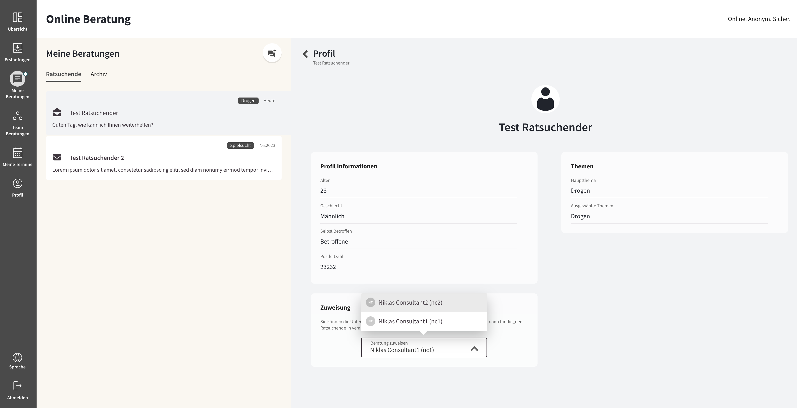
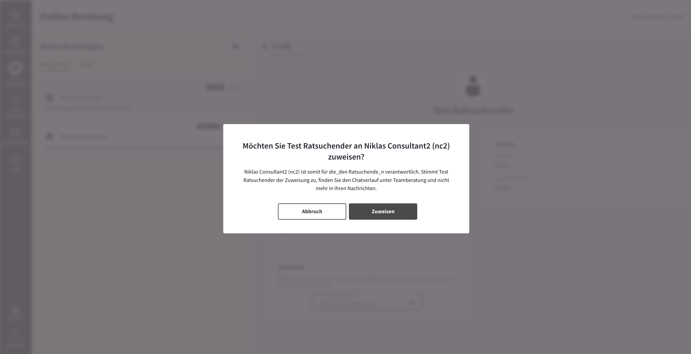
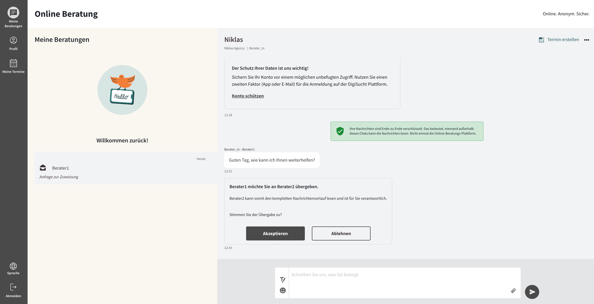

import { PrimaryNote, Bold, UIElement } from "../../components.jsx";

Um einen Ratsuchenden an einen anderen Berater / eine andere Beraterin weiterzuleiten, müssen Sie folgende Schritte ausführen:

<ul>
  <li>
    Klicken Sie auf das Feld, in welchem sich der nachunten gerichtete Pfeil
    befindet. Durch den Klick öffnet sich eine Auswahlliste, in welcher sich
    weitere Berater_innen Ihrer Beratungsstellen befinden.
  </li>
</ul>

<ul>
  <li>
    Wählen eine_n dieser Berater_innen durch einen Klick auf eine_n dieser
    Berater_innen aus und bestätigen Sie die anschließende Bestätigungsabfrage.
  </li>
</ul>

<ul>
  <li>
    Nun erhält der Ratsuchende eine Nachricht im Chat, mit der Anfrage, dem
    Wechsel des Beraters / der Beraterin zuzustimmen. Die Ratsuchenden können
    entweder zustimmen oder ablehnen. Das folgende Bildschirmfoto zeigt die
    Ansicht für den Ratsuchenden.
  </li>
</ul>

Die Neuzuweisung der Ratsuchenden wird nur unter der Voraussetzung stattfinden, dass der Ratsuchende dem Wechsel des Beraters zustimmt:

<ul>
  <li>
    Wenn der Ratsuchende ablehnt, findet die Neuzuweisung nicht statt und Sie
    sind weiterhin der Berater / die Beraterin des Ratsuchenden.
  </li>
  <li>
    Wenn der Ratsuchende zustimmt, ist der / die von Ihnen ausgewählte
    Berater_in der / die neue Ansprechpartner_in für den hier betroffenen
    Ratsuchenden.
  </li>
</ul>
