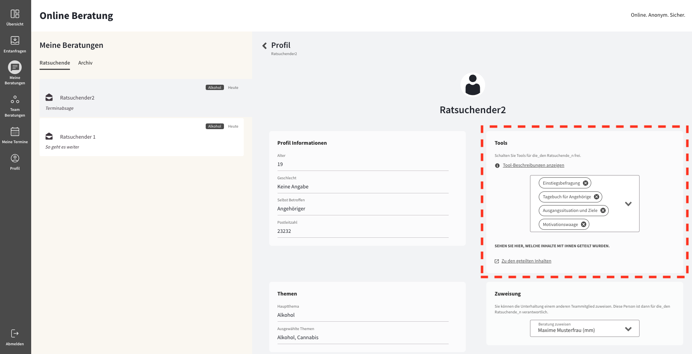
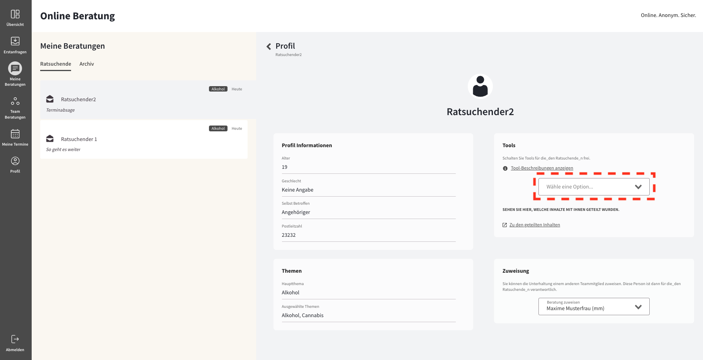
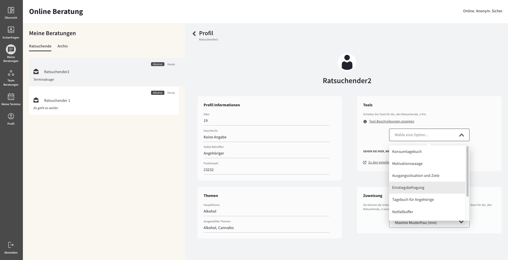
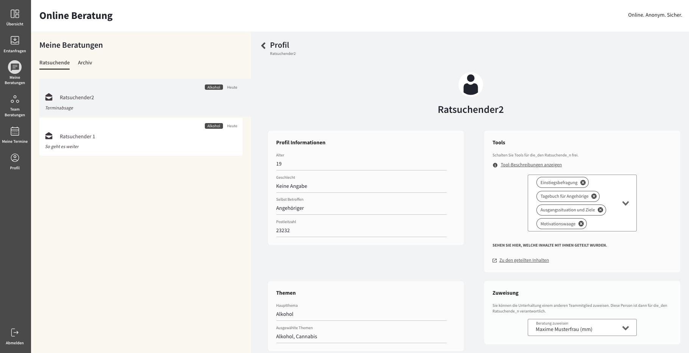
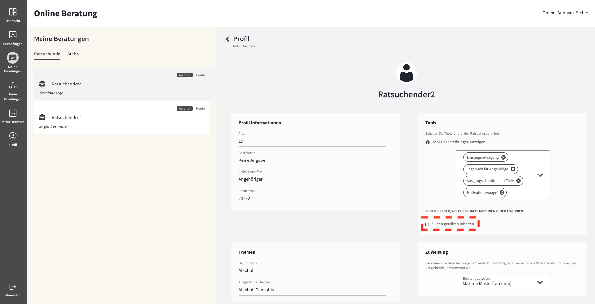

import { PrimaryNote, Bold, UIElement } from "../../components.jsx";

<PrimaryNote>
  Bei der Funktion <Bold>Tools</Bold> handelt es sich um eine optionale
  Zusatzfunktion. Um Zugriff auf diese Funktion zu haben, muss Ihre
  Online-Beratungsplattform diese Zusatzfunktion gebucht haben.
</PrimaryNote>

Bezug genommen wird hierbei auf eine Zusatzfunktion, auf die Sie als Berater_in über das Ratsuchendenprofil zugreifen können.

## Verfügbare Tools

Die Funktion Tools ermöglicht es Ihnen als Berater_in unterschiedliche Zusatzfunktionen zur Verfügung zu stellen:

<ul>
  <li>
    <Bold>Konsumtagebuch</Bold>
  </li>
  Das Konsumtagebuch ermöglicht der/dem Ratsuchenden die tägliche Protokollierung
  des Alkoholkonsums, des Cannabiskonsums und/oder des Glücksspielverhaltens. Dokumentiert
  werden kann aktuell u. a. die Frequenz, die Menge bzw. die Dauer des Substanzkonsums
  / Glücksspielens sowie die Gründe / Umstände, in denen das Verhalten gezeigt wurde.
  <li>
    <Bold>Motivationswaage</Bold>
  </li>
  Die Motivationswaage hilft Ratsuchenden dabei, Vor- und Nachteile einer Verhaltensänderung
  abzuwägen und zu gewichten. Sie hilft beim Aufdecken von Ambivalenzen und Befürchtungen
  und ermöglicht das Ableiten von Schlussfolgerungen. Beratenden gibt das Tool Einblick
  in den motivationalen Stand der/des Ratsuchenden und ermöglicht eine Anpassung
  der individuellen Interventionen (z.B. Erkennen von Ansatzpunkten zum Umgang mit
  Befürchtungen).
  <li>
    <Bold>Ausgangssituation und Ziele</Bold>
  </li>
  Die Befragung hilft Ratsuchenden dabei, ihre aktuelle Situation genauer zu beschreiben
  und bewerten. Es dient als Grundlage für die Einschätzung, welche Übungen am besten
  geeignet sind, um ihre Problematik zu lösen. Die Antworten auf die Fragen geben
  auch der Beraterin / dem Berater einen Einblick in die aktuelle Situation und ermöglichen
  eine individuell abgestimmte Beratung.
  <li>
    <Bold>Einstiegsbefragung</Bold>
  </li>
  Die Einstiegsbefragung erfasst Informationen zur / zum Ratsuchenden und zum aktuellen
  Problemhintergrund. Die Befragung kann für Betroffene und Angehörige genutzt werden.
  Sie enthält Items des KDS-F, sowie (in Abhängigkeit der vorliegenden Problematik)
  ergänzende Fragebögen zu den Themen Alkoholkonsum (AUDIT), Cannabiskonsum (SDS),
  Mediennutzungsverhalten (CIUS) und Glücksspiel (PGSI)
  <li>
    <Bold>Tagebuch für Angehörige</Bold>
  </li>
  Das Tagebuch unterstützt die Selbstreflexion von Angehörigen und fördert den Prozess
  des Verstehens ihrer eigenen Gedanken und Gefühle im Zusammenhang mit Konflikten.
  Es dokumentiert die Erlebnisse des Tages und bietet eine Orientierung durch die
  drei Fragen, die in der Tagesansicht gezeigt werden. Dadurch kann das Tagebuch
  als Nachweis für die Arbeit mit Berater*innen dienen und eine Rückmeldung ermöglichen.
  <li>
    <Bold>Notfallkoffer</Bold>
  </li>
  Der Notfallkoffer ist ein personalisiertes Paket von Strategien und Werkzeugen,
  das Personen mit Suchterkrankungen dabei hilft, Rückfälle zu vermeiden und auf
  Herausforderungen vorbereitet zu sein. Der Koffer enthält wichtige Informationen
  und Tipps, die in schwierigen Situationen helfen können.
  <li>
    <Bold>Risikosituationen und Kontrollstrategien</Bold>
  </li>
  Das Tool unterstützt Menschen, die nach Rat suchen, dabei, ihre gegenwärtige Situation
  genauer zu beschreiben und zu bewerten. Es dient als Grundlage, um festzustellen,
  welche Maßnahmen am besten geeignet sind, um ihre Problematik zu lösen. Die Antworten
  auf die gestellten Fragen ermöglichen der Beraterin / dem Berater zudem einen Einblick
  in die aktuelle Situation und fördern eine individuell angepasste Beratung.
  <li>
    <Bold>Aktiv sein</Bold>
  </li>
  Dieses Tool bietet Ihnen Unterstützung dabei, eine gute Lebensqualität zu erreichen,
  um damit den Suchtdruck zu verringern und Rückfälle zu vermeiden. Insbesondere
  sportliche Aktivitäten können dabei helfen, Entzugserscheinungen zu reduzieren
  und Ihre Stimmung zu verbessern. Aber auch andere regelmäßige Aktivitäten können
  helfen, alte Gewohnheiten zu überwinden. Diese Übung gibt Ihnen Vorschläge, wie
  Sie Ihren Alltag aktiv und angenehm gestalten können und bietet Ihnen die Möglichkeit,
  Ihre eigenen Ideen für Aktivitäten einzutragen.
</ul>

## Freischalten von Tools

Standardmäßig stehen den Ratsuchenden zunächst keine Tools zur Verfügung. Allerdings können Sie als Berater_in für die Ihnen zugewiesenen Rastsuchenden ein oder mehrere Tools freischalten, sodass der entsprechende Ratsuchende auf diese Zusatzfunktionen zugreifen kann. Hierzu müssen Sie auf das Eingabefeld in dem Abschnitt <UIElement>Tools</UIElement> klicken.

Dann können Sie das Tool auswählen, welches Sie dem entsprechenden Ratsuchenden zur Verfügung stellen wollen.

<PrimaryNote>
  Nachdem Sie einem Ratsuchenden mindestens ein Tool zur Verfügung gestellt
  haben, hat der entsprechende Ratsuchende einen zusätzlichen Menüpunkt
  <UIElement>Tools</UIElement> im Hauptmenü verfügbar, worüber auf die Tools zugegriffen
  werden kann.
</PrimaryNote>

## Nutzung der Tools

Wenn Sie als Berater_in einem Ihrer Ratsuchenden die Nutzung der Tools freigeschaltet haben, können Ihre Ratsuchende diese Tools nutzen. Mithilfe der Tools können Ratsuchende Informationen bezüglich deren Probleme angeben. Diese Informationen können Ihre Ratsuchenden mit Ihnen teilen. Um auf diese geteilten Informationen zugreifen zu können, müssen Sie auf den Link <UIElement>Zu den geteilten Inhalten</UIElement> klicken.

Bei manchen Tools, wie z.B. dem Konsumtagebuch und der Motivationswaage müssen die Ratsuchenden den Berater_innen Erlaubnis geben, ihre Einträge einzusehen, bevor diese gelesen werden können.
