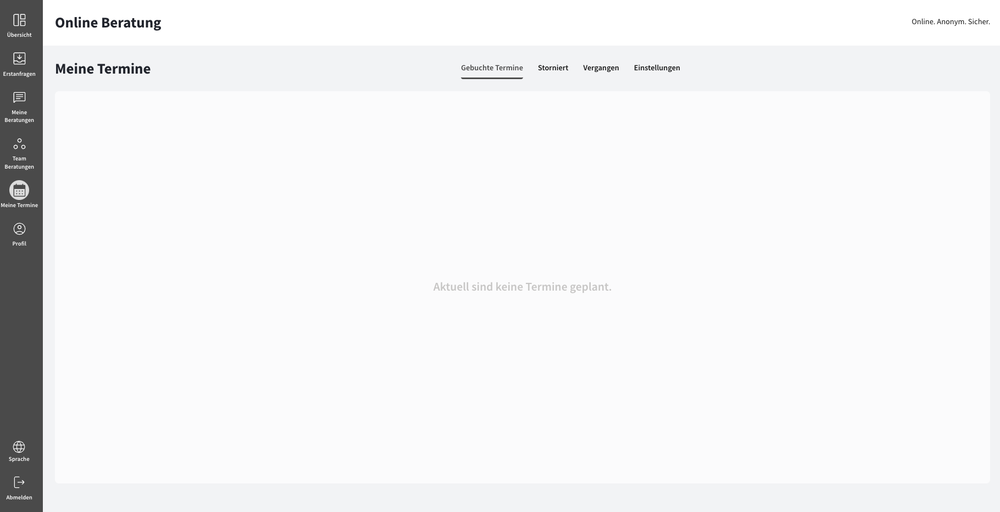
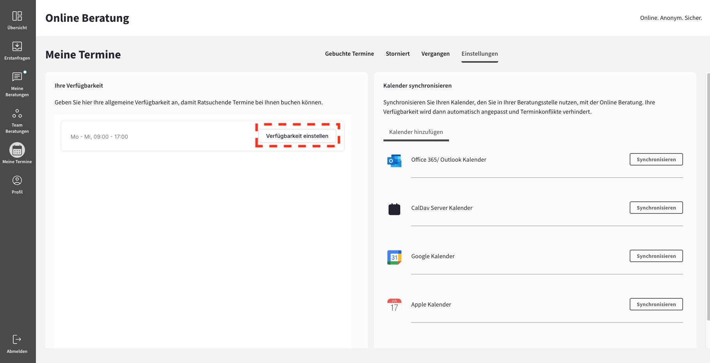

import { PrimaryNote, Bold, UIElement } from "../../components.jsx";

<PrimaryNote>
  Bei der Funktion "Meine Termine" handelt es sich um eine optionale
  Zusatzfunktion. Um Zugriff auf diese Funktion zu haben, muss Ihre
  Online-Beratungsplattform diese Zusatzfunktion gebucht haben.
</PrimaryNote>

## Allgemeine Informationen

Die Terminfunktion ermöglicht Ratsuchenden, Beratungstermine mit ihren Beratern zu buchen, wodurch das bestehende Beratungsangebot durch Textchat um eine weitere Komponente erweitert wird. Mit der Terminfunktion können Beratungstermine koordiniert und geplant werden.

Bitte beachten Sie, dass Ratsuchende bestimmte Termintypen auswählen können, die vom Mandanten-Administrator oder dem Beratungsstellen-Administrator festgelegt werden. Für diese Termintypen gibt es einige vorgegebene Konfigurationen, die von den Administratoren, nicht aber von Ihnen individuell angepasst werden können:

<ul>
  <li>Name des Erstberatungstyps</li>
  <li>Beschreibungstext</li>
  <li>Dauer des Erstberatungstyps</li>
  <li>Berater</li>
  Der Mandanten-Administrator hat die Möglichkeit, einem Termintyp einen oder
  mehrere Berater_innen zuzuweisen. Auf diese Weise kann festgelegt werden, bei
  welchen Berater_innen Termine über diesen Termintyp gebucht werden können.
  <li>Gewünschte Terminart</li>
  Des Weiteren können Ratsuchende aus den vier Terminarten "Videoberatung",
  "Vor-Ort-Beratung", "Chat" und "Telefon-Beratung" wählen. Der
  Mandanten-Administrator kann festlegen, welche Terminart für einen bestimmten
  Termintyp angeboten werden soll.
</ul>

## Terminübersicht

Um zu dem Menüpunkt <UIElement>Meine Termine</UIElement> zu gelangen, müssen Sie in der Navigationsleiste auf den Menüpunkt <UIElement>Meine Termine</UIElement> klicken.
Im Menüpunkt <UIElement>Meine Termine</UIElement> finden Sie umfassende Informationen und Tools zur Verwaltung Ihrer Termine. Hier können Sie verschiedene Anpassungen vornehmen und alle relevanten Details zu Ihren Terminen einsehen. Nutzen Sie diese Funktionen, um Ihr Terminmanagement optimal zu gestalten.

Die Ansicht <UIElement>Meine Termine</UIElement> unterteilt sich in vier Abschnitte, die Sie über die Tabs erreichen können:

<ul>
  <li>
    <UIElement>Gebuchte Termine</UIElement>
  </li>
  <li>
    <UIElement>Storniert</UIElement>
  </li>
  <li>
    <UIElement>Vergangen</UIElement>
  </li>
  <li>
    <UIElement>Einstellungen</UIElement>
  </li>
</ul>

<PrimaryNote>
  Bitte beachten Sie, dass Sie als Berater_in nicht befugt sind, Termine zu
  erstellen. Termine können ausschließlich von Ratsuchenden erstellt werden. Als
  Berater_in haben Sie jedoch die Möglichkeit, Termine zu verschieben oder
  abzusagen. Nutzen Sie diese Funktionen, um flexibel auf Änderungen zu
  reagieren und einen reibungslosen Ablauf zu gewährleisten.
</PrimaryNote>

### Gebuchte Termine

In diesem Abschnitt finden Sie eine übersichtliche Darstellung aller bevorstehenden Termine, die von Ratsuchenden erstellt wurden und Ihnen zugewiesen sind. Jeder Termin wird als Eintrag in der Liste angezeigt und bietet Ihnen die folgenden Informationen:

  <Bold>(1) Terminzeitpunkt</Bold>

  <Bold>
    (2) Link <UIElement>Zum Kalender hinzufügen</UIElement>, um den Termin Ihrem
    Kalender hinzuzufügen
  </Bold>
   
  Durch einen Klick auf diesen Link laden Sie eine Termindatei herunter, welche
  die Termindetails enthält, sodass Sie Ihren Kalender manuell synchronisieren
  können. Wenn Sie die Kalender-Synchronisation nutzen, was wir empfehlen,
  werden die Termine automatisch mit Ihrem Kalender synchronisiert. Die Datei
  enthält alle Termindetails außer der Terminnotizen, da es sich dabei um
  besonders sensible Information handeln kann.

  <Bold>(3) Name des Ratsuchenden</Bold>

  <Bold>(4) Gewünschte Terminart</Bold>

  <Bold>(5) Link zu einem Videoberatungsraum</Bold>
   
  Unabhängig von der vom Ratsuchenden gewählten Terminart generieren wir immer
  einen Link zum Video-Call als Alternative, falls Sie den Termin nicht im vom
  Ratsuchenden gewählten Modus wahrnehmen können.

  <Bold>(6) Nachricht des Ratsuchenden zum Termin</Bold>
   
  Dies ist die Terminnotiz, die Ratsuchende bei der Buchung des Termins eingeben
  können. Es handelt sich dabei um ein Freitextfeld. Terminnotizen werden bei
  Kalender-Synchronisation nicht in den Kalendertermin synchronisiert und sind
  nur über die Plattform einsehbar.

  <Bold>
    (7) Button <UIElement>Verschieben</UIElement> zum Verschieben des Termins
  </Bold>
   
  Sollten Sie wieder erwartend zum Zeitpunkt des Termines verhindert sein,
  können Sie den Termin verschieben. Tun Sie dies am besten in Rücksprache mit
  den Ratsuchenden. Ratsuchende erhalten bei Verschiebung eine Benachrichtigung
  im Nachrichtenverlauf der Beratungskommunikation mit aktualisierter Uhrzeit
  und Datum.

  <Bold>
    (8) Button <UIElement>Absagen</UIElement> zum Absagen des Termins
  </Bold>
   
  Sie können einen Termin auch jederzeit absagen. Tun Sie dies am besten in
  Rücksprache mit den Ratsuchenden. Ratsuchende erhalten bei einer Absage eine
  Benachrichtigung im Nachrichtenverlauf der Beratungskommunikation. Wenn ein
  Termin abgesagt ist, können Sie die Termindetails im Tab{" "}
  <UIElement>Storniert</UIElement> einsehen.

  <Bold>
    (9) Button <UIElement>Video-Call starten</UIElement> zum Starten des
    Video-Calls
  </Bold>

### Stornierte Termine

In diesem Abschnitt finden Sie eine übersichtliche Darstellung aller Termine, die von Ihnen oder von Ratsuchenden, die Ihnen zugewiesen sind, storniert wurden.

### Vergangene Termine

In diesem Abschnitt erhalten Sie eine übersichtliche Auflistung aller vergangenen Termine.

### Einstellungen

In diesem Abschnitt haben Sie verschiedene Einstellungsmöglichkeiten.

Der Abschnitt <UIElement>Einstellungen</UIElement> unterteilt sich in
• Ihre Verfügbarkeiten
• Kalender synchronisieren

#### Ihre Verfügbarkeiten

Durch einen Klick auf den Button <UIElement>Verfügbarkeit einstellen</UIElement> aktivieren Sie den Bearbeitungsmodus und können Ihre Verfügbarkeiten für Termin einstellen:

Sie können an dieser Stelle zwei Einstellungen vornehmen:

<ul>
  <li><Bold>Verfügbarkeiten festlegen</Bold></li>
  Geben Sie hier Ihre allgemeine Verfügbarkeit an, damit Ratsuchende Termine bei Ihnen buchen können.
  Sie können hier festlegen, an welchen Tagen zu welchen Zeiten Sie grundsätzlich für Termine zur Verfügung stehen. Dafür müssen Sie die Umschalttaste für die entsprechenden Tage aktivieren. Standardmäßig sind keine Verfügbarkeiten vordefiniert.
  Sie können für einen Tag mehrere Zeitfenster hinterlegen, an denen Sie für Beratungstermine zur Verfügung stehen. Um ein neues Zeitfenster hinzuzufügen, müssen Sie das <UIElement>+</UIElement> Symbol klicken.
  Sie können auch einzelnen Zeitfenster für andere Tage replizieren, ohne diese nochmal von Hand eingeben zu müssen, indem sie das Kopieren-Symbol klicken.
  Um einzelne Zeitfenster zu löschen, müssen Sie das Mülleimer-Symbol klicken.
  Die von Ihnen hier hinterlegten Verfügbarkeiten stehen Ihren Ratsuchenden zur Verfügung, um Beratungstermine bei Ihnen zu buchen.
  Aus den von Ihnen angegebenen Zeitfenstern und der eingestellten Terminlänge, berechnet die Plattform automatisch Terminfenster, die von Ihren Ratsuchenden gebucht werden können. Wenn Sie also z.B. eine Verfügbarkeit von 9:00 - 12:00 Uhr eintragen und die Terminlänge 60 Minuten beträgt, dann sehen Ratsuchende drei Terminfenster, aus denen Sie wählen können.

<li>
  <Bold>Datumsüberschreibungen</Bold>
</li>
Hier haben Sie die Möglichkeit, Abwesenheiten einzutragen. Sie können also Termine
hinzuzufügen, an denen Ihre Verfügbarkeit von Ihren üblichen Verfügbarkeiten abweicht.
Diese Funktion eignet sich beispielsweise, wenn Sie durch Krankheit oder Urlaub an
bestimmten Tagen nicht verfügbar sind. Dadurch verhindern Sie, dass Ratsuchende neue
Termine an diesen Zeitpunkten buchen können. Sie können sich entweder für einzelne
Zeitslots als abwesend eintragen oder auch ganztägig.

  <PrimaryNote>
    Um die von Ihnen vorgenommenen Angaben anzuwenden, müssen Sie unbedingt auf den <UIElement>Speichern</UIElement>-Button klicken. Andernfalls gehen Ihre vorgenommenen Änderungen verloren.
  </PrimaryNote>
</ul>

#### Kalender synchronisieren

An dieser Stelle haben Sie verschiedene Optionen, welche Kalender Sie zur Synchronisierung mit der Online-Beratungsplattform nutzen wollen:

<ul>
  <li>Office 365 / Outlook Kalender</li>
  <li>CalDav Server Kalender</li>
  <li>Google Kalender</li>
  <li>Apple Kalender</li>
</ul>

Um einen neuen Kalender hinzuzufügen, gehen Sie auf den Tab <UIElement>Kalender hinzufügen</UIElement> und wählen Sie den Kalendertypen aus und klicken auf den <UIElement>Synchronisieren</UIElement> Button und folgen den Anweisungen.

<PrimaryNote>
  Um die Kalender-Synchronisation zu ermöglichen, benötigt die
  Online-Beratungsplattform Zugriffsberechtigungen, die umfangreich klingen
  können. Es ist jedoch wichtig zu beachten, dass keinerlei Termindaten aus
  Ihrem Kalender in der Onlineberatung gespeichert werden. Die Plattform fragt
  lediglich ab, ob an bestimmten Terminen bereits Terminkonflikte vorliegen oder
  nicht. Zudem werden gebuchte Termine lediglich in den von Ihnen gewählten
  Kalender eingetragen. Möglicherweise muss Ihr IT-Administrator die
  Online-Beratungsapplikation freischalten, um die Synchronisation nutzen zu
  können. Sollte dies der Fall sein, werden Sie entsprechend informiert, wenn
  Sie Ihren Kalender synchronisieren möchten.
</PrimaryNote>

Wenn Sie Ihren Kalender erfolgreich verbunden haben, können Sie auswählen, in welchen Kalender neue Termine eingetragen werden sollen.

Wenn Sie Ihren Kalender erfolgreich verbunden haben, können Sie die Kalender wechseln, in denen nach Konflikten gesucht werden sollen, um Doppelbuchungen zu vermeiden:

Wenn Sie einen Kalender zur Synchronisation hinzugefügt haben, haben Sie folgende Vorteile:

<ul>
  <li>
    Die synchronisierten Kalender werden während der Terminbuchung auf
    Terminkonflikte überprüft. Dadurch wird verhindert, dass Termine zu Zeiten
    gebucht werden, an denen Sie bereits andere Termine oder Abwesenheiten
    eingetragen haben.
  </li>
  <li>
    Termine, die über die Online-Beratungsplattform gebucht werden, werden
    automatisch in den ausgewählten Kalender übertragen. Dabei wird der
    Nutzername der Ratsuchenden übertragen, nicht aber die Terminnotizen. Die
    E-Mail-Adresse der Ratsuchenden ist für Sie als Berater_in aus
    Datenschutzgründen nicht einsehbar.
  </li>
</ul>

Wenn Sie weitere Kalender hinzufügen wollen, gehen Sie einfach wieder auf den entsprechenden Reiter <UIElement>Kalender hinzufügen</UIElement> und wählen Sie einen weiteren Kalender aus, der zur Synchronisierung genutzt werden soll.

Wenn Sie einen Kalender gar nicht mehr zur Synchronisation nutzen wollen, trennen Sie ihn durch Klicken auf den Button mit dem Mülleimer-Symbol.

