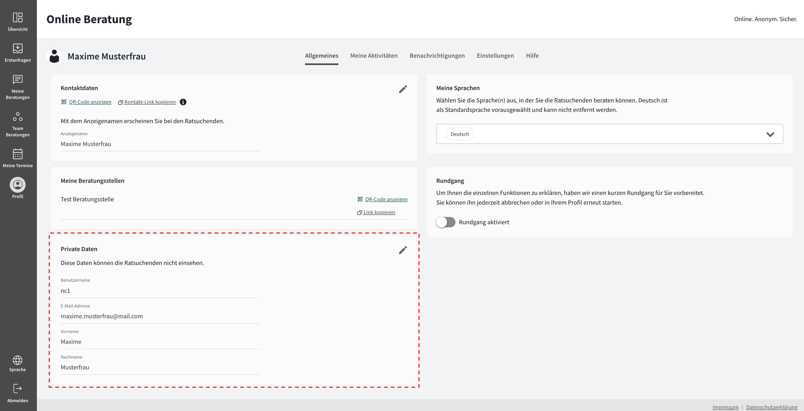

import { PrimaryNote, Bold, UIElement } from "../../components.jsx";
import useBaseUrl from "@docusaurus/useBaseUrl";

Um zu Ihrem Profil zu gelangen, müssen Sie in der Navigationsleiste auf den Menüpunkt <UIElement>Profil</UIElement> klicken.

Unter dem Menüpunkt <UIElement>Profil</UIElement> finden Sie alle Einstellungen, die Ihr Profil betreffen. Hier haben Sie die Möglichkeit, verschiedene Anpassungen vorzunehmen und Informationen zu bearbeiten, um Ihr Profil Ihren Bedürfnissen anzupassen.

  

Das Profil unterteilt sich in fünf Abschnitte, die Sie über die Tabs erreichen können:

<ul>
  <li>
    <UIElement>Allgemeines</UIElement>
  </li>
  <li>
    <UIElement>Meine Aktivitäten</UIElement>
  </li>
  <li>
    <UIElement>Benachrichtigungen</UIElement>
  </li>
  <li>
    <UIElement>Einstellungen</UIElement>
  </li>
  <li>
    <UIElement>Hilfe</UIElement>
  </li>
</ul>

## Allgemeines

Der Abschnitt <UIElement>Allgemeines</UIElement> besteht aus fünf Unterteilungen:

<ul>
  <li>
    <UIElement>Kontaktdaten</UIElement>
  </li>
  <li>
    <UIElement>Meine Beratungsstellen</UIElement>
  </li>
  <li>
    <UIElement>Private Daten</UIElement>
  </li>
  <li>
    <UIElement>Meine Sprachen</UIElement>
  </li>
  <li>
    <UIElement>Rundgang</UIElement>
  </li>
</ul>

<PrimaryNote>
  Beachten Sie, dass es sich bei dem Punkt <UIElement>Rundgang</UIElement> um
  eine optionale Funktion handelt, die auf Ihrer Onlineberatungsinstanz unter
  Umständen nicht aktiviert ist.
</PrimaryNote>

### Kontaktdaten

In diesem Abschnitt haben Sie die Möglichkeit, Ihren Anzeigenamen zu ändern. Bei dem Anzeigenamen handelt es sich um den Namen, mit dem Sie bei den Ratsuchenden erscheinen.

Zudem haben Sie die Möglichkeit, den Link zu Ihrem persönlichen Beratungsprofil zu kopieren und an Ratsuchende weiterzuleiten. Ihr persönlicher Link ermöglicht es Ratsuchenden, direkt mit Ihnen eine Online-Beratung zu beginnen (die erste Nachricht des Ratsuchenden wird direkt in <UIElement>Meine Nachrichten</UIElement> geleitet und steht nicht zunächst unter <UIElement>Erstanfragen</UIElement> zur Annahme zur Verfügung).

<PrimaryNote>
  Die Eingaben der Ratsuchenden bei der Registrierung werden erfasst, aber in dem Suchprozess der Beratungsstellen ignoriert. Es werden alle Beratungsstellen des entsprechenden Beraters / der entsprechenden Beraterin angezeigt, welche als <UIElement>in der Registrierung sichtbar</UIElement> eingestellt sind (Einstellung der Beratungsstelle).

  

  
  Wenn dem Berater oder der Beraterin keine aktive Beratungsstelle zugeordnet ist, wird der Direktlink zu Ihnen funktionslos und die Registrierung erfolgt auf normalem Weg. In diesem Fall werden den Ratsuchenden alle Beratungsstellen angezeigt, die den Angaben in der Registrierung entsprechen. Dies stellt sicher, dass Ratsuchende weiterhin Hilfe erhalten können, selbst wenn bestimmte Beratungsstellen oder Berater nicht mehr verfügbar sind.
</PrimaryNote>

### Meine Beratungsstellen

In diesem Abschnitt haben Sie eine Übersicht über die Beratungsstellen, denen Sie als Berater_in zugeordnet sind.

Zudem haben Sie die Möglichkeit, einen Registrierungslink zu einer Ihrer Beratungsstelle zu kopieren und an Ratsuchende weiterzuleiten. Der Registrierungslink zu einer Beratungsstelle ermöglicht es den Ratsuchenden, sich direkt bei der entsprechenden Beratungsstelle zu registrieren.

<PrimaryNote>
  Die Eingaben der Ratsuchenden bei der Registrierung werden erfasst, jedoch für
  die Anzeige der Beratungsstellen ignoriert. Es wird lediglich die
  Beratungsstelle angezeigt, zu der der entsprechende Direktlink gehört,
  unabhängig davon, ob diese Beratungsstelle zum Zeitpunkt der Registrierung
  aktiv ist oder nicht.
</PrimaryNote>

### Private Daten

In diesem Abschnitt haben Sie eine Übersicht über Ihre persönlichen Daten. Sie können diese verändern und anpassen. Ihre E-Mail-Adresse und Ihr Vor- und Nachname werden den Ratsuchenden nicht angezeigt. Nur andere Berater_innen können Ihren Vor- und Nachnamen einsehen.

### Meine Sprache

In diesem Abschnitt haben Sie die Möglichkeit, die von Ihnen gesprochenen Sprachen auszuwählen. Damit können Sie angeben, in welchen Sprachen Sie beraten können. Die Sprachen werden den Ratsuchenden dann im Registrierungsprozess angezeigt:

Vor dem Senden der Erstanfrage können Ratsuchende auswählen, in welcher Sprache sie beraten werden möchten:

Außerdem steht neben jeder Erstanfrage die vom Ratsuchenden vorausgewählte Sprache. So kann der / die Berater_in sofort erkennen, ob sie die vom Ratsuchenden ausgewählte Sprache spricht, und ihm in dieser antworten kann:

### Rundgang

<PrimaryNote>
  Hierbei handelt es sich um eine optionale Zusatzfunktion.
</PrimaryNote>

Diese Funktion ist optional und kann als Zusatzfunktion genutzt werden. Der Zugriff auf diese Zusatzfunktion hängt davon ab, ob Sie diese Funktion gebucht haben oder nicht. Durch einen Klick auf die Umschalttaste starten Sie den Rundgang durch die Anwendung. Der automatisierte Rundgang dient, dazu Ihnen die einzelnen Funktionen der Online-Beratungsplattform zu erklären. Sie können diesen Rundgang jederzeit abbrechen oder in Ihrem Profil erneut starten.

## Meine Aktivitäten

Um zu dem Abschnitt <UIElement>Meine Aktivitäten</UIElement> zu gelangen, müssen Sie im Profil auf den Tab <UIElement>Meine Aktivitäten</UIElement> klicken.

Der Abschnitt <UIElement>Meine Aktivitäten</UIElement> besteht aus zwei Unterteilungen:

<ul>
  <li>
    <UIElement>Meine Statistik</UIElement>
  </li>
  <li>
    <UIElement>Meine Abwesenheit</UIElement>
  </li>
</ul>

### Meine Statistik

In diesem Abschnitt haben Sie die Möglichkeit, Ihre eigenen Statistiken einzusehen.
Dabei stehen die Daten aus den folgenden Zeiträumen zur Verfügung:

<ul>
  <li>der aktuelle Monat</li>
  <li>der letzte Monat</li>
  <li>das aktuelle Jahr</li>
  <li>das letzte Jahr</li>
</ul>

Die erhobenen Zahlen aus diesen Zeiträumen separiert in:

<ul>
  <li>die Anzahl der angenommenen Beratungen</li>
  <li>die Anzahl der geschriebenen Nachrichten</li>
</ul>

Des Weiteren steht eine Excel Datei zum Download, über den gewählten Zeitraum, zur Verfügung.

Diese Datei beinhaltet zusätzlich die erhobenen Werte zu:

<ul>
  <li>
    den aktiven Beratungen (eine Beratung gilt als aktiv, sofern mindestens eine
    Nachricht im gewählten Zeitraum geschrieben wurde)
  </li>
  <li>der Dauer von Videoanrufen in Minuten : Sekunden.</li>
</ul>

### Meine Abwesenheit

In diesem Abschnitt haben Sie die Möglichkeit, eine Abwesenheitsnachricht zu verfassen und zu hinterlegen. Um diese Funktion zu aktivieren, muss der Umschalttaste <UIElement>Ratssuchende über meine Abwesenheit informieren</UIElement> aktiviert werden. Im Vorfeld müssen Sie dazu eine Nachricht in das Textfeld schreiben. Nach erfolgreicher Einstellung einer Abwesenheitsnachricht erscheint folgender Bestätigungshinweis:

Ihre aktivierte Abwesenheitsnachricht wird Ihren Ratsuchenden angezeigt, wenn diese die Beratungskommunikation mit Ihnen öffnen:

<PrimaryNote>
  Die Abwesenheitsfunktion greift nur bei bereits bestehenden
  Beratungskommunikationen, nicht bei Erstanfragen. Bei Erstanfragen werden die
  Abwesenheitshinweise bewusst nicht eingeblendet, da andere Kollegen der
  Beratungsstelle die Erstanfrage annehmen können.
</PrimaryNote>

Wenn Sie sich mit aktivierter Abwesenheitsnachricht abmelden und später wieder anmelden, sehen Sie folgenden Hinweis nach der Anmeldung:

Soll die Abwesenheitsnachricht weiterhin aktiv bleiben, klicken Sie auf <UIElement>Nein</UIElement>. Möchten Sie die Beratungen wieder aufnehmen und die Abwesenheitsnachricht deaktivieren, klicken Sie auf <UIElement>Ja</UIElement>.

## Benachrichtigungen

Um zu dem Abschnitt <UIElement>Benachrichtigungen</UIElement> zu gelangen, müssen Sie im Profil auf den Tab <UIElement>Benachrichtigungen</UIElement> klicken.

Als Berater_in haben Sie die Möglichkeit, sowohl E-Mail-Benachrichtigungen als auch Browser-Benachrichtigungen zu aktivieren. Dadurch erhalten Sie sofortige Benachrichtigungen per E-Mail oder per Browser-Benachrichtigungen über wichtige Informationen und neue Nachrichten.

Um diese Funktionen zu aktivieren, müssen Sie auf die entsprechende Schaltfläche klicken. Dadurch ist diese Funktion aktiviert und sie haben die Möglichkeit einzelne Benachrichtigungen zu aktivieren bzw. zu deaktivieren. Hier können Sie individuell entscheiden, in welchen Fällen Sie eine Benachrichtigung erhalten wollen:

Der Abschnitt <UIElement>Benachrichtigungen</UIElement> besteht aus zwei Unterteilungen:

<ul>
  <li>
    <UIElement>E-Mail-Benachrichtigungen</UIElement>
  </li>
  <li>
    <UIElement>Browser-Benachrichtigungen</UIElement>
  </li>
</ul>

### E-Mail-Benachrichtigungen

Für Sie als Berater_in sind die E-Mail-Benachrichtigungen standardmäßig aktiviert. E-Mail-Benachrichtigungen können für folgende Ereignisse ein- oder ausgeschaltet werden:

<ul>
  <li><Bold>Neue Erstanfrage</Bold></li>
  Der Berater / die Beraterin erhält eine E-Mail-Benachrichtigung, wenn eine neue Erstanfrage in 
  einer Beratungsstelle eingeht, welcher er / sie zugeordnet ist.
  Als Berater_in erhalten Sie diese E-Mail-Benachrichtigung unabhängig davon, ob Sie im System angemeldet sind oder nicht.

<li>
  <Bold>Neue Chat-Nachricht</Bold>
</li>
Als Berater_in erhalten Sie eine E-Mail-Benachrichtigung, wenn Ratsuchende, die Ihnen
zugeordnet sind, Ihnen eine neue Nachricht senden. Als Berater_in erhalten Sie diese
E-Mail-Benachrichtigung nur, wenn Sie nicht im System angemeldet sind.

<li>
  <Bold>Neuzuweisung eines Ratsuchenden</Bold>
</li>
Der Berater / die Beraterin erhält eine E-Mail-Benachrichtigung, wenn ein anderer
Berater Ihnen eine Beratungskommunikation zuweist und der Ratsuchende dieser Zuweisung
zustimmt. Als Berater_in erhalten Sie diese E-Mail-Benachrichtigung unabhängig davon,
ob Sie im System angemeldet sind oder nicht.

  <li><Bold>Termine</Bold></li>
  Der Berater / die Beraterin erhält eine E-Mail-Benachrichtigung, wenn ein Termin angesetzt, verschoben oder abgesagt wurde.
  Als Berater_in erhalten Sie diese E-Mail-Benachrichtigung unabhängig davon, ob Sie im System 
  angemeldet sind oder nicht.
</ul>

### Browser-Benachrichtigungen

Für Sie als Berater_in sind die Browser-Benachrichtigungen standardmäßig deaktiviert.

<PrimaryNote>
  Um diese Funktion nutzen zu können, müssen Sie prüfen, ob Sie in den
  Browsereinstellungen die Berechtigungen aktiviert haben, um Ihnen
  Browser-Benachrichtigungen zu senden. Je nach Browser können Sie diese
  Einstellung auch nur für eine Sitzung, für immer oder einen bestimmten
  Zeitraum vormerken und Sie können die Entscheidung über die Browser
  Einstellungen jederzeit wieder ändern.
</PrimaryNote>

Wenn Sie die Benachrichtigungen zulassen, erhalten Sie auditive und visuelle Hinweise beim Erhalten neuer Erstanfragen und Nachrichten, auch wenn Sie gerade in einem anderen Browserfenster arbeiten. Diese erhalten Sie nur, solange Sie auch in der Anwendung angemeldet sind:

<ul>
  <li>
    <Bold>Neue Erstanfrage</Bold>
  </li>
  Der Berater / die Beraterin erhält eine Browser-Benachrichtigung, wenn eine neue
  Erstanfrage in einer Beratungsstelle eingeht, welcher er / sie zugeordnet ist.
  <li>
    <Bold>Neue Chat-Nachricht</Bold>
  </li>
  Als Berater_in erhalten Sie eine Browser-Benachrichtigung, wenn Ratsuchende, die
  Ihnen zugeordnet sind, Ihnen eine neue Nachricht senden.
</ul>

  

  

## Einstellungen

Um zu dem Abschnitt <UIElement>Einstellungen</UIElement> zu gelangen, müssen Sie im Profil auf den Tab <UIElement>Einstellungen</UIElement> klicken.

Der Abschnitt <UIElement>Einstellungen</UIElement> besteht aus drei Unterteilungen:

<ul>
  <li>
    <UIElement>Passwort</UIElement>
  </li>
  <li>
    <UIElement>Zwei-Faktor-Authentifizierung</UIElement>
  </li>
  <li>
    <UIElement>Sprachen</UIElement> – optionale Funktion
  </li>
</ul>

### Passwort

Diese Funktion ermöglicht es Ihnen, Ihr Passwort zu ändern. Hierzu müssen Sie zuerst ihr aktuelles Passwort unter <UIElement>Aktuelles Passwort</UIElement> eingeben. Anschließend müssen Sie zweimal Ihr neues Passwort gemäß der Passwortrichtlinien eingeben. Ob ihr Passwort die Passwortrichtlinien erfüllt, wird Ihnen während der Eingabe direkt angezeigt:

Anschließend wird der <UIElement>Passwort ändern</UIElement> Button aktiviert. Durch einen Klick auf diesen Button bestätigen Sie, dass Sie Ihr Passwort ändern möchten. Dadurch werden Sie automatisch abgemeldet und zur Login-Seite weitergeleitet, auf welcher Sie sich mit Ihrem neu gesetzten Passwort wieder anmelden können.

### Zwei-Faktor-Authentifizierung

Alle Information zur Aktivierung und Deaktivierung des zweiten Faktors finden Sie in Kapitel "Ersteinrichtung"

### Sprachauswahl

Alle Information zur Sprachauswahl finden Sie in Kapitel "Sprache"

## Hilfe

Um zu dem Abschnitt <UIElement>Hilfe</UIElement> zu gelangen, müssen Sie im Profil auf den Tab <UIElement>Hilfe</UIElement> klicken.

Hier befindet sich eine Weiterleitung zu der Online-Dokumentation. Um zur Online-Dokumentation zu gelangen, klicken Sie auf den Link <UIElement>Zum Handbuch</UIElement>. In der Online-Dokumentation finden Sie alle Informationen, die Sie zur Verwendung der Online-Beratungsplattform benötigen.

## Sprache

<PrimaryNote>
  Bei der Funktion "Sprache" handelt es sich um eine optionale Zusatzfunktion. 
  Ob Ihnen diese Funktion zur Verfügung steht, ist von zwei Faktoren abhängig:

  <ul>
    <li>Es handelt sich hierbei um eine optionale Zusatzfunktion, die zusätzlich gebucht werden muss, um diese auf Ihrer Online-Beratungsplattform nutzen zu können.</li>
    <li>Unter der Voraussetzung, dass Sie diese Zusatzfunktion für Ihre Online-Beratungsplattform gebucht haben, kann diese Funktion von Ihrem System-Administrator in der Verwaltungskonsole aktiviert und deaktiviert werden. Um Zugriff auf diese Funktion zu haben, muss also zum einen Ihre Online-Beratungsplattform diese Zusatzfunktion gebucht haben und zum anderen muss die Funktion von Ihrem System-Administrator aktiviert worden sein.</li>
  </ul>
</PrimaryNote>

Diese Funktion ermöglicht es Ihnen, die Sprache zu wechseln, in welcher Sprache Ihnen die Online-Beratungsplattform angezeigt werden soll. In der Anwendung können Sie die Sprache an verschiedenen Stellen auswählen oder ändern:

<ul>
  <li>Auf der Login-Seite</li>
  <li>Auf der Registrierungsseite</li>
  <li>Im Profil eines Beraters / einer Berater_in oder Ratsuchenden:</li>

<li>Im Hauptmenü der Anwendung:</li>
Um die Sprache im Hauptmenü auszuwählen, müssen Sie auf den Menüpunkt <UIElement>
  Sprache
</UIElement> in der Navigationsleiste klicken. Wenn Sie auf den Button Sprache klicken,
öffnet sich ein Dropdownmenü, aus dem eine verfügbare Sprache durch einen weiteren
Klick auf die gewünschte Sprache ausgewählt werden kann. Die Spracheinstellung nutzt
als Default die Spracheinstellung des Browsers. Wenn im Browser keine verfügbare
Sprache hinterlegt ist, dann wird die Applikation auf Deutsch angezeigt.

</ul>
