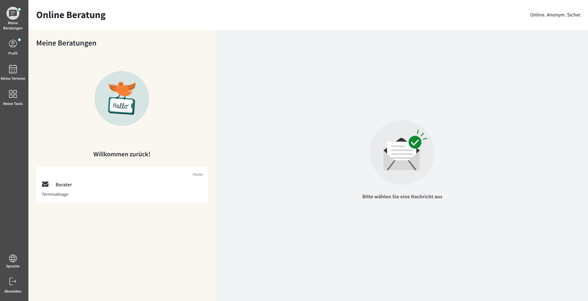

import { PrimaryNote, Bold, UIElement } from "../../components.jsx";
import useBaseUrl from "@docusaurus/useBaseUrl";

Nach erfolgreicher Anmeldung als Ratsuchender werden Sie zu dem ersten Menüpunkt weitergeleitet: <UIElement>Meine Beratungen</UIElement>.

Am linken Bildschirmrand befindet sich die Navigationsleiste, mit verschiedenen Menüpunkten:

<ul>
  <li>
    <UIElement>Meine Beratungen</UIElement>
  </li>
  <li>
    <UIElement>Profil</UIElement>
  </li>
  <li>
    <UIElement>Meine Termine</UIElement>
  </li>
  <li>
    <UIElement>Meine Tools</UIElement>
  </li>
  <li>
    <UIElement>Sprache</UIElement>
  </li>
  <li>
    <UIElement>Abmelden</UIElement>
  </li>
</ul>

<PrimaryNote>
  Bitte beachten Sie, dass es sich bei einigen der hier sichtbaren Menüpunkten
  um optionale Zusatzfunktionen handelt. Je nach Konfiguration Ihrer
  Online-Beratungsplattform stehen Ihnen nicht alle dieser Funktionen nicht zur
  Verfügung.
</PrimaryNote>

Um zwischen den Reitern zu wechseln, müssen sie auf den jeweiligen Reiter klicken. Dadurch wird der Reiter aktiv und optisch hervorgehoben.

Bei der mobilen Version befinden sich diese am unteren Rand des Bildschirms:

  

