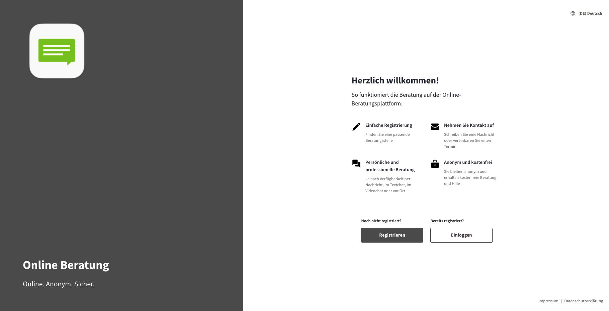
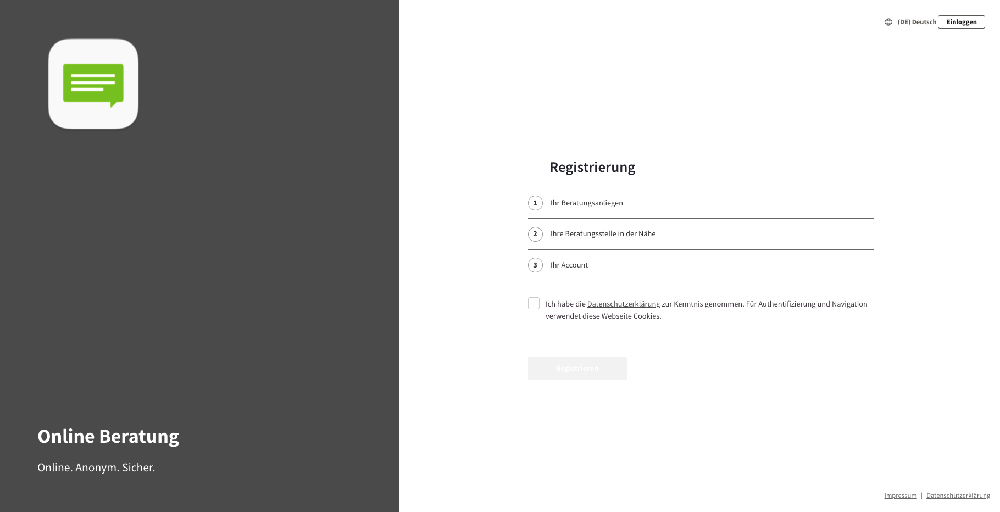
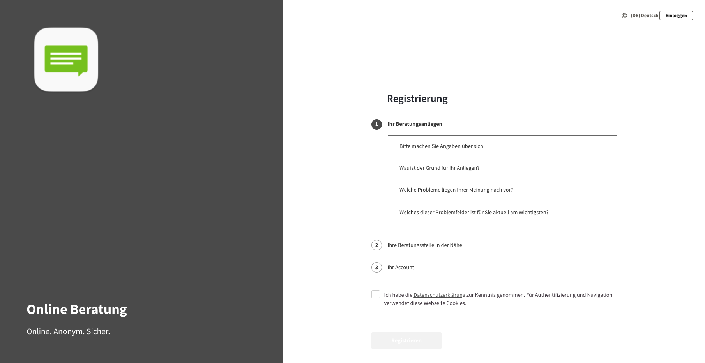
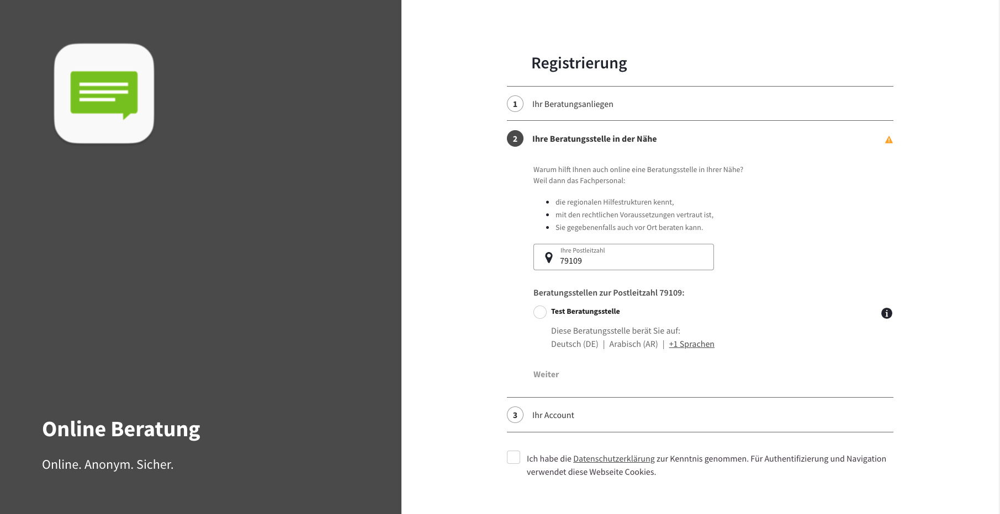
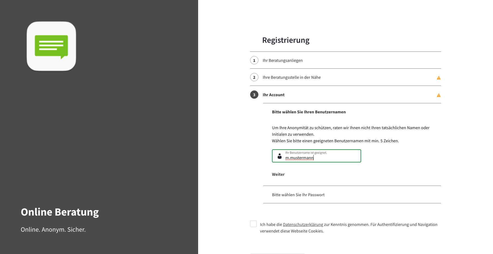
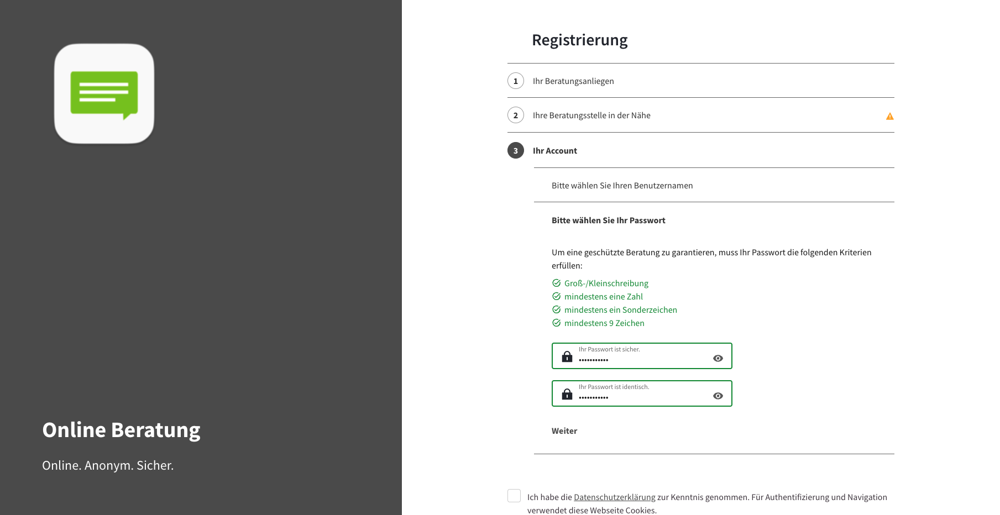

import { PrimaryNote, Bold, UIElement } from "../../components.jsx";
import useBaseUrl from "@docusaurus/useBaseUrl";

Wenn Sie ein Ratsuchender sind und bisher über kein Benutzerkonto bei der Online-Beratungsplattform verfügen, haben Sie die Möglichkeit sich zu registrieren, um über die Registrierung ein Benutzerkonto anzulegen.

Die Willkommensseite bietet einen umfassenden Überblick über die Funktionsweise der Online-Beratungsplattform und präsentiert dabei die wichtigsten Informationen. Zudem beinhaltet die Willkommensseite zwei Buttons:

<ul>
  <li>
    <UIElement>Registrieren</UIElement>
  </li>
  Dieser Button leitet Sie zur Registrierungsseite weiter.
  <li>
    <UIElement>Einloggen</UIElement>
  </li>
  Dieser Button leitet Sie zur Anmeldeseite weiter.
</ul>

Wenn Sie den [Registrieren] Button klicken, werden Sie zur Registrierungsseite weitergeleitet.

<PrimaryNote>
  Bitte beachten Sie, dass je Konfiguration der Online-Beratungsplattform, die
  hier im Anschluss erwähnten Informationen variieren können.
</PrimaryNote>

Das Registrierungsformular enthält drei Bereiche:

<ul>
  <li>Ihr Beratungsanliegen</li>
  <li>Ihre Beratungsstelle in der Nähe</li>
  <li>Ihr Account</li>
</ul>

## Ihr Beratungsanliegen

Dieser Bereich umfasst die Angabe folgender Informationen

<ul>
  <li>Alter</li>
  <li>Geschlecht</li>
  <li>
    die Beziehung zur betroffenen Person (selbst betroffen ODER Angehöriger),
  </li>
  <li>
    die Probleme und das Hauptproblem, für das die Ratsuchenden Beratung
    benötigen
  </li>
</ul>

## Beratungsstelle

Dieser Bereich umfasst die Angabe folgender Informationen:

<ul>
  <li>Die Postleitzahl, um eine Beratungsstelle in Ihrer Nähe zu finden</li>
  <li>Die Auswahl der Beratungsstelle</li>
  Basierend auf den von Ihnen im Registrierungsprozess angegebenen Informationen
  wird Ihnen an dieser Stelle eine Auswahl von Beratungsstellen angeboten, die
  zu Ihren Angaben passen. Um eine Auswahl von Beratungsstellen angeboten zu
  bekommen, müssen Sie alle Informationen in den vorherigen Punkten und die
  Postleitzahl eingegeben haben, um die verfügbaren Beratungsstellen zu sehen.
</ul>

Zudem sehen Sie an dieser Stelle, in welcher Sprache die jeweilige Beratungsstelle Ihr Beratungsangebot anbietet.

## Ihr Account

Dieser Bereich umfasst die Angabe folgender Informationen:

<ul>
  <li>Benutzername</li>
  Ihr Benutzernamens muss mindestens fünf Zeichen beinhalten. Es erscheint ein Warnhinweis,
  wenn die Mindestanforderung nicht erfüllt wird. Der [Weiter] Button wird erst aktiviert
  und damit klickbar, wenn die Mindestanforderung erfüllt ist.
</ul>

<ul>
  <li>Passwort</li>
  Ihr Passwort muss bestimmte Kriterien erfüllen: Groß-Kleinschreibung, mindestens
  eine Zahl, mindestens ein Sonderzeichen, mindestens 9 Zeichen. Erst wenn alle Kriterien
  erfüllt sind, färbt sich auch das Eingabefeld grün. Der [Weiter] Button wird erst
  aktiviert und damit klickbar, wenn die Mindestanforderung erfüllt ist.
</ul>

Erst wenn Sie den Datenschutzerklärungen und Nutzungsbedingungen zugestimmt haben, ist der gesamte Registrierungsprozess abgeschlossen. In diesem Fall wird der [Registrieren] Button aktiviert und damit klickbar.

<PrimaryNote>
  Verfassen Sie innerhalb von 24 Stunden nach der Registrierung keine
  Erstanfrage, dann wird ihr Account automatisch gelöscht.
</PrimaryNote>

## Registrierung mit Direktlinks

### Direktlink zu einem Berater / einer Beraterin

Wenn Sie sich mit einem Direktlink zu einem Berater / einer Beraterin registrieren, werden Ihre Eingaben bei der Registrierung erfasst, aber in dem Suchprozess der Beratungsstellen ignoriert. Es werden alle Beratungsstellen des entsprechenden Beraters / der entsprechenden Beraterin angezeigt.

Wenn dem Berater oder der Beraterin keine aktive Beratungsstelle zugeordnet ist, wird der Direktlink zu Ihnen funktionslos und die Registrierung erfolgt auf normalem Weg.

### Direktlink zu einer Beratungsstelle

Wenn Sie sich mit einem Direktlink zu einer Beratungsstelle registrieren, werden Ihre Eingaben bei der Registrierung erfasst, jedoch für die Anzeige der Beratungsstellen ignoriert. Es wird lediglich die Beratungsstelle angezeigt, zu der der entsprechende Direktlink gehört.
