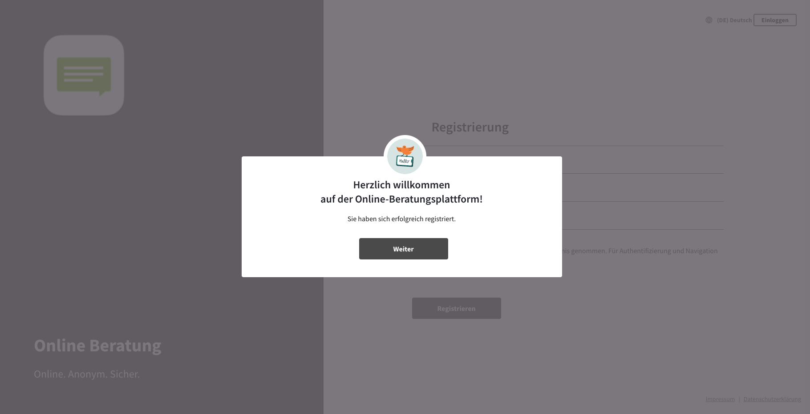
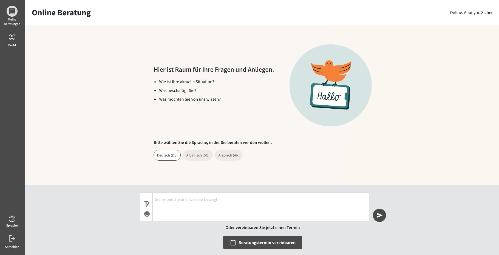
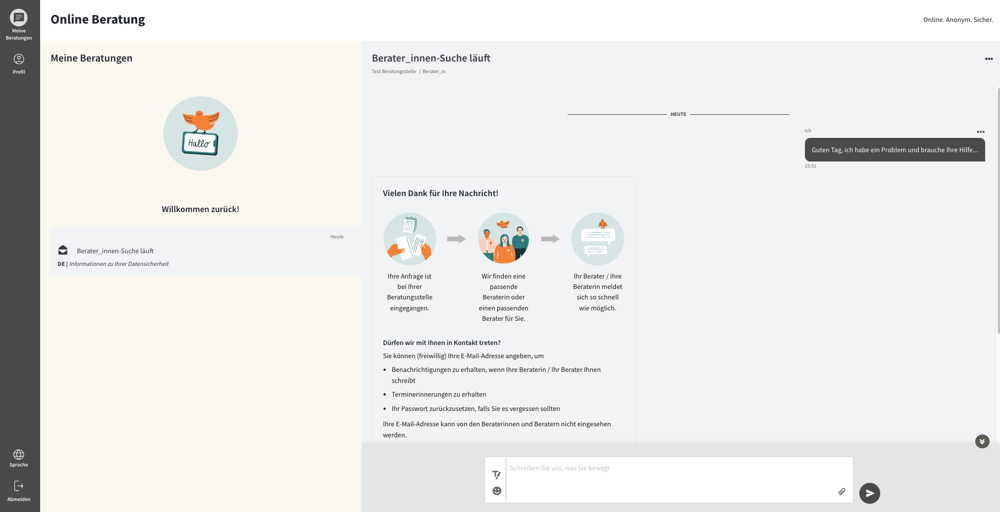
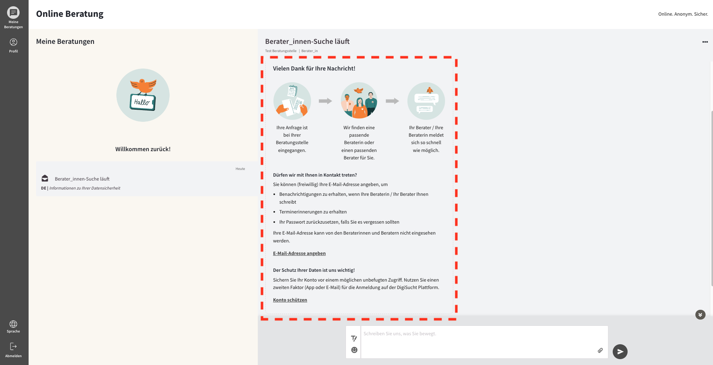
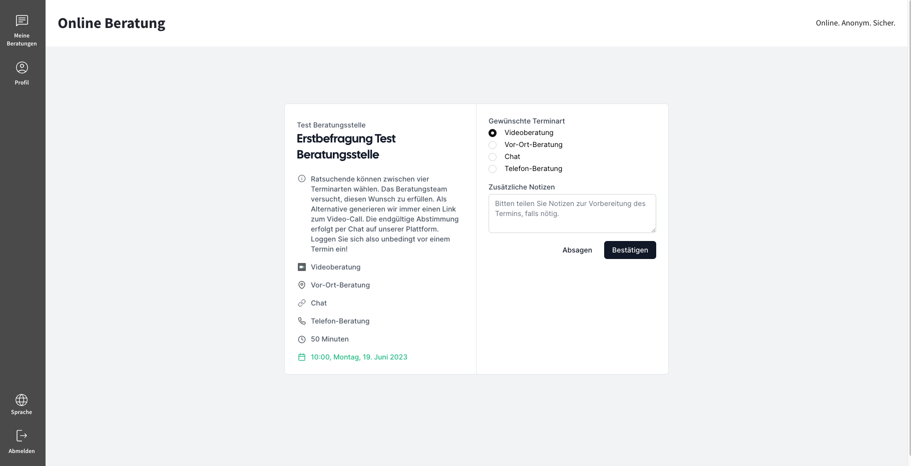
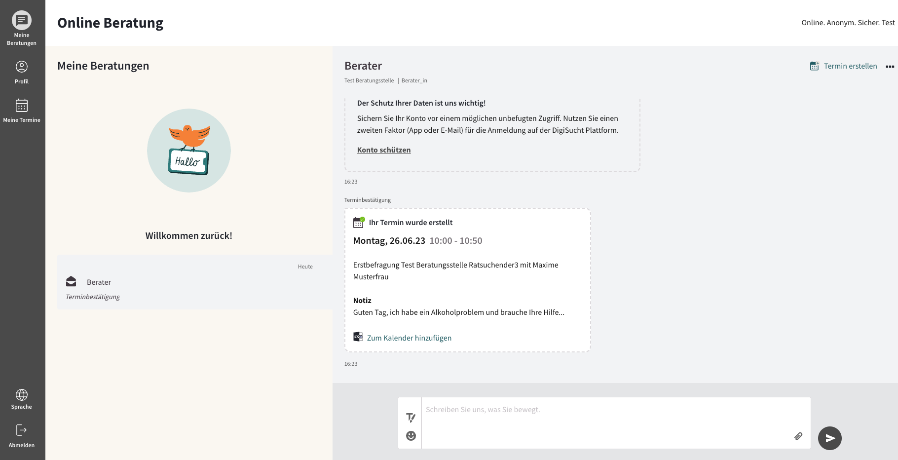

import { PrimaryNote, Bold, UIElement } from "../../components.jsx";
import useBaseUrl from "@docusaurus/useBaseUrl";

Nach der erfolgreichen Registrierung werden Sie automatisch bei der Online-Beratungsplattform angemeldet.

Vor dem Senden einer Erstanfrage können Sie die gewünschte Beratungssprache auswählen. Die verfügbaren Optionen basieren auf den Sprachen, die von den Beraterinnen und Beratern in der jeweiligen Beratungsstelle angeboten werden. Sie erhalten während des Registrierungsvorgangs eine Übersicht über die Sprachen, die von einer Beratungsstelle unterstützt werden.

Sie haben standardmäßig die Option, eine Textnachricht als Erstanfrage zu versenden. Wenn die optionale Terminfunktion von der von Ihnen verwendeten Online-Beratungsplattform verwendet wird, können Sie auch einen Beratungstermin als Erstanfrage vereinbaren. Dadurch haben Sie die Möglichkeit, direkt einen festen Termin für Ihre Beratung zu vereinbaren. Somit stehen Sie im ersten Schritt vor der Entscheidung, ob Sie eine Textnachricht als Erstnachricht versenden wollen oder einen Erstberatungstermin vereinbaren möchten.

## Textnachricht

Sie können Ihr Anliegen in das Textfeld eingeben und absenden. Ihnen wird automatisch ein Berater / eine Beraterin der Beratungsstelle zugewiesen, die Sie im Registrierungsprozess ausgewählt haben.

Nachdem Sie Ihre Erstanfrage als Textnachricht abgeschickt haben, startet die Berater_innen Suche. Sobald Ihnen ein Berater / eine Beraterin zugewiesen wurde und Ihnen geantwortet hat, sehen Sie dies in dieser Ansicht. Zusätzlich erhalten Sie eine Systemnachricht, welche wichtige Informationen für Sie bereithält:

Hier erfahren Sie, wie es Schritt für Schritt weiter geht. Zudem haben Sie hier direkt die Möglichkeit eine E-Mail-Adresse zu hinterlegen, mit dem Button <UIElement>E-Mail-Adresse angeben</UIElement> und die 2-Faktor-Authentifizierung zu aktivieren mit dem Button <UIElement>Konto schützen</UIElement>.

Sowohl das Hinterlegen einer E-Mail-Adresse als auch die Aktivierung der 2-Faktor-Authentifizierung kann jederzeit von dem Ratsuchenden im Profil nachträglich getätigt und wieder entfernt bzw. deaktiviert werden.

## Beratungstermin vereinbaren

Alternativ zur Textnachricht können Sie ebenfalls einen Beratungstermin als Erstanfrage vereinbaren, indem Sie auf den Button <UIElement>Beratungstermin vereinbaren</UIElement> klicken.

Entscheiden Sie sich für den Erstberatungstermin, müsse Sie im zweiten Schritt einen der angebotenen Termintypen der Beratungsstelle auswählen. Die Verwaltung der Termintypen wird von dem Administrator der Online-Beratungsplattform vorgenommen.

Nachdem Sie sich für einen Termintyp entschieden haben, müssen Sie im nächsten Schritt einen Terminzeitpunkt auswählen. Die verfügbaren Zeitpunkte, die Sie hier wählen können, hängen von den Verfügbarkeiten der Berater_innen, der von Ihnen gewählten Beratungsstelle ab.

Nachdem Sie sich für einen Termin entschieden haben, können Sie entscheiden, ob Sie eine Video-, Vor-Ort-, Chat- oder Telefon-Beratung buchen möchten. Zudem können Sie hier zusätzliche Notizen eintragen, um Ihrem Berater Informationen zu Ihrem Anliegen zu geben.

<PrimaryNote>
  Beachten Sie das die hier verfügbare Auswahl von Terminarten von Ihrer
  Beratungsstelle eingegrenzt werden kann.
</PrimaryNote>

Die Zuordnung zu einem Berater / einer Beraterin erfolgt in diesem Fall automatisiert. Sie werden automatisch einem Berater / einer Beraterin zugewiesen, die an dem von Ihnen gewählten Termin verfügbar ist.

Nachdem Sie automatisch einem Berater / einer Beraterin zugewiesen wurden, sehen sie eine Buchungsbestätigung Ihres Termins in dem Nachrichtenverlauf. Zudem können Sie Ihrem Berater / Ihrer nun auch Textnachrichten senden.

