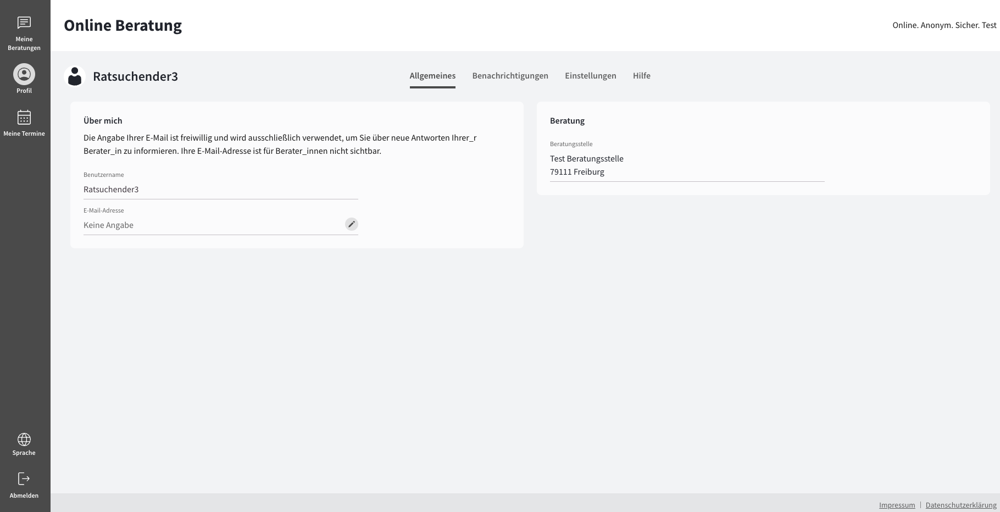
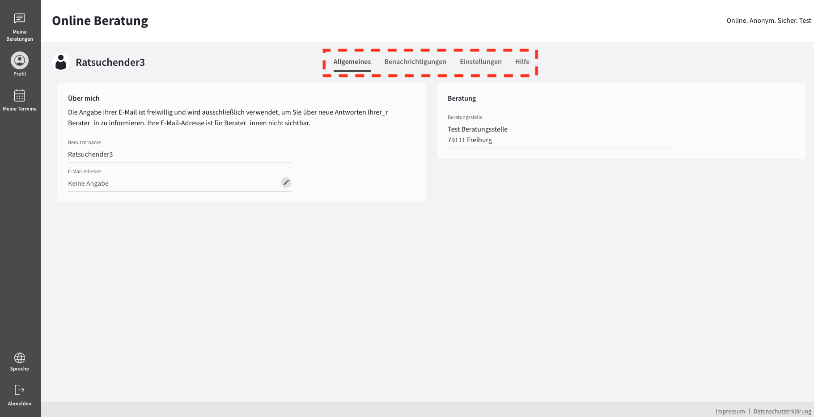
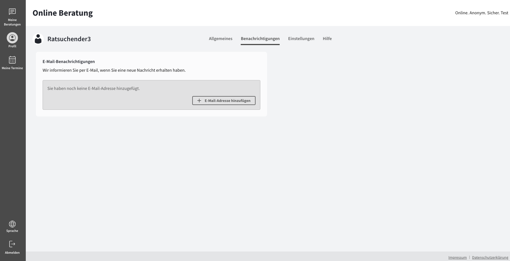
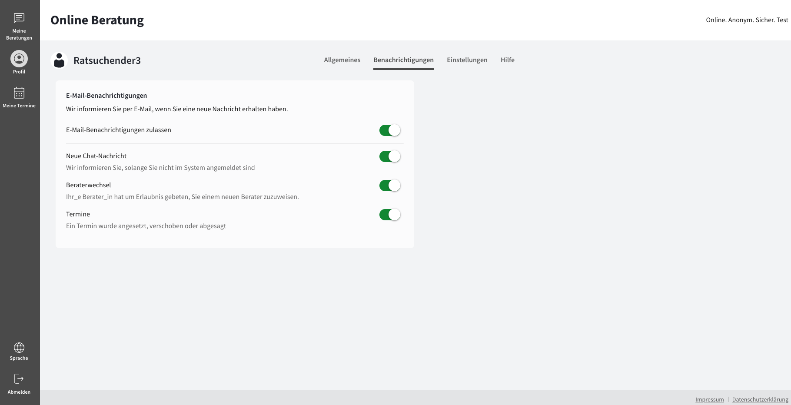
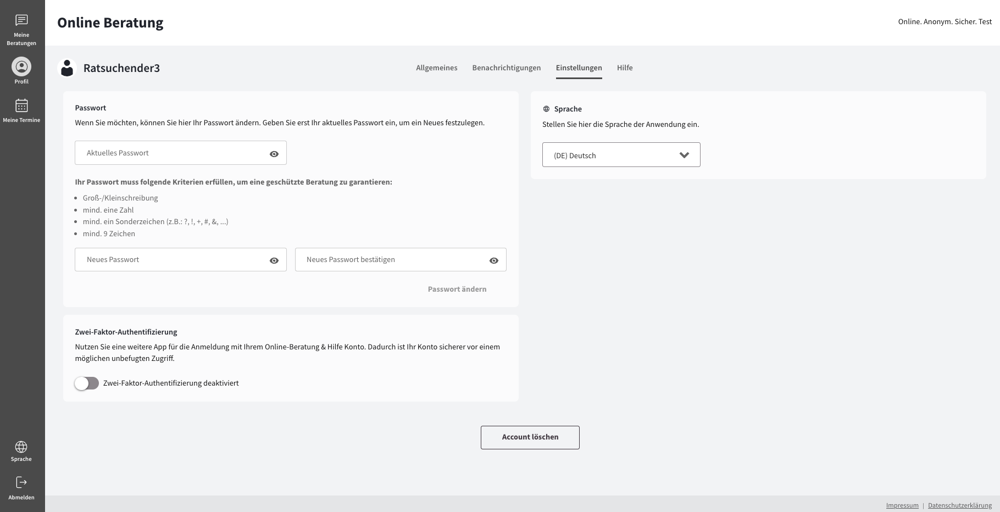
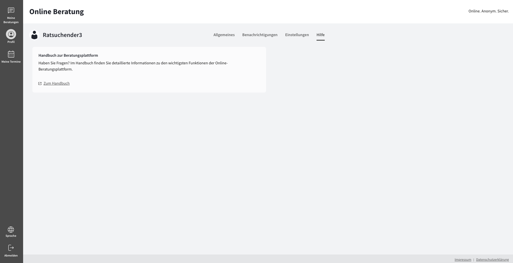

import { PrimaryNote, Bold, UIElement } from "../../components.jsx";
import useBaseUrl from "@docusaurus/useBaseUrl";

Um zu Ihrem Profil zu gelangen, müssen Sie in der Navigationsleiste auf den Menüpunkt <UIElement>Profil</UIElement> klicken.

Unter dem Menüpunkt <UIElement>Profil</UIElement> finden Sie alle Einstellungen, die Ihr Profil betreffen. Hier haben Sie die Möglichkeit, verschiedene Anpassungen vorzunehmen und Informationen zu bearbeiten, um Ihr Profil Ihren Bedürfnissen anzupassen.

  

Das Profil unterteilt sich in vier Abschnitte, die Sie über die Tabs erreichen können:

<ul>
  <li>
    <UIElement>Allgemeines</UIElement>
  </li>
  <li>
    <UIElement>Benachrichtigungen</UIElement>
  </li>
  <li>
    <UIElement>Einstellungen</UIElement>
  </li>
  <li>
    <UIElement>Hilfe</UIElement>
  </li>
</ul>

## Allgemeines

Der Abschnitt <UIElement>Allgemeines</UIElement> besteht aus zwei Unterteilungen:

<ul>
  <li>
    <UIElement>Über mich</UIElement>
  </li>
  <li>
    <UIElement>Beratung</UIElement>
  </li>
</ul>

### Über mich

In diesem Abschnitt haben Sie die Möglichkeit, eine E-Mail-Adresse zu hinterlegen oder eine hinterlegte E-Mail-Adresse zu löschen.

<PrimaryNote>
  Die Angabe Ihrer E-Mail ist freiwillig und wird ausschließlich verwendet, um
  Sie über neue Antworten Ihre_r Berater_in zu informieren. Ihre E-Mail-Adresse
  ist für Berater_innen nicht sichtbar.
</PrimaryNote>

### Beratung

In diesem Abschnitt sehen Sie, welcher Beratungsstelle Sie zugeordnet sind.

## Benachrichtigungen

Um zu dem Abschnitt <UIElement>Benachrichtigungen</UIElement> zu gelangen, müssen Sie im Profil auf den Tab <UIElement>Benachrichtigungen</UIElement> klicken.

Als Ratsuchender haben Sie die Möglichkeit, E-Mail-Benachrichtigungen zu aktivieren. Dadurch erhalten Sie sofortige Benachrichtigungen per E-Mail über wichtige Informationen und neue Nachrichten.

Für Sie als Ratsuchender sind die E-Mail-Benachrichtigungen standardmäßig deaktiviert, da Sie hierfür eine E-Mail-Adresse hinzufügen müssen. Nachdem Sie eine E-Mail-Adresse hinterlegt haben, können Sie E-Mail-Benachrichtigungen aktivieren.

### E-Mail-Benachrichtigungen

Für Sie als Ratsuchender sind die E-Mail-Benachrichtigungen standardmäßig deaktiviert, da Sie hierfür eine E-Mail-Adresse hinzufügen müssen. E-Mail-Benachrichtigungen können für folgende Ereignisse ein- oder ausgeschaltet werden:

<ul>
  <li>
    <Bold>Neue Chat-Nachricht</Bold>
  </li>
  Als Ratsuchender erhalten Sie eine E-Mail-Benachrichtigung, wenn Ihr Berater /
  Ihre Beraterin, Ihnen eine neue Nachricht senden. Als Ratsuchender erhalten Sie
  diese E-Mail-Benachrichtigung nur, wenn Sie nicht im System angemeldet sind.
  <li>
    <Bold>Beraterwechsel</Bold>
  </li>
  Der Ratsuchende erhält eine E-Mail-Benachrichtigung, wenn dieser von dessen Berater_in
  um Erlaubnis gebeten wird, einem / einer anderen Berater_in zugewiesen zu werden.
  Als Ratsuchender erhalten Sie diese E-Mail-Benachrichtigung unabhängig davon, ob
  Sie im System angemeldet sind oder nicht.
  <li>
    <Bold>Termine</Bold>
  </li>
  Der Ratsuchende erhält eine E-Mail-Benachrichtigung, wenn ein Termin angesetzt,
  verschoben oder abgesagt wurde. Als Ratsuchender erhalten Sie diese E-Mail-Benachrichtigung
  unabhängig davon, ob Sie im System angemeldet sind oder nicht.
</ul>

## Einstellungen

Um zu dem Abschnitt <UIElement>Einstellungen</UIElement> zu gelangen, müssen Sie im Profil auf den Tab <UIElement>Einstellungen</UIElement> klicken.

Der Abschnitt <UIElement>Einstellungen</UIElement> besteht aus drei Unterteilungen:

<ul>
  <li>
    <UIElement>Passwort</UIElement>
  </li>
  <li>
    <UIElement>Zwei-Faktor-Authentifizierung</UIElement>
  </li>
  <li>
    <UIElement>Sprachen</UIElement> – optionale Funktion
  </li>
  <li>
    Und dem Button <UIElement>Account löschen</UIElement>
  </li>
</ul>

### Passwort

Details für diese Funktion können Sie im entsprechenden Abschnitt des Kapitels Berater_innen Ansicht finden.

### Zwei-Faktor-Authentifizierung

Alle Information zur Aktivierung und Deaktivierung des zweiten Faktors finden Sie in Kapitel "Ersteinrichtung"

### Sprachauswahl

Alle Information zur Sprachauswahl finden Sie im Abschnitt "Sprache" im Kapitel Berater_innen Ansicht.

### Account löschen

Dieser Button ermöglicht es Ihnen, Ihren Account bei der Online-Beratungsplattform zu löschen. Nachdem Sie Ihren Account gelöscht haben, können Sie sich nicht mehr auf der Online-Beratungsplattform anmelden und haben kein Zugriff mehr auf Ihre Beratungskommunikationen.

## Hilfe

Um zu dem Abschnitt <UIElement>Hilfe</UIElement> zu gelangen, müssen Sie im Profil auf den Tab <UIElement>Hilfe</UIElement> klicken.

Hier befindet sich eine Weiterleitung zu der Online-Dokumentation. Um zur Online-Dokumentation zu gelangen, klicken Sie auf den Link <UIElement>Zum Handbuch</UIElement>. In der Online-Dokumentation finden Sie alle Informationen, die Sie zur Verwendung der Online-Beratungsplattform benötigen.
