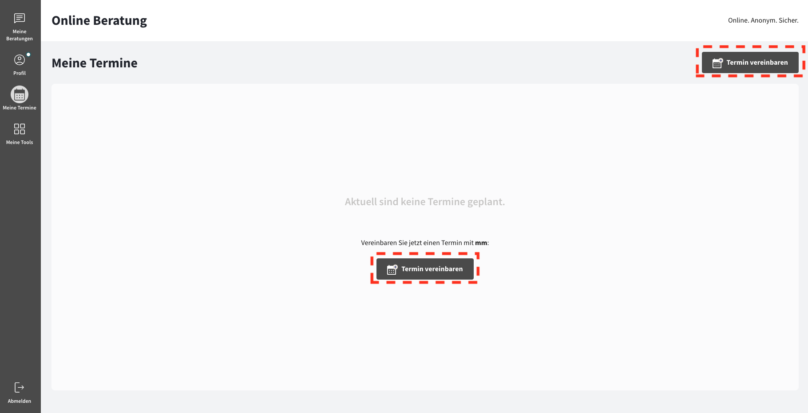

import { PrimaryNote, Bold, UIElement } from "../../components.jsx";
import useBaseUrl from "@docusaurus/useBaseUrl";

<PrimaryNote>
  Bei der Funktion "Meine Termine" handelt es sich um eine optionale
  Zusatzfunktion. Um Zugriff auf diese Funktion zu haben, muss die von Ihnen
  verwendete Online-Beratungsplattform diese Zusatzfunktion gebucht haben.
</PrimaryNote>

Sobald Ihnen ein Berater oder eine Beraterin zugewiesen wurde, stehen Ihnen Möglichkeiten zur Verfügung, Termine direkt mit dieser Person zu vereinbaren. Im Menüpunkt <UIElement>Meine Termine</UIElement> finden Sie umfassende Informationen zur Verwaltung Ihrer Termine.

Hier können Sie verschiedene Anpassungen vornehmen und alle relevanten Details zu Ihren Terminen einsehen. Nutzen Sie diese Funktionen, um den Überblick über Ihre Termine zu behalten.

Um zu dem Menüpunkt <UIElement>Meine Termine</UIElement> zu gelangen, müssen Sie in der Navigationsleiste auf den Menüpunkt <UIElement>Meine Termine</UIElement> klicken.

## Termin erstellen

<PrimaryNote>
  Bitte beachten Sie, dass ausschließlich Sie als Ratsuchender befugt sind,
  Termine zu erstellen. Ihr Berater / Ihre Beraterin ist nicht in der Lage,
  Termine zu erstellen. Ihr Berater / Ihre Beraterin hat jedoch die Möglichkeit,
  Termine, die von Ihnen gebucht wurden, zu verschieben oder abzusagen.
</PrimaryNote>

Als Ratsuchender haben Sie zwei Möglichkeiten, einen Termin zu buchen:

<ul>
  <li>Innerhalb der Beratungskommunikation</li>
  <li>
    Im Menüpunkt <UIElement>Meine Termine</UIElement>
  </li>
</ul>

### Beratungskommunikation

Als Ratsuchender können Sie einen Termin direkt in der Beratungskommunikation mit Ihrem Berater / Ihrer Beraterin vornehmen. Hierzu müssen Sie auf den Button <UIElement>Termin erstellen</UIElement> klicken.

Anschließend öffnet sich eine neue Darstellung, in welcher Ihnen die Termine angezeigt werden, an denen Ihr Berater / Ihre Beraterin verfügbar ist. Das System zeigt automatisch nur freie Termine an.

Wenn Sie auf einen gewünschten Tag klicken, werden Ihnen die verfügbaren Startzeiten angezeigt, zu denen Sie einen Termin mit Ihrem Berater vereinbaren können.

Nachdem Sie den Termin für Ihre Beratung durch einen weiteren Klick auf die von Ihnen gewünschte Zeit ausgewählt haben, können Sie die von Ihnen bevorzugte Terminart auswählen und eine zusätzliche Notiz zu Ihrem Termin hinzufügen. Hier können Sie beispielsweise Ihrem Berater / Ihrer Beraterin Informationen zu Ihrem Anliegen bereitstellen, damit sich Ihr Berater / Ihre Beraterin auf den Termin vorbereiten kann.

Durch einen Klick auf den Button <UIElement>Bestätigen</UIElement> wird der Termin erstellt. Durch einen Klick auf den Button <UIElement>Absagen</UIElement> gelangen Sie im Buchungsprozess einen Schritt zurück.

### Meine Termine

Als Ratsuchender können Sie einen Termin unter dem Menüpunkt <UIElement>Meine Termine</UIElement> mit Ihrem Berater / Ihrer Beraterin vereinbaren. Hierzu müssen Sie zu dem Menüpunkt <UIElement>Meine Termine</UIElement> navigieren und auf einen der Buttons <UIElement>Termin vereinbaren</UIElement> klicken.

Die weiteren Schritte sind identisch, wie wenn Sie Termin direkt über die Beratungskommunikation buchen.

## Gebuchte Termine

Nachdem Sie einen Termin mit Ihrem Berater / Ihrer Beraterin gebucht haben, wird in der Beratungskommunikation eine automatische Systemnachricht als Buchungsbestätigung generiert, welche die wichtigsten Informationen zu dem Termin bereitstellt.

Außerdem finden Sie unter dem Menüpunkt <UIElement>Meine Termine</UIElement> zu jedem Ihrer Termine einen Eintrag.
Dies bietet Ihnen eine übersichtliche Darstellung aller bevorstehenden Termine, die Sie erstellt haben. Jeder Termin wird als Eintrag in der Liste angezeigt und bietet Ihnen die folgenden Informationen:

(1) Terminzeitpunkt

(2) Link <UIElement>Zum Kalender hinzufügen</UIElement>, um den Termin Ihrem Kalender hinzuzufügen
Durch einen Klick auf diesen Link laden Sie eine Termindatei herunter, welche
die Termindetails enthält, sodass Sie Ihren Kalender manuell synchronisieren
können. Wenn Sie die Kalender-Synchronisation nutzen, was wir empfehlen,
werden die Termine automatisch mit Ihrem Kalender synchronisiert. Die Datei
enthält alle Termindetails außer der Terminnotizen, da es sich dabei um
besonders sensible Information handeln kann.

(3) Name Ihres Beraters / Ihrer Beraterin

(4) Gewünschte Terminart

(5) Link zu einem Videoberatungsraum
Unabhängig von der vom Ratsuchenden gewählten Terminart generieren wir immer
einen Link zum Video-Call als Alternative, falls Sie den Termin nicht im vom
Ratsuchenden gewählten Modus wahrnehmen können.

(6) Nachricht von Ihnen zum Termin
Dies ist die Terminnotiz, die Sie als Ratsuchender bei der Buchung des Termins
eingeben können. Es handelt sich dabei um ein Freitextfeld. Terminnotizen
werden bei Kalender-Synchronisation nicht in den Kalendertermin synchronisiert
und sind nur über die Plattform einsehbar.

(7) Button <UIElement>Verschieben</UIElement> zum Verschieben des Termins
Sollten Sie wieder erwartend zum Zeitpunkt des Termines verhindert sein,
können Sie den Termin verschieben. Tun Sie dies am besten in Rücksprache mit
den Ratsuchenden. Ratsuchende erhalten bei Verschiebung eine Benachrichtigung
im Nachrichtenverlauf der Beratungskommunikation mit aktualisierter Uhrzeit
und Datum.

(8) Button <UIElement>Absagen</UIElement> zum Absagen des Termins
Sie können einen Termin auch jederzeit absagen. Tun Sie dies am besten in
Rücksprache mit den Ratsuchenden. Ratsuchende erhalten bei einer Absage eine
Benachrichtigung im Nachrichtenverlauf der Beratungskommunikation. Wenn ein
Termin abgesagt ist, können Sie die Termindetails im Tab <UIElement>Storniert</UIElement> einsehen.

(9) Button <UIElement>Video-Call starten</UIElement> zum Starten des Video-Calls

## Termin verschieben

Unter dem Menüpunkt <UIElement>Meine Termine</UIElement> finden Sie zu jedem Ihrer Termine einen Eintrag.

Dies bietet Ihnen eine übersichtliche Darstellung aller bevorstehenden Termine, die Sie erstellt haben. Jeder Termin wird als Eintrag in der Liste angezeigt und bietet Ihnen die Möglichkeit, einen Termin zu verschieben.

Durch Klicken auf diesen Button wird der gleiche Prozess wie bei der Erstellung eines neuen Termins durchlaufen. Der Unterschied besteht jedoch darin, dass der alte Terminzeitpunkt überschrieben wird.

Bei der Neubuchung eines Termins haben Sie nicht die Möglichkeit, die ursprünglich gewählte Terminart zu ändern. Allerdings haben Sie die Möglichkeit, einen Grund für die Verschiebung anzugeben.

Durch einen Klick auf den Button <UIElement>Neuplanen</UIElement> bestätigen Sie die Ihre Terminverschiebung.

## Termin absagen

Unter dem Menüpunkt <UIElement>Meine Termine</UIElement> finden Sie zu jedem Ihrer Termine einen Eintrag.

Dies bietet Ihnen eine übersichtliche Darstellung aller bevorstehenden Termine, die Sie erstellt haben. Jeder Termin wird als Eintrag in der Liste angezeigt und bietet Ihnen die Möglichkeit, einen Termin abzusagen.

Nachdem Sie diesen Button geklickt haben, erscheint eine weitere Darstellung.

Durch einen Klick auf den Button <UIElement>Absagen</UIElement> erscheint eine weitere Darstellung mit den wichtigsten Informationen zu dem Termin.

Sie haben hier die Möglichkeit einen Grund Ihre Absage einzugeben, wobei diese Angabe optional ist. Durch einen Klick auf den Button <UIElement>Diesen Termin absagen</UIElement> bestätigen Sie die Ihre Absage.

