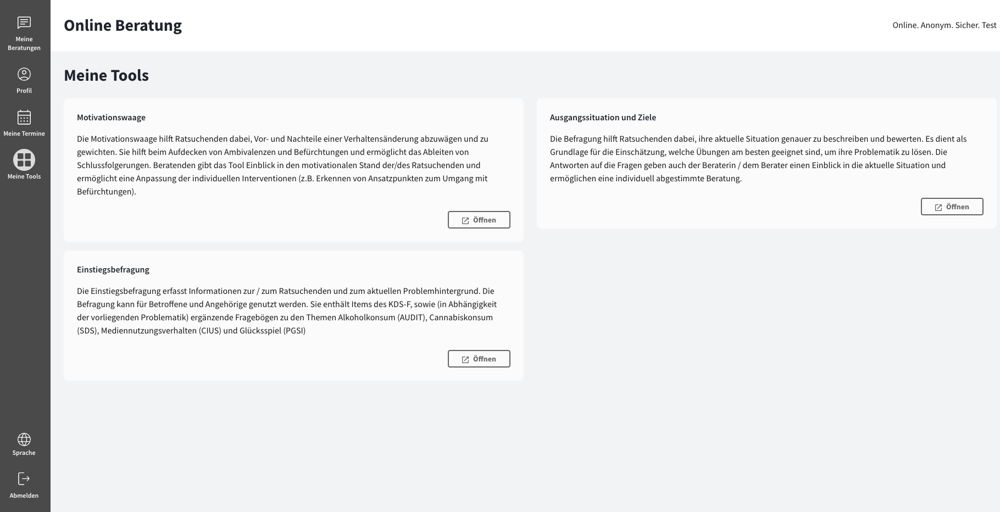

import { PrimaryNote, Bold, UIElement } from "../../components.jsx";
import useBaseUrl from "@docusaurus/useBaseUrl";

<PrimaryNote>
  Es handelt sich hierbei um eine optionale Zusatzfunktion, die möglicherweise
  nicht von der von Ihnen genutzten Online-Beratungsplattform verwendet wird
  oder diese Funktion wurde von Ihrem Berater / Ihrer Beraterin nicht für Sie
  aktiviert.
</PrimaryNote>

Wenn Ihnen die Funktion Tools zur Verfügung steht, haben Sie im Hauptmenü einen Menüpunkt <UIElement>Meine Tools</UIElement>.

Dort sehen Sie eine Übersicht der für Sie freigeschalteten Tools. Mit Klick auf das jeweilige Tool öffnet sich dieses in einem neuen Tab und kann Ihnen genutzt werden.

Bei einigen Tools können Berater_innen die Inhalte, die von Ihnen im Rahmen der Tools getätigt werden, erst einsehen, wenn Sie sich dazu entschließen, die Inhalte mit Ihrem Berater / Ihrer Beraterin zu teilen. Diese Einstellung ist auf der Einstellungsseite des jeweiligen Tools verfügbar.
