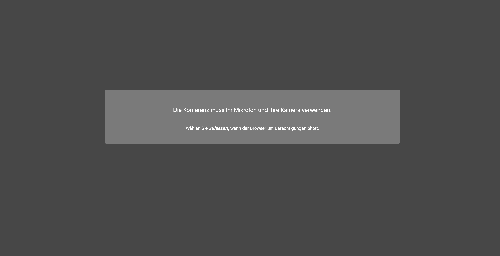
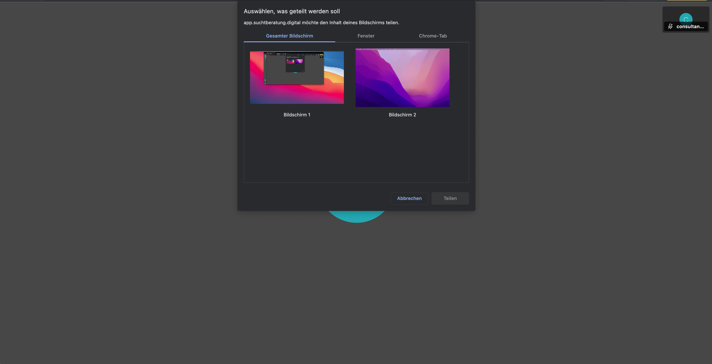

import { PrimaryNote, Bold, UIElement } from "../../components.jsx";
import useBaseUrl from "@docusaurus/useBaseUrl";

<PrimaryNote>
  Als Berater_in haben Sie die Möglichkeit, einen Video-Call / Audio-Call mit
  Ratsuchenden zu starten und durchzuführen. Ratsuchende können keinen
  Video-Call / Audio-Call nicht starten.
</PrimaryNote>

Wählen Sie im Menüpunkt <UIElement>Meine Nachrichten</UIElement> eine Beratungskommunikation aus, indem Sie diese einmal anklicken. Dadurch öffnet sich der Nachrichtenverlauf der entsprechenden Beratungskommunikation. Links neben dem Optionenmenü sehen Sie zwei Symbole:

<ul>
  <li>Ein Kamera-Symbol, zum Starten eines Video-Calls</li>
  <li>Ein Telefonhörer-Symbol, zum Starten eines Audio-Calls</li>
</ul>

Für eine Video-Beratung steht ein Zeitfenster von 180 Minuten offen. Mit Beginn der Video-Beratung läuft die Uhr und die Beratung wird nach drei Stunden automatisch geschlossen. Ebenso wird der dafür eingerichtete Videoraum geschlossen. Es erfolgt keine Aufzeichnung der Beratung, die z. B. später noch einmal angesehen werden kann. Wie in einem normalen Beratungsgespräch vor Ort müssen Sie sich dann ggf. Notizen der Beratung anfertigen.

## Video-Beratung starten

Um die Video-Beratung zu starten, müssen Sie auf das Kamera-Symbol klicken. Wenn Sie auf das Kamera-Symbol geklickt haben, werden Sie gefragt, ob Sie den Zugriff des Systems auf Ihre Kamera und Ihr Mikrofon erlauben möchten. Hier dann bitte auf <UIElement>Zulassen</UIElement> klicken, sonst kann die Video-Beratung nicht gestartet werden.

Wenn Sie die Nutzung von Kamera und Mikrofon zulassen, öffnet sich ein neues Fenster und die Video-Beratung startet. Der Ratsuchende wird dann „angerufen“ und kann entscheiden, ob er ihre Anfrage zu einer Video-Beratung annehmen oder ablehnen möchte. Das sieht beim Ratsuchenden wie folgt aus:

Der Ratsuchende hat bei einem eingehenden Anruf drei Optionen:

<ul>
  <li>
    Video-Anruf annehmen und Kamera freischalten durch einen Klick auf das
    Kamera-Symbol
  </li>
  <li>
    Video-Anruf zu einem Telefonat umwandeln, wenn die Kamera nicht aktiviert
    werden möchte. Dann kann ein Telefonat durchgeführt werden.
  </li>
  <li>Anruf ablehnen, durch einen Klick auf den roten Telefonhörer</li>
</ul>

Sollte der Ratsuchende bei Ihrer Anfrage verhindert sein und an der Video-Beratung nicht teilnehmen können oder lehnt den Anruf ab, wird ein Eintrag im Nachrichtenverlauf erzeugt, dass Sie als Berater_in versucht haben, den Ratsuchenden zu kontaktieren.

Ansicht für die ratsuchende Person:

Ansicht für den / die Berater_in:

## Optionen in der Video-Beratung

Wenn der Ratsuchende Ihre Anfrage zu einer Video-Beratung durch einen Klick auf das Kamera-Symbol angenommen hat, erscheint bei Ihnen als Berater_in der Ratsuchende nun in Großdarstellung und sie sehen sich im kleinen Fenster. Beim Ratsuchenden ist es entsprechend umgekehrt.

Während der Video-Beratung können Sie einige Einstellungen vornehmen. Die Einstellungsoptionen finden Sie in dem Menü:

Folgende Einstellungsoptionen stehen Ihnen als Berater_in und dem Ratsuchenden zur Verfügung:

<ul>
  <li>
    <UIElement>Video-Link kopieren</UIElement>
  </li>
  <li>
    <UIElement>Mikrofon aktivieren / deaktivieren</UIElement>
  </li>
  <li>
    <UIElement>Kamera starten / stoppen</UIElement>
  </li>
  <li>
    <UIElement>Bildschirmfreigabe ein-/ ausschalten</UIElement>
  </li>
  <li>
    <UIElement>Hintergrund auswählen</UIElement>
  </li>
  <li>
    <UIElement>Einstellungen</UIElement>
  </li>
  <li>
    <UIElement>Konferenz verlassen</UIElement>
  </li>
</ul>

### Video-Link kopieren

<PrimaryNote>Diese Funktion steht nur Berater_innen zur Verfügung.</PrimaryNote>

Durch das Kopieren des Video-Links können Sie diesen an andere Personen verteilen, die durch den Link dem Video-Call beitreten können. Somit können Sie mit mehreren Personen einen Video-Call durchführen.

Die Vorgehensweise ist dann folgende:

<ul>
  <li>
    Sie starten als Berater_in die Video-Call mit einem Ratsuchenden. Es öffnet
    sich das Fenster für die Video-Call und dann muss der Ratsuchende Ihre
    Anfrage annehmen.
  </li>
  <li>Sie klicken den oben markierten Button zum Kopieren des Video-Links.</li>
  <li>
    Diesen Link können Sie an weitere Personen verschicken. Beispielsweise per
    E-Mail oder in einer Beratungskommunikation innerhalb der
    Online-Beratungsplattform.
  </li>
  <li>
    Die Person, die den Link erhält, kann an der Video-Beratung teilnehmen, ohne
    zwingend ein Konto auf Ihrer Online-Beratungsplattform zu benötigen.
  </li>
  <li>Die Zahl weiterer Teilnehmer ist nicht begrenzt.</li>
  <li>
    Wenn die eingeladene Person dem Video-Call beitreten möchte, erhält der /
    die Berater_in einen Hinweis, dass eine Person der Video-Beratung beitreten
    möchte. Sie als Berater_in können entscheiden, ob sie die Person in den
    Video-Call eintreten lassen oder nicht.
  </li>
</ul>

<ul>
  <li>
    Beendet die Berater_in den Video-Call, dann wird dieser komplett
    geschlossen, d.h. alle Teilnehmenden werden aus dem Video-Call entfernt.
  </li>
</ul>

### Mikrofon aktivieren / deaktivieren

Durch Klicken auf das Mikrofon-Symbol können Sie Ihr Mikrofon ein- und ausschalten. Wenn Sie Ihr Mikrofon ausschalten, wird das Symbol durchgestrichen, und Ihr Gesprächspartner kann Sie nicht mehr hören. Um Ihr Mikrofon wieder einzuschalten, klicken Sie erneut auf das Mikrofon-Symbol.

### Kamera starten / stoppen

Durch Klicken auf das Kamera-Symbol können Sie Ihre Kamera ein- und ausschalten. Wenn Sie Ihre Kamera ausschalten, werden Sie für Ihren Gesprächspartner unsichtbar, und das Symbol wird durchgestrichen. Um Ihre Kamera wieder einzuschalten, klicken Sie erneut auf das Kamera-Symbol.

### Bildschirmfreigabe ein-/ ausschalten

Durch die Bildschirmfreigabe können Sie Ihrem Gesprächspartner in Echtzeit anzeigen, was auf Ihrem Bildschirm angezeigt wird. Wenn Sie Ihren Bildschirm mit Ihrem Gesprächspartner teilen möchten, klicken Sie auf das unten markierte Symbol. Dadurch öffnet sich ein neues Fenster, in dem Sie die Option haben, entweder Ihren gesamten Bildschirm oder einzelne geöffnete Dokumente zu teilen.

Um das Teilen des Bildschirms zu beenden, klicken Sie bitte erneut auf das Symbol <UIElement>Bildschirm freigeben</UIElement> und dann auf <UIElement>Abbrechen</UIElement>.

### Hintergrund auswählen

Wenn Sie Ihre Kamera aktiviert haben, können Sie mit dem Anpassen des Hintergrunds Ihrem Gesprächspartner eine andere visuelle Umgebung präsentieren. Dies ermöglicht es Ihnen, eine professionelle oder passende Umgebung für Ihr Video-Meeting zu schaffen, was hilfreich sein kann, um Ablenkungen zu minimieren oder eine angemessene Atmosphäre zu schaffen. Hierbei steht Ihnen eine Auswahl an vordefinierten Hintergründen zur Verfügung.

### Einstellungen

In den Einstellungen haben Sie die Möglichkeit, auszuwählen, welche Mikrofone, Kameras oder Audioausgaben verwendet werden sollen, falls mehrere verfügbar sind. Zusätzlich können Sie dort auch Ihren Anzeigenamen festlegen.

### Konferenz verlassen

Um die Video-Beratung zu beenden, können Sie auf den farbigen Button mit dem Telefonhörer-Symbol klicken. Dadurch wird die Video-Beratung beendet und Sie kehren zur Online-Beratungsplattform zurück.

