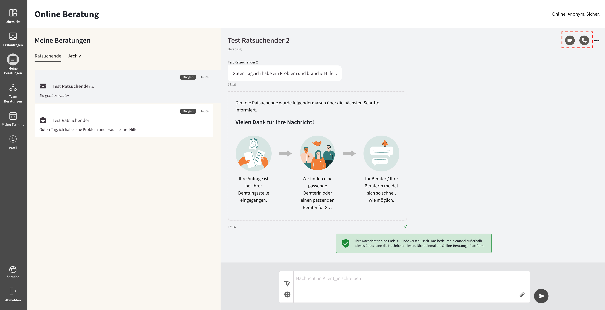
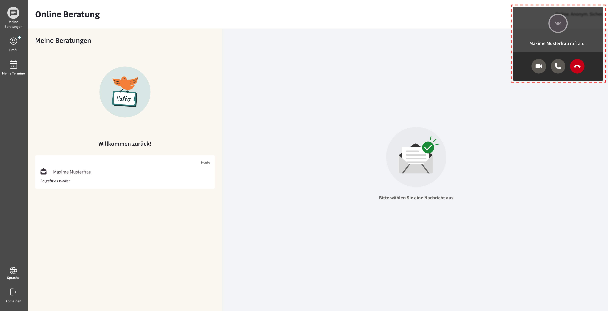

import { PrimaryNote, Bold, UIElement } from "../../components.jsx";
import useBaseUrl from "@docusaurus/useBaseUrl";

Wenn der Ratsuchende oder Sie keine Videoberatung wünschen, besteht die Möglichkeit, eine Art "Telefon-Beratung" durchzuführen, bei der keine Videoübertragung erfolgt. Nur Sie als Berater_in können diese Aktion starten, indem Sie anstelle des Kamera-Symbols auf den Telefonhörer klicken.

Der Ablauf ist ähnlich wie bei der Videoberatung: Sobald der Ratsuchende den Anruf annimmt, können Sie die Telefon-Beratung durchführen. Während der Beratung haben sowohl Sie als Berater_in als auch der Ratsuchende die Möglichkeit, die Kamera einzuschalten und zu einer Videoberatung zu wechseln.

