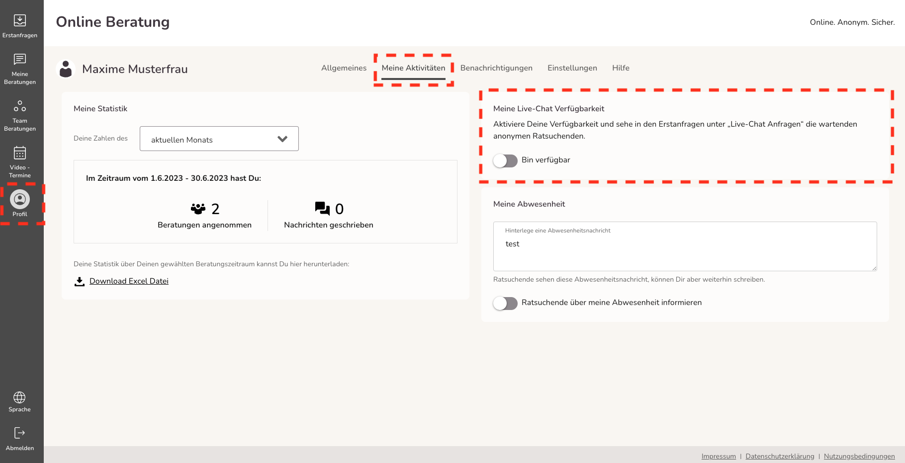
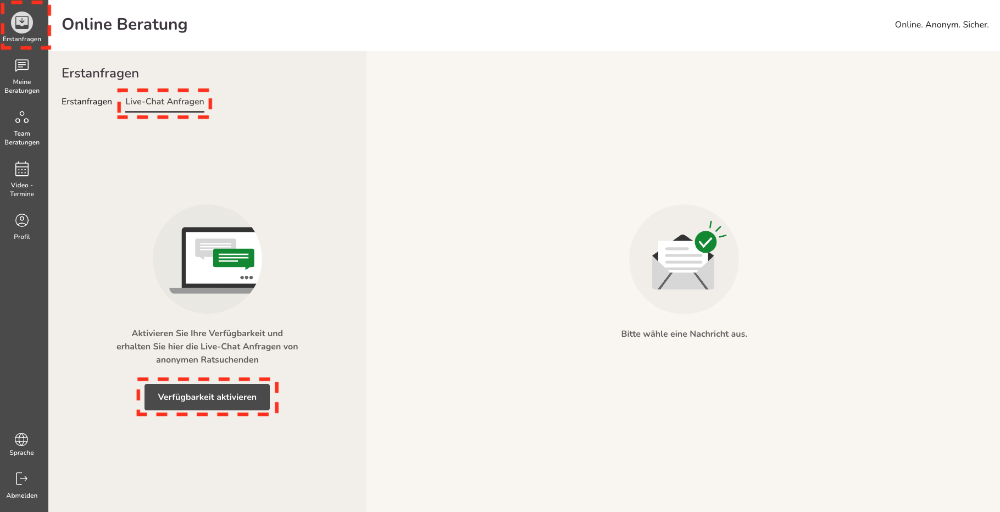
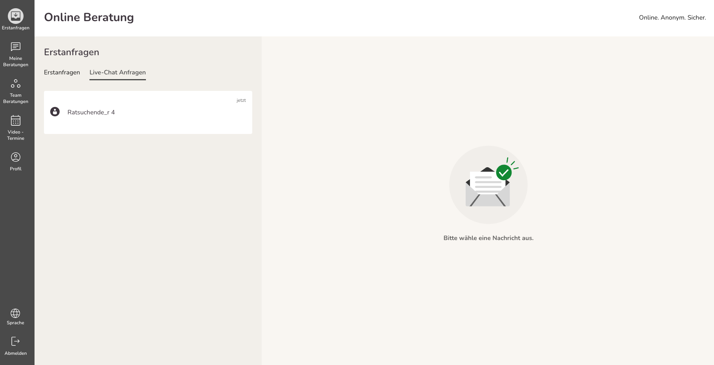
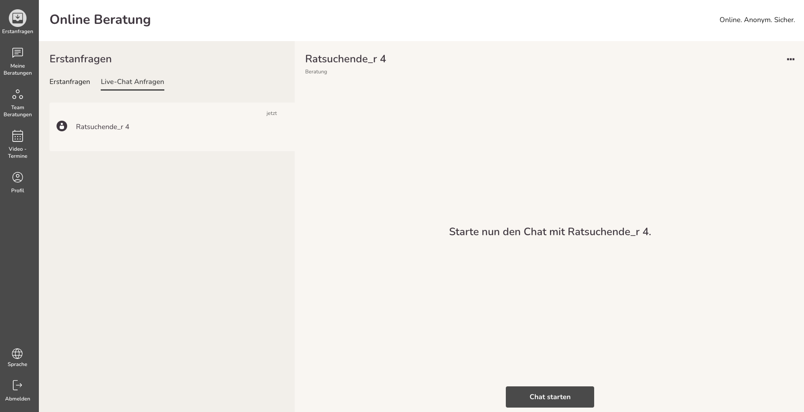
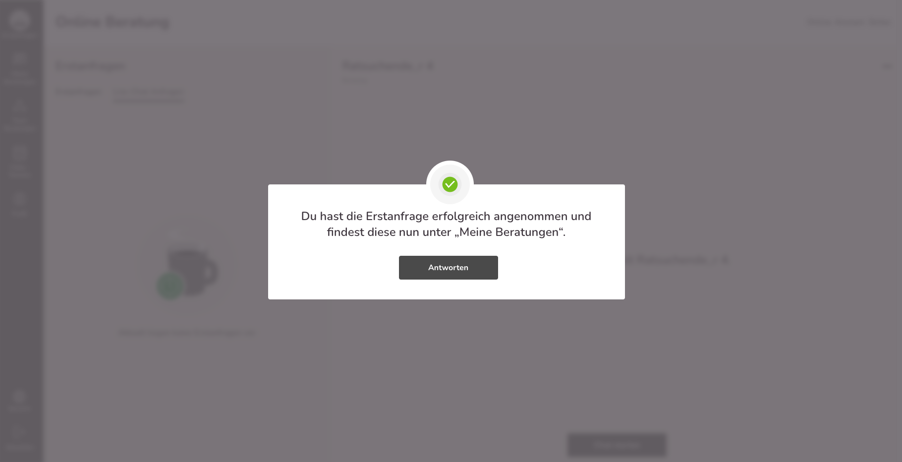
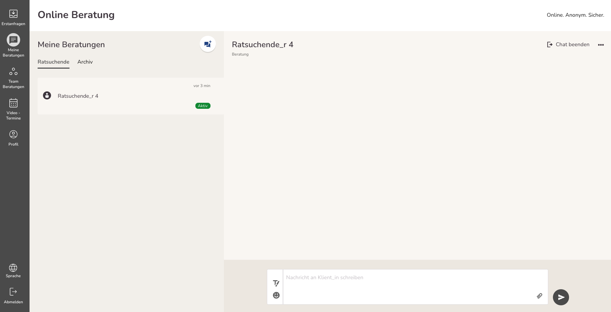
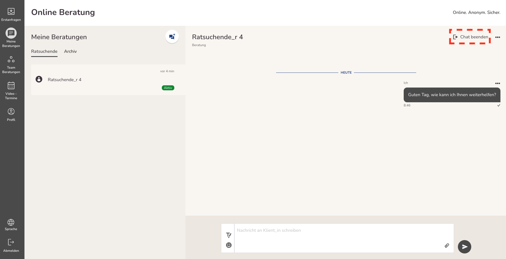
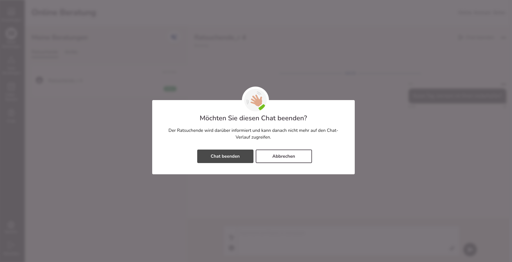
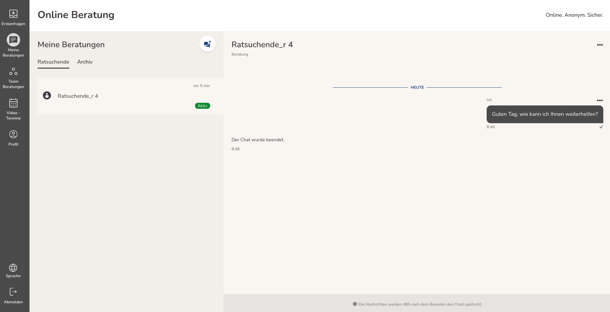

import { PrimaryNote, Bold, UIElement } from "../../components.jsx";
import useBaseUrl from "@docusaurus/useBaseUrl";

## Anonyme live Beratung aktivieren

Um eine anonyme live Beratung zu starten, muss ein Ratsuchender eine Anfrage stellen. Voraussetzung, dass ein Ratsuchender eine Anfrage stellen kann, ist, dass mindestens ein Berater / eine Beraterin verfügbar ist.
Berater_innen haben zwei Möglichkeiten, sich für die anonyme live Beratung verfügbar zu melden:

<ul>
  <li>
    Gehen Sie zum Menüpunkt <UIElement>Profil</UIElement> und klicken Sie auf
    den Tab <UIElement>Meine Aktivitäten</UIElement>. Wählen Sie anschließend
    "Meine Live-Chat-Verfügbarkeit" aus und aktivieren Sie die entsprechende
    Umschalttaste.
  </li>
</ul>

<ul>
  <li>
    Gehen Sie zum Menüpunkt <UIElement>Erstanfragen</UIElement> und wechseln Sie
    zum Tab <UIElement>Live-Chat-Anfragen</UIElement>. Dort finden Sie die
    Option, die Verfügbarkeit zu aktivieren, indem Sie auf den Button
    <UIElement>Verfügbarkeit aktivieren</UIElement> klicken.
  </li>
</ul>

Durch eine dieser beiden Methoden können Berater_in ihre Verfügbarkeit für die anonyme live Beratung aktivieren und können dadurch anonyme live Beratungsanfragen empfangen. Sie können die anonyme live Beratung aktivieren, indem Sie eine der oben beschriebenen Methoden verwenden.

## Anonyme live Beratungsanfrage annehmen

Wenn Sie Ihre Verfügbarkeit für die anonyme live Beratung aktiviert haben und ein Ratsuchender eine Anfrage stellt, sehen Sie diese Anfragen unter dem Menüpunkt <UIElement>Erstanfragen</UIElement> und dem Tab <UIElement>Live-Chat-Anfragen</UIElement>. Sie sehen an dieser Stelle, alle vorliegenden anonymen live Beratungsanfragen.

Da die Ratsuchenden sich nicht registrieren müssen, tragen alle den Benutzernamen "Ratsuchende_r" und werden einfach durchnummeriert, beispielsweise "Ratsuchende_r 4".

Wenn Sie den Ratsuchenden anklicken, wird die Anfrage geöffnet und Sie können die Anfrage annehmen:

Wenn Sie auf den Button <UIElement>Chat starten</UIElement> klicken, erhalten Sie folgenden Hinweis:

Wenn Sie nun auf den Button <UIElement>Antworten</UIElement> klicken, werden Sie automatisch zum Menüpunkt <UIElement>Meine Nachrichten</UIElement> weitergeleitet, wo Sie nun die Beratungskommunikation mit dem Ratsuchenden durchführen.

## Anonyme live Beratung durchführen

<PrimaryNote>
  So lange Sie als Berater_in die Chatanfrage nicht angenommen haben, kann der
  Ratsuchende Ihnen keine Nachricht schreiben.
</PrimaryNote>

Nachdem Sie eine anonyme live Beratungsanfrage angenommen haben, befindet sich die Beratungskommunikation unter dem Menüpunkt <UIElement>Meine Beratungen</UIElement>.

Sie haben jetzt die Möglichkeit, direkt mit dem Ratsuchenden zu kommunizieren. Sie können alle Kommunikationsmöglichkeiten nutzen, die Ihnen auch bei einer "normalen" Beratungskommunikation zur Verfügung stehen. Beachten Sie jedoch, dass es bei einer anonymen live Beratung keine Videoberatung geben kann, da es sich um eine anonyme Beratung handelt.

<PrimaryNote>
    Anhand des Namens des Ratsuchenden und des grünen Elements mit dem Text "Aktiv" können Sie erkennen, ob es sich um eine anonyme live Beratung oder eine "normale" Beratungskommunikation handelt.
    Wenn eine anonyme live Beratung aktiv ist, wird dies durch den Hinweis "aktiv" angezeigt. Sobald der Chat beendet ist, entfällt dieser Hinweis.
</PrimaryNote>

## Anonyme live Beratung beenden

<PrimaryNote>
  Nachdem die anonyme live Beratung beendet wurde, kann diese nicht wieder aktiviert werden.
</PrimaryNote>

Der Chat kann sowohl von Ihnen als Berater_in als auch von dem Ratsuchenden beendet werden. Wenn Sie den Chat beenden möchten, müssen Sie auf den Button <UIElement>Chat beenden</UIElement> klicken.

Anschließend erfolgt eine Sicherheitsabfrage, um sicherzustellen, dass Sie die anonyme live Beratung wirklich beenden wollen.

Wenn Sie auf <UIElement>Abbrechen</UIElement> klicken, bleibt der Chat bestehen. Klicken Sie auf <UIElement>Chat beenden</UIElement> wird die anonyme live Beratung beendet. Im Nachrichtenverlauf erscheint dann der Eintrag "Der Chat wurde beendet".

Sobald der Chat beendet wurde, wird der Ratsuchende umgehend automatisch abgemeldet und kann sich nicht wieder im System anmelden, wodurch er / sie keinen Zugriff mehr auf die Beratungskommunikation hat.

Für Sie als Berater_in bleibt der Chat noch für 48 Stunden unter <UIElement>Meine Nachrichten</UIElement> einsehbar. Nach Ablauf der 48 Stunden wird die anonyme live Beratung dann auch für Sie als Berater_in gelöscht.
