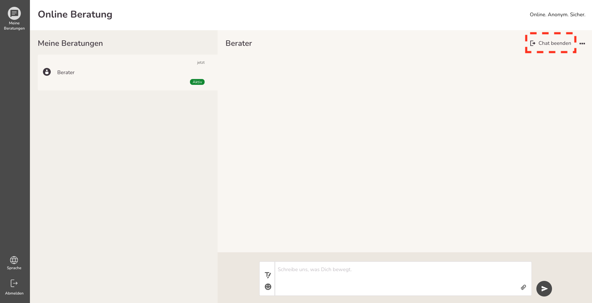

import { PrimaryNote, Bold, UIElement } from "../../components.jsx";
import useBaseUrl from "@docusaurus/useBaseUrl";

## 1:1 Chat aktivieren

Der 1:1 Chat ermöglicht es Ratsuchenden, ohne einen Registrierungsprozess durchlaufen zu müssen in Kontakt mit einer Beraterin / einem Berater treten. Somit gewährleistet der 1:1 Chat maximale Anonymität für Sie als Ratsuchender.

## 1:1 Chat starten

Um einen 1:1-Chat zu starten, müssen Sie eine Anfrage stellen. Voraussetzung, dass ein Ratsuchender eine Anfrage stellen kann, ist, dass mindestens ein Berater / eine Beraterin ihre 1:1-Chat-Verfügbarkeit aktiviert hat.
Sie gelangen zum 1:1 Chat über den Warteraum <Bold>(abc.onlineberatung.net/beratung/warteraum)</Bold>, wobei abc für den Namen der Subdomain der Online-Beratungsplattform steht.

Anschließend sollten Sie diesen Inhalt sehen:

Um in den Warteraum des 1:1 Chats zu gelangen, müssen Sie zunächst die Datenschutzerklärung und die Nutzungsbedingung der Online-Beratungsplattform akzeptieren, indem Sie auf <UIElement>Ich bin einverstanden</UIElement> klicken.

Wenn Sie die Datenschutzerklärung und die Nutzungsbedingung akzeptiert haben, wird geprüft, ob ein Berater / eine Beraterin für den 1:1 Chat verfügbar ist.

Wenn kein Berater / keine Beraterin verfügbar ist, erscheint Folgendes:

Wenn ein Berater / eine Beraterin verfügbar ist, erscheint Folgendes:

Dieser Bildschirm wird so lange angezeigt, bis ein Berater / eine Beraterin Ihre Anfrage annimmt. Eine zeitliche Begrenzung gibt es hier nicht! Sie haben die Möglichkeit zu warten, bis ein Berater / eine Beraterin verfügbar ist. Falls Ihnen die Wartezeit nach einer gewissen Zeit zu lange ist, wird Ihnen die Möglichkeit geboten, sich auf der Online-Beratungsplattform zu registrieren.

Sobald ein Berater / eine Beraterin Ihr Anfrage akzeptiert, werden Sie zur Online-Beratungsplattform weitergeleitet:

Nun können Sie mit Ihrem Berater / Ihrer Beraterin kommunizieren, indem Sie Textnachrichten formulieren und senden.

## 1:1 Chat beenden

<PrimaryNote>
  Nachdem der 1:1-Chat beendet wurde, kann dieser nicht wieder aktiviert werden.
  Sie haben anschließend kein Zugriff mehr auf die Inhalte der
  Beratungskommunikation.
</PrimaryNote>

Der Chat kann sowohl von Ihnen als Ratsuchender als auch von Ihrem Berater / Ihrer Beraterin beendet werden. Wenn Sie den Chat beenden möchten, haben Sie zwei Möglichkeiten:

### Chat beenden

Um den 1:1 Chat zu beenden, können Sie auf den Button <UIElement>Chat beenden</UIElement> klicken.

Anschließend erfolgt eine Sicherheitsabfrage, um sicherzustellen, dass Sie den 1:1-Chat wirklich beenden wollen.

Wenn Sie auf <UIElement>Abbrechen</UIElement> klicken, bleibt der Chat bestehen. Klicken Sie auf <UIElement>Chat beenden</UIElement> wird der 1:1 Chat geschlossen und Sie werden automatisch abgemeldet und zur Startseite weitergeleitet.

### Abmelden

Um den 1:1 Chat zu beenden, können Sie auf <UIElement>Abmelden</UIElement> im Hauptmenü klicken. Anschließend wird der 1:1 Chat geschlossen und Sie werden automatisch abgemeldet und zur Startseite weitergeleitet.

