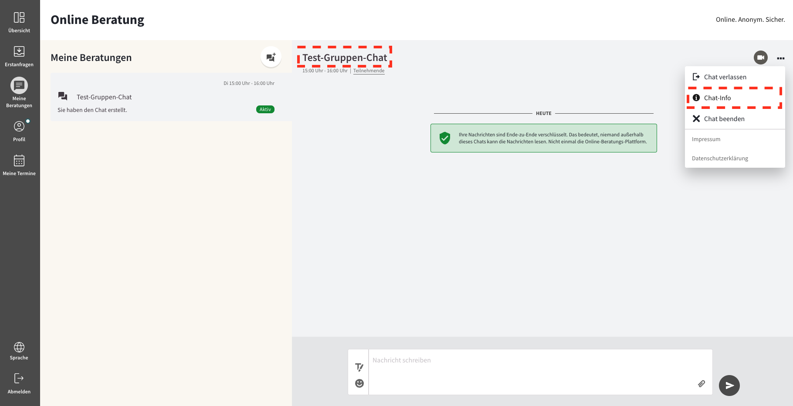

import { PrimaryNote, Bold, UIElement } from "../../components.jsx";
import useBaseUrl from "@docusaurus/useBaseUrl";

## Gruppenberatung erstellen und starten

Beraterinnen und Berater, die von den Administratoren die entsprechenden Rechte erhalten haben, finden den Gruppenchat-Button unter Meine Beratungen. Wenn Berater nicht über diese Rechte verfügen, können sie keine Gruppenchats erstellen. Sie können jedoch an bestehenden Gruppenchats teilnehmen. Sie können diese Chats jedoch nicht starten. Durch Anklicken des Icon-Buttons mit dem Chat-Bubble kann man eine neue Gruppenberatung erstellen. Um die Gruppenchats von den 1:1 Beratungen zu unterscheiden, befindet sich links oben auf der Chat-Kachel das gleiche Icon wie auf dem Erstellungs-Button.

Im nächsten Schritt geben Sie das Thema des Chats, das Datum und die Uhrzeit an, zu der der Chat beginnen soll, und ob er sich wöchentlich wiederholen soll. Die Chatdauer kann zwischen 30 Minuten und 3 Stunden gewählt werden. Die Dauer ist für die Teilnehmer informativ. Das genaue Ende des Chats liegt im Ermessen des Moderators. Für weitere Informationen siehe 7.3.4 Videogruppenchat beenden oder verlassen.

Wenn Sie mit den Chateinstellungen fertig sind, klicken Sie auf <UIElement>Chat erstellen</UIElement>, um den Chat zu erstellen.

Sie erhalten eine Systemmeldung, dass die Gruppenberatung erfolgreich erstellt wurde. Sie sehen nun den neuen Gruppenchat mit den angehängten "Spielregeln" des Chats. Um die allgemeinen Texte der Chatregeln anzupassen, kontaktieren Sie uns bitte. Derzeit können wir keine spezifischen Texte für die verschiedenen Gruppenchats anbieten.

Unter <UIElement>Chat-info</UIElement> können Sie bereits den Einladungslink kopieren und die Teilnehmer_innen einladen. Unter <UIElement>Chat-info</UIElement> finden Sie alle Einstellungen zu der Gruppenberatung, wie z.B. Dauer und Datum des Chats, die Sie jederzeit ändern können.

Wenn die gewünschte Startzeit erreicht ist, müssen Sie den Chat manuell für alle Teilnehmer öffnen, indem Sie auf die Schaltfläche <UIElement>Chat starten</UIElement> klicken. Dies gibt dem Moderator die Kontrolle über den Gruppenchat und eine gewisse Flexibilität bei Beginn und Ende der Sitzungen.

Wenn Sie auf Chat Start klicken, wird der Chat als aktiv angezeigt.

## Teilnehmer einladen

Um zum Einladungslink zu gelangen, klicken Sie auf den Namen der Gruppe. Sie können auch im Untermenü unter den drei Punkten auf Chat-Infos klicken.

Sie können den Einladungslink kopieren und über beliebige Kanäle an Ratsuchende versenden. Es steht ein QR-Code zur Verfügung, den Sie als PNG-Datei herunterladen und ausdrucken können. Wenn die Teilnehmer dem Gruppenchat beigetreten sind, sehen sie ihre Namen unter den Chat-Infos. Sie können diese Informationen auch auf der Hauptseite der Gruppenberatung sehen, indem Sie unter dem Namen des Chats auf <UIElement>Teilnehmende</UIElement> klicken.

Alle Berater der Beratungsstelle erhalten automatisch die Einladung zum Gruppenchat unter dem Reiter "Meine Beratungen". Sie können entscheiden, ob sie teilnehmen möchten oder nicht. Einladungen können derzeit nicht aus dem Chat-Feed entfernt werden.

## Videokonferenz starten und beitreten

Eine Videokonferenz kann von allen Beratern gestartet werden, die an der Gruppenberatung teilnehmen. Um die Videokonferenz zu starten, klicken Sie auf das <UIElement>Kamera-Symbol</UIElement> in der oberen Leiste der Gruppenberatung.

Der Ablauf der Videokonferenz ist ähnlich wie bei der Videoberatung aufgebaut. Bei den anderen Teilnehmern wird der Anruf mittels Overlay und dem bekannten Klingelton empfangen. Dem Benutzer stehen die gleichen Funktionen zur Verfügung. Mehr zu den Möglichkeiten der Videoberatung finden Sie in Kapitel Videoberatung.

Die neue Zusatzfunktion zu den bekannten Videoberatungsfunktionen ist die automatische Systemmeldung im Chat. Sollten sich Teilnehmer verspäten oder den Anruf versehentlich ablehnen, können sie der Videokonferenz jederzeit beitreten, solange die Konferenz noch läuft, indem sie in der Systemmeldung auf die Schaltfläche <UIElement>Beitreten</UIElement> klicken.

Sobald die Videokonferenz beendet ist, verschwindet diese Meldung und die Benutzer werden im Chat darüber informiert:

## Gruppenberatung beenden oder verlassen

Der/die Moderator_en haben die Kontrolle über den Beginn und das Ende des Chats. Beispiel: Sie haben normalerweise eine Stunde Zeit, aber die Teilnehmer haben wichtige Themen, die sie noch ein paar Minuten diskutieren möchten. Sie entscheiden, den Chat länger offenzulassen. Wenn Sie die Sitzung schließen möchten, klicken Sie auf das <UIElement>Drei-Punkte-Symbol</UIElement> und dann auf <UIElement>Chat beenden</UIElement>. Dadurch werden alle Nachrichten der Sitzung gelöscht. Die Teilnehmer können keine Nachrichten mehr hinterlassen. Wenn Sie den Chat z.B. nächste Woche für den neuen Termin starten, starten Sie neu ohne den alten Chatverlauf. Wenn Sie aus Versehen den Chat nicht beenden, wird das System den Chat nach 6 Stunden automatisch beenden.

Wenn Sie nicht mehr an der Gruppenberatung teilnehmen möchten, klicken Sie auf <UIElement>Chat verlassen</UIElement>. Die Einladung zum Gruppenchat bleibt jedoch in Ihrer Chat-Übersicht auf der linken Seite verfügbar. Sie können zu einem späteren Zeitpunkt wieder daran teilnehmen. Bitte beachten Sie, dass wenn alle Moderatoren den Chat verlassen haben, die Ratsuchenden nicht mehr am Chat teilnehmen können. Ein vollständiges Löschen der Einladung und der Gruppenberatung ist derzeit nicht möglich.

## Ratsuchenden aus der Gruppenberatung bannen

Wenn ein Ratsuchender wiederholt gegen die Chat-Regeln verstoßen hat, können Sie ihn aus dem Chat verbannen. Ratsuchende sind jedoch nur für diesen einen Termin der Gruppenchatserie gebannt. Wird der Chat beim nächsten Termin wieder gestartet, können die gebannten Teilnehmer wieder teilnehmen. Es ist derzeit nicht möglich, Teilnehmer komplett aus dem Chat zu entfernen und zu bannen.

Um Teilnehmer zu verbannen, klicken Sie auf <UIElement>Teilnehmende</UIElement> unter dem Namen des Gruppenchats. Es erscheint eine Liste aller Teilnehmer. Klicken Sie auf das <UIElement>Drei-Punkte-Symbol</UIElement> neben dem Namen des Teilnehmers, den Sie bannen möchten. Klicken Sie auf <UIElement>Bannen</UIElement>. Der Teilnehmer hat keinen Zugang mehr zum Chat und kann keine Nachrichten mehr lesen oder hinterlassen.

Wenn Sie einen Teilnehmer gebannt haben, wird dies entsprechend angezeigt. Bitte beachten Sie, dass dieser Schritt nicht rückgängig gemacht werden kann.

Ratsuchende, die verbannt von einem wurden, erhalten folgende Nachricht:

Ratsuchende sind jedoch nur für diesen einen Termin der Gruppenchatserie gebannt. Wird der Chat beim nächsten Termin wieder gestartet, können die gebannten Teilnehmer wieder teilnehmen. Es ist derzeit nicht möglich, Teilnehmer komplett aus dem Chat zu entfernen und zu bannen.
