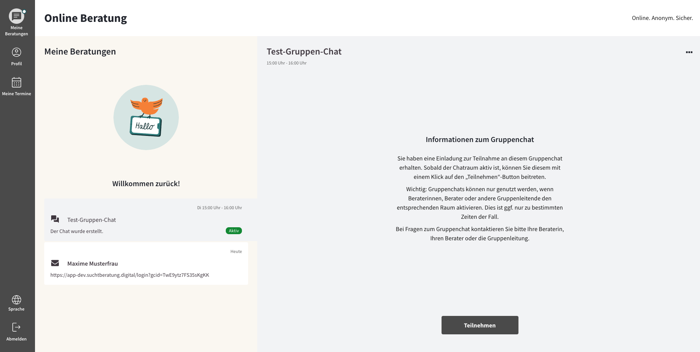
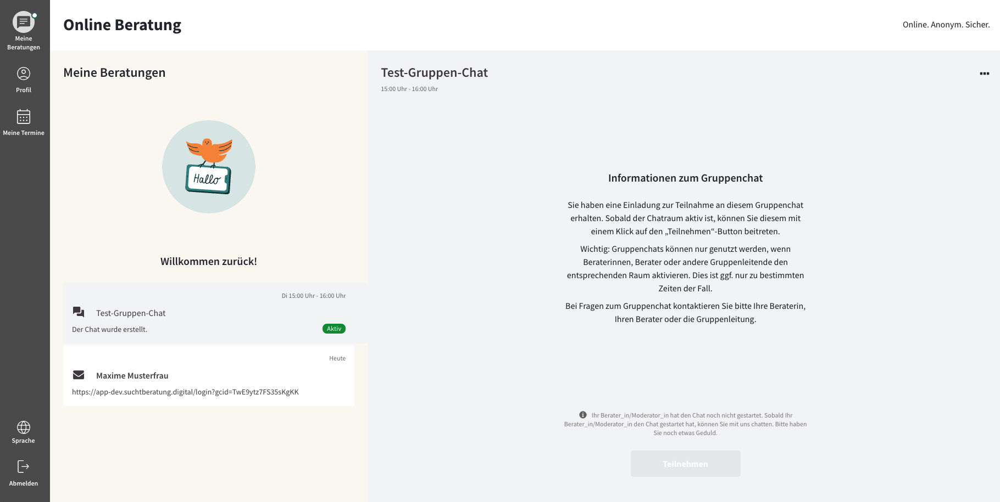
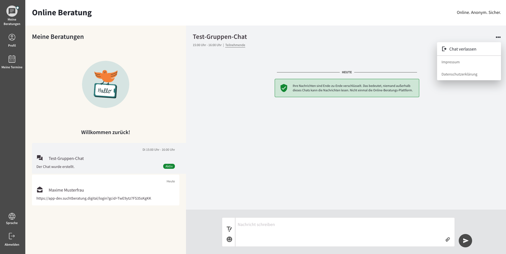

import { PrimaryNote, Bold, UIElement } from "../../components.jsx";
import useBaseUrl from "@docusaurus/useBaseUrl";

## Gruppenberatung beitreten

Wenn Ratsuchende im 1:1-Chat einen Einladungslink erhalten und diesen anklicken, werden sie nach kurzem Laden des Gruppenchats automatisch in den Gruppenchat weitergeleitet. Der Gruppenchat erscheint als neue Kachel unter dem Reiter <UIElement>Meine Beratungen</UIElement>. Wenn der Chat aktiv ist, können die Benutzer, nachdem sie sich mit den Chatregeln vertraut gemacht haben, auf <UIElement>Teilnehmen</UIElement> klicken.

Wenn der Moderator den Gruppenchat noch nicht aktiviert hat, ist diese Schaltfläche deaktiviert und die Benutzer sehen die folgende Meldung:

## Videokonferenz beitreten

Ratsuchende können an einer Videokonferenz teilnehmen, wenn sie von einem der Moderatoren gestartet wird. Die Teilnahme erfolgt analog zu dem unter Kapitel Videokonferenz starten und beitreten beschriebenen Verhalten.

## Gruppenberatung verlassen

Ratsuchende können sich entscheiden, den Chat zu verlassen, indem sie auf <UIElement>Chat verlassen</UIElement> klicken. Die Einladung zum Gruppenchat bleibt jedoch in Ihrer Chat-Übersicht auf der linken Seite verfügbar. Sie können zu einem späteren Zeitpunkt wieder daran teilnehmen. Ein vollständiges Löschen der Einladung und der Gruppenberatung ist derzeit nicht möglich.

