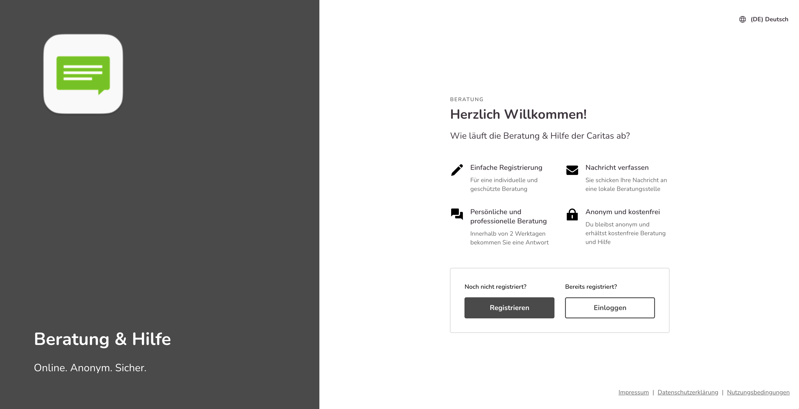
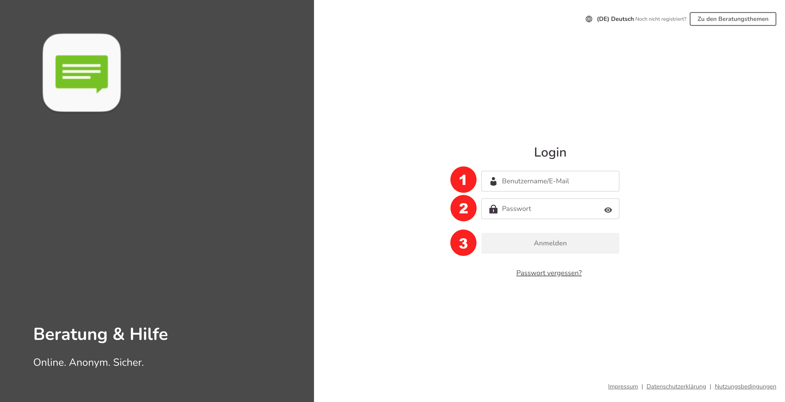

import { PrimaryNote } from '../../components.jsx';
import useBaseUrl from '@docusaurus/useBaseUrl';

<PrimaryNote>
    Die Beratungsplattform funktioniert auch auf Smartphones und Tabletts. Im Folgenden sehen sie auch immer die entsprechenden Ansichten in der Mobilversion. Die Bedienung erfolgt analog zur Desktopversion und enthält dieselben Funktionen. 
</PrimaryNote>

Der einfachste und direkte Zugang zur Plattform ist: <strong>abc.onlineberatung.net</strong>, wobei abc für den Namen Ihrer Subdomain steht, dann erscheint das nachfolgende Login-Fenster.  

Hier sehen Sie die beiden Buttons „Zur Registrierung“ und „Zum Login. 

Der „Einloggen“ Button führt Sie zur Login Seite. 

Um sich anzumelden, tragen Sie Ihre Login-Daten ein: 

- Geben Sie Ihre E-Mailadresse oder Ihren Benutzernamen ein <strong>(1)</strong>. 
- Geben Sie Ihr Passwort ein <strong>(2)</strong>.
- Klicken Sie dann auf „Anmelden“ <strong>(3)</strong>. 

<PrimaryNote>
<strong>Erster Login auf der Beratungsplattform</strong>

Um sich das erste Mal in Ihrem Account einzuloggen, klicken Sie bitte auf „Passwort vergessen?“. Anschließend öffnet sich ein neues Fenster in dem Sie dann bitte Ihre E-Mail-Adresse eingeben. Anschließend bekommen Sie per E-Mail einen Link zugesandt.  

<strong>Dieser Link ist 120 Minuten gültig. Achtung: es kann sein, dass diese E-Mail im Spamordner landet. Überprüfen Sie dies bitte.</strong>

Anschließend können Sie sich ein Passwort geben. Aus Gründen des Datenschutzes müssen folgende Anforderungen an das Passwort erfüllt sein:

- Mindestens 9 Zeichen
- Groß- und Kleinschreibung
- mind. eine Zahl
- ein Sonderzeichen (z. B. +, *, !, etc.)

</PrimaryNote>