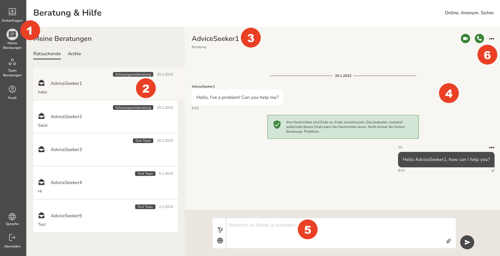
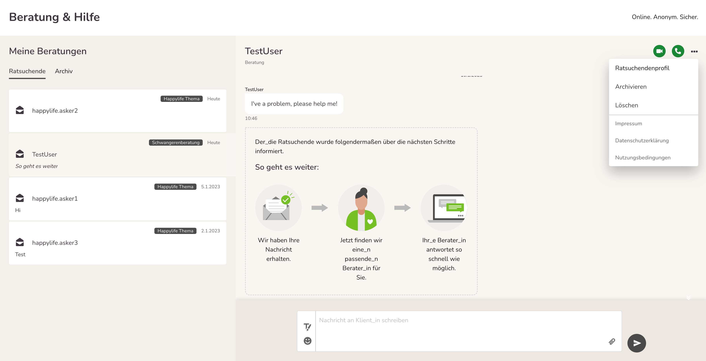

import { PrimaryNote } from "../../components.jsx";
import useBaseUrl from "@docusaurus/useBaseUrl";

Nach erfolgreichem Login gelangen Sie auf die zentrale Arbeitsübersicht.

  

  Am linken Bildschirmrand befindet sich die Navigationsleiste, mit
  verschiedenen Reitern, je nach Konfiguration sind nicht alle davon Verfügbar{" "}
  <strong>(1)</strong>:

- 2 Erstanfragen
- 3 Meine Nachrichten
- 4 Teamberatungen (nur bei Teamberatungsstellen)
- 5 Termine (optional)
- 6 Profil
- 7 Abmelden

bei der mobilen Version befinden sich diese am unteren Rand des Bildschirms – siehe Abbildung.

Rechts davon befindet sich die Liste der Beratungskommunikationen <strong>(2)</strong>: Das Postfach (Nutzername der Ratsuchenden, PLZ (falls diese benötigt wird), Eingangszeit, Symbol (gelesen/ungelesen)).

Beim Klick auf eine Beratungskommunikation erscheint (durch graue Farbe verbunden) der Nachrichtenverlauf am rechten Bildschirmrand <strong>(3)</strong>.

Links (in Weiß) befindet sich die Anfrage der Ratsuchenden, in grau rechts die eigenen Berater_innen- Nachricht <strong>(4)</strong>.

Das Textfeld zum Verfassen der Nachrichten <strong>(5)</strong>, vergrößert sich, abhängig von der Länge der Nachricht, die verfasst wird. Ganz rechts befindet sich der graue Absende-Button.

  <strong>(6)</strong> Hier gibt es mehrere Optionen:

- Das Impressum, die Datenschutzerklärung und die Nutzungsbedingungen können unter einem neuen Browser-Tab eingelesen werden
- Im „Ratsuchendenprofil“ können Sie alle öffentlich zugänglichen Informationen über den RS einsehen und darüber hinaus die Anfrage des Ratsuchenden an einen anderen Berater weiterleiten
  - Wenn Sie einen Fall einem anderen Betreuer zuweisen:
    - Die Ratsuchenden erhalten eine Nachricht im Chat, in der sie aufgefordert werden, dem Wechsel des Beraters zuzustimmen. Die Ratsuchenden können entweder zustimmen oder ablehnen.
    - Erst wenn der Ratsuchende dem Wechsel des Beraters zustimmt, hat der neue Berater Zugang zum Ratsuchenden-Chat mit dem bisherigen Berater.
- Sie können die Konversation archivieren oder löschen. Eine archivierte Konversation erscheint automatisch wieder in „Meine Nachrichten“ sobald der User erneut eine Nachricht an Sie sendet.

  

