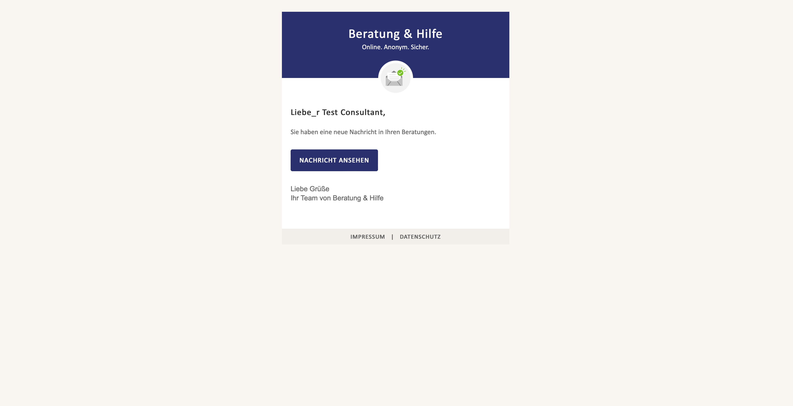
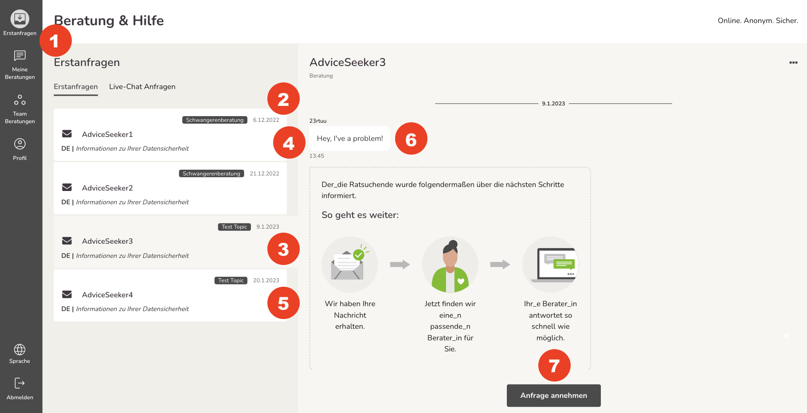
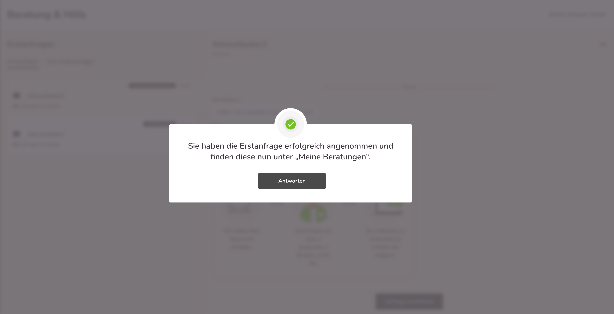

import { PrimaryNote } from "../../components.jsx";
import useBaseUrl from "@docusaurus/useBaseUrl";

Wenn eine neue Anfrage in Ihrer Onlineberatungsstelle eingegangen ist, erhalten Sie eine Benachrichtigung an die von Ihnen hinterlegte E-Mailadresse.

  

Wir befinden uns im Menüpunkt „Erstanfragen“. Das Symbol „Erstanfragen“ <strong>(1)</strong> in der linken Navigationsleiste ist optisch hervorgehoben. Die Übersicht der offenen Erstanfragen kann vom gesamten Beratungsteam Ihrer Beratungsstelle eingesehen werden.

Zudem sehen Sie folgende Elemente:

- Eingangszeitpunkt der Erstanfrage <strong>(2)</strong>.
- Aktuelle Anfrage, die im Dialogfeld sichtbar ist <strong>(3)</strong>.
- Gelesene, nicht angenommene Erstanfrage (offenes Briefsymbol) <strong>(4)</strong>.
- Ungelesene Erstanfrage (geschlossenes Briefsymbol) <strong>(5)</strong>.
- Aktuelles Dialogfeld mit geöffneter Anfrage <strong>(6)</strong>.
- „Anfrage Annehmen“ <strong>(7)</strong>, mit Klick auf diesen Button wird Ihnen die Erstanfrage zugeordnet, es wird Ihr Beratungsfall und ordnet sich somit in Ihre „Meine Nachrichten“ ein.

Sie erhalten anschließend folgenden Hinweis:

Mit einem Klick auf „ANTWORTEN“ werden Sie automatisch in „Meine Nachrichten“ weitergeleitet und die Anfrage kann sofort beantwortet werden.

### Ersttermine

Wenn Sie die Terminfunktionalität nutzen, dann können Ratsuchenden mit ihrer Beratungsstelle Erstberatungstermine vereinbaren. Sobald ein Ersttermin mit einem der Berater_innen gebucht wurde, sind die Ratsuchenden zugewiesen und nicht mehr in der Liste der Erstanfragen.
