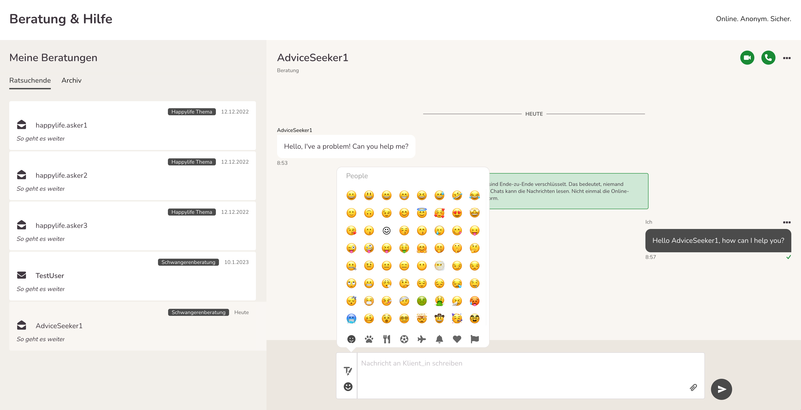
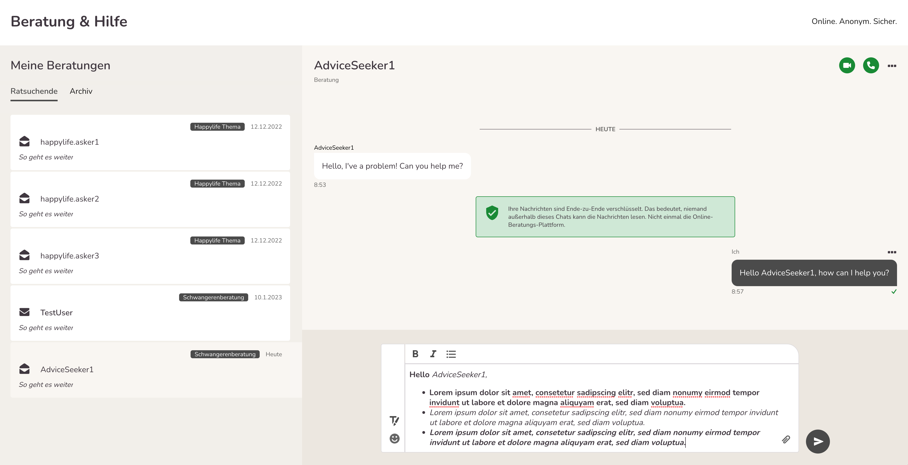

import { PrimaryNote } from "../../components.jsx";
import useBaseUrl from "@docusaurus/useBaseUrl";

Nachdem Sie die Anfrage angenommen haben, werden Sie direkt in den Bereich „Meine Nachrichten“ weitergeleitet.

Wir befinden uns im Menüpunkt <strong>Meine Nachrichten</strong>. Das entsprechende Symbol in der linken Navigationsleiste ist optisch hervorgehoben.

  

Sie sehen folgende Elemente:

- Übersicht über die angenommenen Beratungen. Ein offenes Briefsymbol bedeutet, dass die letzte Nachricht gelesen wurde. Das geschlossene Briefsymbol vor einer Nachricht zeigt an, dass eine Folgeanfrage vom Ratsuchenden vorliegt, die Sie noch nicht geöffnet und gelesen haben <strong>(1)</strong>.
- Weiß hinterlegt sehen Sie die Nachricht der Ratsuchenden <strong>(2)</strong>.
- Grau hinterlegt sehen Sie Ihre Antwort <strong>(3)</strong>.
- Das Textfeld zum Verfassen der Nachrichten vergrößert sich, je mehr geschrieben wird. Ganz rechts befindet sich der graue Absende-Button <strong>(4)</strong>. Beim Klicken auf diesen, wird die Nachricht versendet.
- Das Häkchen hat eine Bestätigungsfunktion <strong>(5)</strong>. Ist das Häkchen grau bedeutet das, dass die Nachricht erfolgreich versendet wurde und nun bei dem Ratsuchenden im Postfach liegt. Ein grünes Häkchen bedeutet, dass der Ratsuchende die Nachricht gelesen hat. Das funktioniert allerdings nur bei Regel-/Standardberatungsstellen, nicht bei Teamberatungsstellen!

Im Texteingabefeld finden Sie einen sog. Emoji-Picker , einen Texteditor und eine Büroklammer.

Beim Verfassen von Nachrichten können Sie sich des Emoji-Pickers bedienen. D.h. wenn Sie auf den Smiley klicken, öffnet sich eine Auswahl an verschiedensten Emojis, die Sie dann durch Doppelklicken in Ihre Nachricht einfügen können.

  

Daneben steht ein Texteditor zur Verfügung, mit dem Sie Ihre Nachricht formatieren können. An Funktionen sind möglich „fett“ (B), „kursiv“ (I) und Aufzählungszeichen. Zudem können Sie auch (klickbare) Links einfügen, die dann farblich hervorgehoben sind.

Im Texteingabefeld finden Sie eine Büroklammer. Durch Anklicken öffnet sich der Explorer, dann können Sie eine Datei hochladen und verschicken. Folgende Dateiformate sind zugelassen und können von Ihnen, aber auch von den Ratsuchenden verschickt werden: Word, Excel, PDF, PNG, JPG. Die maximale Dateigröße beträgt 5 MB. Aus Sicherheitsgründen können je Ratsuchenden und Tag maximal 7 Dateien verschickt werden.

Ihre Nachricht kann maximal 7.000 Zeichen lang sein, was etwa drei DIN A 4 Seiten entspricht. Hier sollten Sie jedoch bedenken, dass sehr lange Nachricht den Empfänger „erschlagen“ könnten – daher die Empfehlung, längere Nachrichten in mehrere kurze Nachrichten zu verpacken. Bitte bedenken Sie auch, dass nur ein starres Zeitfenster von 180 Minuten zur Bearbeitung von Nachrichten zur Verfügung steht. Aus Sicherheitsgründen werden Sie danach automatisch ausgeloggt. Ihre (Nachrichten-) Entwürfe werden 10 Sekunden nach der letzten Texteingabe bzw. Aktivität automatisch zwischengespeichert, auch wenn Sie in der Bearbeitung von mehreren Ratsuchenden Anfragen hin und her springen.

### Ende-zu-Ende Verschlüsselung von Nachrichten

Chatnachrichten auf der Onlineberatung sind grundsätzlich Ende-zu-Ende verschlüsselt.
Dies gilt nicht für Anhänge, die über den Chat verschickt werden und auch nicht für Terminvereinbarungen. Ende-zu Ende Verschlüsselung heißt, dass die Daten nicht nur bei der Übertragung über https verschlüsselt werden, sondern zusätzlich auf den Geräten der Chatteilnehmenden direkt ver- und entschlüsselt werden, sodass nur die Chatteilnehmenden diese Nachrichten lesen können.

Unter bestimmten Umständen kann die Software Nachrichten nicht entschlüsseln, daher geben wir Ihnen hier eine Einführung, wie Ende-zu-Ende Verschlüsselung in der Onlineberatung funktioniert.

<strong>Grundsätzliches</strong>

Um eine Ende-zu-Ende verschlüsselte Nachricht lesen zu können, muss auf dem Gerät und in dem Browser, den man dafür verwendet, der nötige Schlüssel zugänglich sein, damit die Onlineberatungs-Software die Nachrichten der anderen Chatteilnehmenden entschlüsseln kann. Im Normalfall händelt die Onlineberatungs-Software das Management dieser Schlüssel im Hintergrund für Sie, sodass Sie nichts weiter tun müssen, als sich einzuloggen, um ihre Chats zu lesen.

<strong>Verschlüsselte Nachrichten entschlüsseln</strong>

Es gibt zwei Fälle in denen man keinen gültigen Schlüssel hat:

- Sie kommen als neue_r Beratende_r in eine existierende Beratungsstelle und wollen Chats lesen, die VOR der Erstellung Ihres Accounts erstellt wurden. (Erstanfragen oder Teamchats)
  - Chats die NACH ihrer Accounterstellung erstellt werden sind für Sie sofort lesbar.
- Sie ändern das Passwort zu ihrem Account und löschen dabei auch Ihren Browser Cache ODER ändern das Passwort und wechseln dabei den Browser oder das Endgerät.

In beiden Fällen ist es möglich, dass Sie mit Hilfe der anderen Chatteilnehmenden einen gültigen Schlüssel für die Konversation bekommen.

Nachrichten werden grundsätzlich entschlüsselt, wenn ein_e Teilnehmer_in mit einem gültigen Schlüssel den Chat öffnet. Sie müssen dafür nicht gleichzeitig Online sein. Teilnehmer_innen sind im 1:1 Chat Berater_innen und Ratsuchende. Wenn Sie in einer Teamberatungsstelle arbeiten, dann sind Teilnehmer_innen auch Ihre Kolleg_innen in der Beratungsstelle mit einem Account.

Um Nachrichten (wieder) für Sie lesbar zu machen muss ein_e andere_r Teilnehmer_in einmal in den jeweiligen Chat klicken. Dann werden die Nachrichten in diesem Chat für Sie wieder entschlüsselt angezeigt, wenn Sie das nächste Mal den Chat öffnen.

Chats sind nicht mehr zu entschlüsseln, wenn ALLE Teilnehmer_innen des Chats zur selben Zeit ihre Schlüssel verloren haben.
