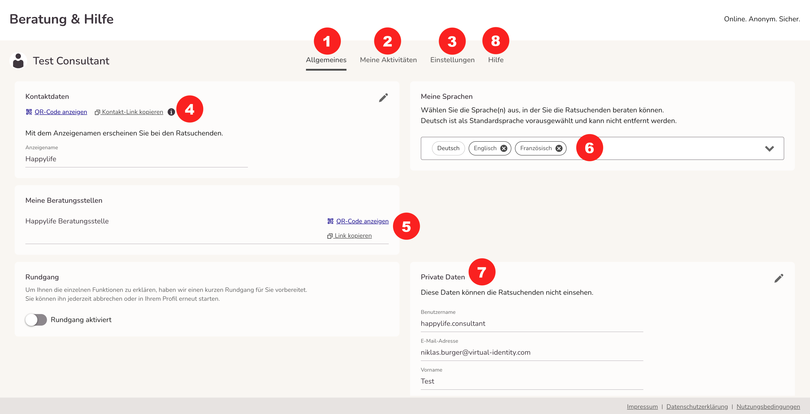
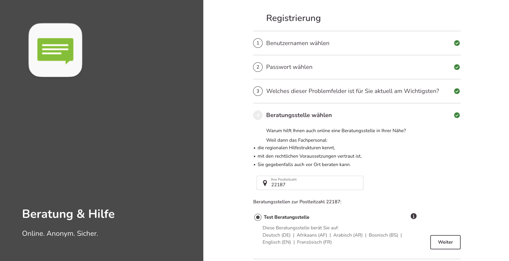
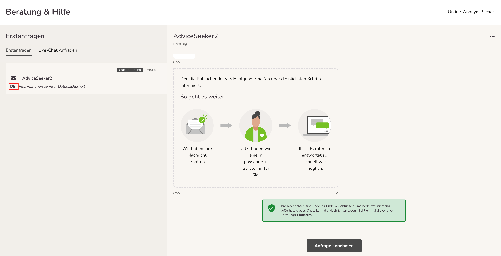
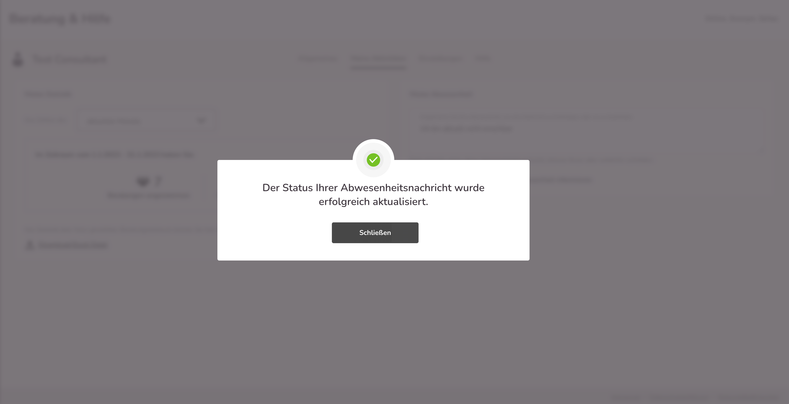
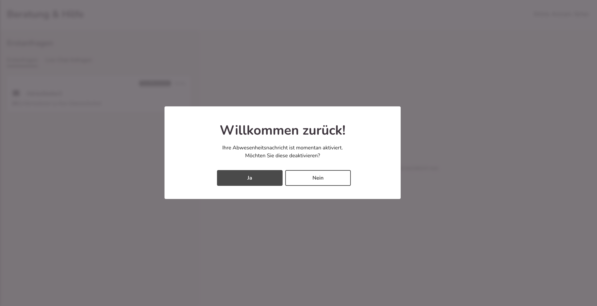
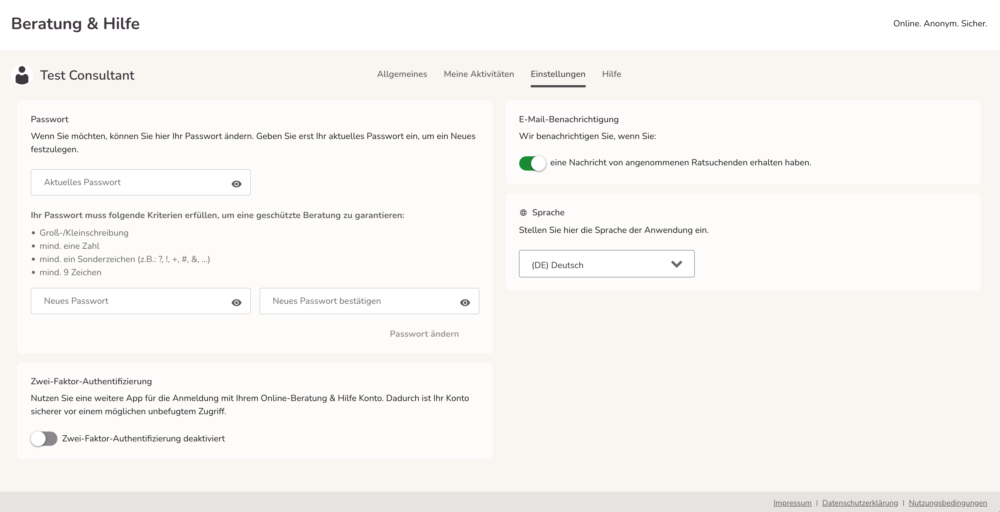
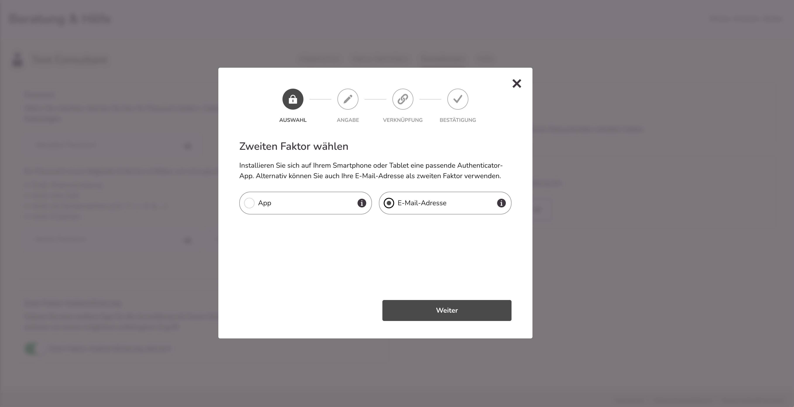

import { PrimaryNote } from "../../components.jsx";
import useBaseUrl from "@docusaurus/useBaseUrl";

Sie haben die Möglichkeit, Teile Ihrer eigenen Profilangaben und Ihr Passwort zu ändern sowie Ihren Ratsuchenden eine Abwesenheitsnachricht zu hinterlassen.

Wir befinden uns im Menüpunkt <strong>Profil</strong>. Das entsprechende Symbol in der linken Navigationsleiste ist optisch hervorgehoben:

  Unter dem Menüpunkt <strong>Profil</strong> finden Sie vier Tabs:

- Allgemeines <strong>(1)</strong>
- Meine Aktivitäten <strong>(2)</strong>
- Einstellungen <strong>(3)</strong>
- Hilfe <strong>(8)</strong>

### Allgemeines <strong>(1)</strong>

Im Menüpunkt Allgemeines (1) finden Sie allgemeine Profilinformationen, wie Ihren Benutzernamen und Ihre Beratungsstelle.

Sie haben die Möglichkeit einen Link, sowohl Ihres persönlichen Beratungsprofils (4), als auch den Ihrer Beratungsstelle (5) zu kopieren und an Ratsuchende weiterleiten.

- <strong>Ihr persönlicher Link</strong> ermöglicht es Ratsuchenden, direkt mit Ihnen
  eine Online-Beratung zu beginnen (die erste Nachricht des Ratsuchenden wird direkt
  in „Meine Nachrichten“ geleitet).{" "}

- <strong>Der Link Ihrer Beratungsstelle</strong> ermöglicht es den Ratsuchenden,
  eine Online-Beratung bei der jeweiligen Beratungsstelle zu beginnen (falls mehrere
  Beratungsstellen vorhanden sind).{" "}

#### Hinweise für die Registrierung mit Direktlinks

Bei der Registrierung mit einem Direktlinks beachten Sie bitte die folgenden Hinweise:

Bei persönlichen Berater_innen Links:

- Die Eingaben der Ratsuchenden bei der Registrierung werden erfasst aber für die Anzeige der Beratungsstellen ignoriert. Es werden alle Beratungsstellen des Beraters angezeigt, welche als “in der Registrierung sichtbar” eingestellt sind (Einstellung der Beratungsstelle).
  - Hinweis: Wenn die Berater keiner aktiven Beratungsstelle zugeordnet sind, dann wird die Berater_innenauswahl ignoriert, und den Ratsuchenden jede Beratungsstelle angezeigt, die ihren Kriterien entspricht – nicht aber die des Beraters, da hiervon mindestens eine aktiv sein muss. So verhindern wir, dass Ratsuchende keine Hilfe finden, falls z.B. Beratungsstellen oder Berater nicht (mehr) verfügbar sind.

Bei Beratungsstellen Links:

- Die Eingaben der Ratsuchenden bei der Registrierung werden erfasst aber für die Anzeige der Beratungsstellen ignoriert. Es wird lediglich die eine, im Link vermerkte Beratungsstelle angezeigt, unabhängig davon, ob diese Beratungsstelle gerade in der Registrierung aktiv geschaltet ist oder nicht

In Private Daten <strong>(7)</strong> sehen Sie ihre persönlichen Daten, Sie können diese verändern und anpassen. Ihre Emailadresse und Ihr Vor- und Nachname werden den Ratsuchenden nicht angezeigt. Nur die anderen Berater_innen können Ihren Vor und Nachnamen einsehen. Wenn Sie Ihre Emailadresse in private Daten ändern, müssen Sie sich ab sofort mit der neuen Emailadresse einloggen.

Außerdem haben Sie die Möglichkeit, die von Ihnen gesprochenen Sprachen <strong>(6)</strong>, in denen Sie die Ratsuchenden beraten können unter <strong>Meine Sprachen</strong> auszuwählen. Die Sprachen werden den Ratsuchenden dann angezeigt und diese haben die Möglichkeit Ihnen Nachrichten in den von Ihnen ausgewählten Sprachen zu schreiben.

Alle Sprachen, die von den Beratern vorausgewählt wurden, werden zukünftig bei der ausgewählten Beratungsstelle im Registrierungsprozess angezeigt.

Außerdem steht neben jeder Erstanfrage die vom Ratsuchenden vorausgewählte Sprache. So kann die Berater_in sofort erkennen ob sie die vom Ratsuchenden ausgewählte Sprache spricht, und ihm in dieser antworten kann.

### Meine Aktivitäten <strong>(2)</strong>

In <strong>Meine Aktivitäten</strong> gibt es die Möglichkeit die eigenen Statistiken einzusehen. Dabei stehen die Daten aus den folgenden Zeiträumen zur Verfügung: der aktuelle Monat, der letzte Monat, das aktuelle Jahr und das letzte Jahr. Die erhobenen Zahlen aus diesen Zeiträumen sind:

- die Anzahl der angenommenen Beratungen
- die Anzahl der geschriebenen Nachrichten

Des Weiteren steht eine Excel Datei zum Download, über den gewählten Zeitraum zur Verfügung. Diese Datei beinhaltet zusätzlich die erhobenen Werte zu:

- den aktiven Beratungen (eine Beratung gilt als aktiv sofern mindestens eine Nachricht im gewählten Zeitraum geschrieben wurde)
- der Dauer von Videoanrufen in Minuten:Sekunden.

Unter <strong>Abwesenheit</strong> können Sie eine Abwesenheitsnachricht verfassen. Um diese Funktion zu aktivieren, muss im Kästchen, das rote Häkchen gesetzt werden. Dann können Sie eine Nachricht in das Textfeld schreiben und auf „ändern“ klicken, dann wird ihren Ratsuchenden die von Ihnen verfasste Nachricht angezeigt wenn sie sich einloggen. Wenn Sie auf „abwesend“ gestellt sind, erhalten Sie keine Info-E-Mails über neu eingegangene Anfragen oder wenn Ihnen ihr Klient wieder geschrieben hat.

<PrimaryNote>
  Die Abwesenheitsfunktion greift nur bei Bestandsklient_innen nicht bei
  Erstanfragen.
</PrimaryNote>

Nach erfolgreicher Einstellung einer Abwesenheitsnachricht erscheint folgender Bestätigungshinweis:

Wenn Sie sich bei aktivierter Abwesenheitsnachricht erneut einloggen, sehen Sie folgenden Hinweis nach der Anmeldung:

Soll die Abwesenheitsnachricht weiterhin aktiv bleiben, klicken Sie auf „Nein“. Möchten Sie die Beratungen wieder aufnehmen und die Abwesenheitsnachricht deaktivieren, klicken Sie auf „Ja“.

### Einstellungen <strong>(3)</strong>

  Im Bereich Benachrichtigungen können Sie wählen, ob Sie die
  E-Mail-Benachrichtigungen, die Sie zu verschiedenen Ereignissen erhalten, AUS
  oder EIN schalten möchten:

- wenn eine neue Erstanfrage in Ihrer Beratungsstelle eingeht
- wenn alte Erstanfragen noch nicht angenommen wurden (täglich)
- wenn die Ratsuchende, mit der Sie in Kontakt stehen, auf Ihre Nachricht antwortet
- wenn ein anderer Berater Ihnen einen Fall zuweist
- wenn ein neuer Termin vereinbart, verschoben oder abgesagt wird

Standardmäßig ist die Einstellung auf EIN gestellt.

Im Bereich <strong>Sicherheit</strong> gibt es die Möglichkeit das Passwort zu ändern, sowie die Einrichtung einer 2-Faktor-Authentifizierung.

#### 2-Faktor-Authentifizierung

Nach erfolgreichem Login wird Ihnen die Möglichkeit „Schützen Sie Ihr Konto“ als Popup angeboten. Drücken Sie entweder auf „Später erinnern“ um die 2-Faktor-Authentifizierung später einzurichten oder auf „Jetzt schützen“ um Sie sofort einzurichten.

Im nächsten Schritt haben Sie die Möglichkeit, den von Ihnen bevorzugten 2-Faktor auszuwählen.

Entweder eine App

Oder Sie hinterlegen Ihre E-Mail-Adresse

Wenn Sie sich für eine der Apps entschieden haben, laden Sie die App von Ihnen gewählte App.

Wenn Sie die App geladen haben, scannen sie den QR-Code oder geben Sie den 32-stelligen Schlüssel manuell ein.

Im Anschluss wird ein Code generiert, den Sie eintippen und auf „Speichern“ klicken, um die Einrichtung abzuschließen.

Wenn Sie sich für die E-Mail-Adresse entschieden haben:

Nach erfolgreicher Aktivierung der 2-Faktor-Authentifizierung erscheint diese in „Sicherheit“ <strong>(3)</strong> grün. Dadurch ist Ihr Konto sicherer vor einem möglichen unbefugten Zugriff.

### 1.7.5. Hilfe <strong>(9)</strong>

Auf dieser Seite befinden sich zusätzliche Informationen über die Browseroptionen und die Verschlüsselung.

#### 1.7.6. Mobile Version des Profilbereichs

