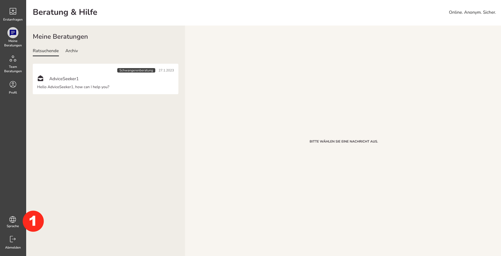
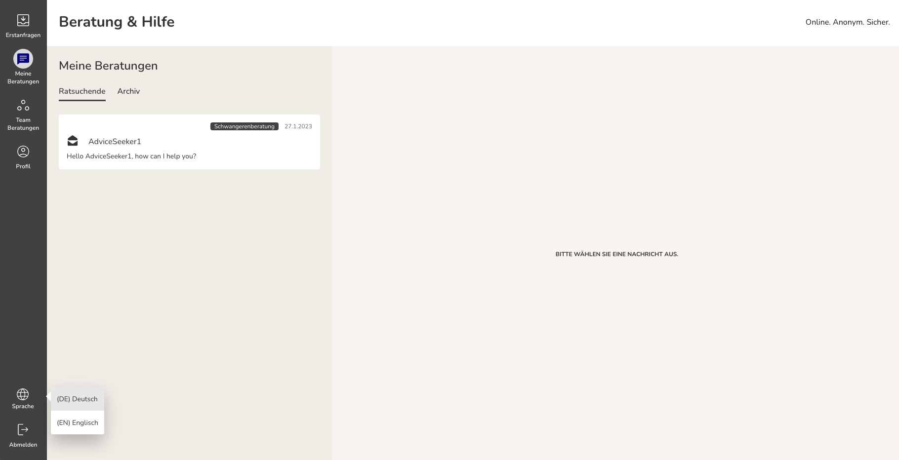

Im Menüpunkt Sprache <strong>(1)</strong> können Nutzende auswählen in welcher Sprache die Applikation für Sie angezeigt werden kann.

Die Spracheinstellung nutzt als Default die Einstellung des Browsers. Wenn im Browser keine verfügbare Sprache hinterlegt ist, dann wird die Applikation auf Deutsch angezeigt.

Wenn nur eine Sprache in der Applikation hinterlegt ist, dann wird die Sprachauswahl nicht angezeigt.
