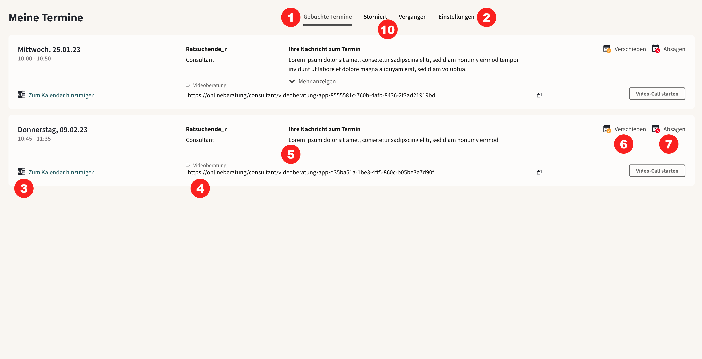
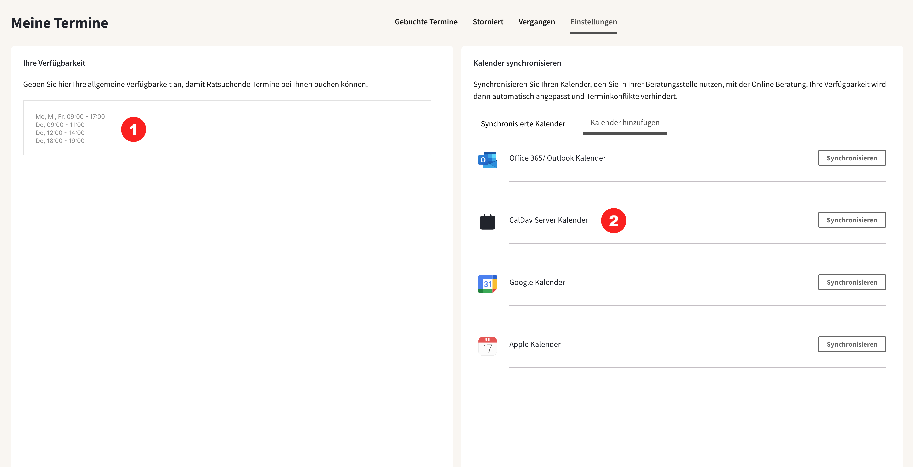
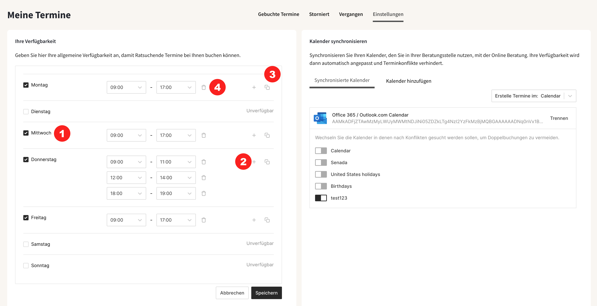
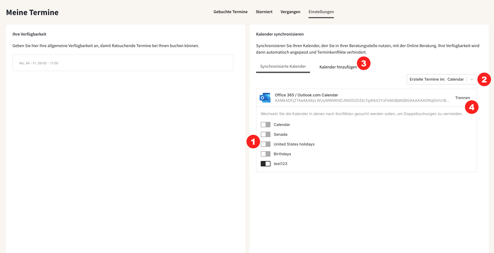

import { PrimaryNote } from "../../components.jsx";

Ist die Funktionalität Terminmanagement auf ihrer Plattform aktiviert, so können Ratsuchende Termine mit ihnen Buchen. Sie sehen eine Übersicht der Termine in dem Reiter “Meine Termine”. Damit es nicht zu Terminüberschneidungen kommt können Sie ihre Verfügbarkeit konfigurieren.

### 1.9.1 Terminübersicht

In meine Termine sehen Sie zunächst eine Übersicht der Termine <strong>(1)</strong>, die Ratsuchende mit Ihnen gebucht haben. Sie können auch zu den Reitern “Storniert” und “Vergangen” wechseln, um abgesagte und vergangene Termine einzusehen. Im Reiter Einstellungen <strong>(2)</strong> können Sie ihre Verfügbarkeit und Kalender-Synchronisation verwalten, die wir im nächsten Kapitel genauer beschreiben. Ratsuchende können nur Termine zu Zeiten buchen an denen Sie verfügbar sind.

  In der Terminübersicht sehen Sie die folgenden Informationen zu jedem Termin:

- Datum und Uhrzeit
- “zum Kalender hinzufügen” <strong>(3)</strong> - mit Klick auf diesen Link laden Sie eine Termindatei herunter, welche die Termindetails enthält, sodass sie ihren Kalender manuell synchronisieren können. Wenn Sie die Kalender-Synchronisation nutzen, was wir empfehlen, werden die Termine automatisch mit ihrem Kalender synchronisiert.
  Die Datei enthält alle Termindetails außer der Terminnotizen, da es sich dabei um besonders sensible Information handeln kann.
- Name der Ratsuchenden
- Termintyp <strong>(4)</strong> – hier sehen Sie um was für einen Termin es sind handelt. Es können entweder Video oder Chat Termine vereinbart werden
- Nachricht zu Termin <strong>(5)</strong> – Dies ist die Terminnotiz, die Ratsuchende bei der Buchung des Termins eingeben können. Es handelt sich dabei um ein Freitextfeld. Terminnotizen werden bei Kalendersynchronisation nicht in den Kalendertermin synchronisiert und sind nur über die Plattform einsehbar.
- Termin verschieben <strong>(6)</strong> – sollten Sie wieder erwarten verhindert sein, können Sie den Termin verschieben. Tun Sie dies am besten in Rücksprache mit den Ratsuchenden, da diese ihre Verfügbarkeit nicht auf der Plattform hinterlegen können. Ratsuchende erhalten bei Verschiebung eine Benachrichtigung mit aktualisierter Uhrzeit und Datum.
- Termin absagen <strong>(7)</strong> – Sie können einen Termin auch jederzeit absagen. Ratsuchende werden über die Absage informiert. Wenn ein Termin abgesagt ist, können Sie die Termindetails im Reiter “Storniert” <strong>(10)</strong> einsehen.

  Für die Termine gibt es einige Konfigurationen, die für die gesamte Instanz
  konfiguriert werden und nicht für Sie individuell einstellbar sind:

- Dauer der Termine, z.B. 50min
- Wie viel Zeit zur Vor- und Nachbereitung zwischen Terminen zur Verfügung steht, z.B. 10min zwischen jedem Termin
- In welcher Zeitspanne gebucht werden kann, also wie viele Stunden/Tage muss ein Termin im Voraus gebucht werden, und wie viele Tage im Voraus kann gebucht werden. Zum Beispiel kann das System so konfiguriert werden, dass Ratsuchende Termine mindestens mit einem Tag Vorlauf, aber höchstens 10 Tage im Voraus buchen können.
- Art der Termine (Chat, Video)

### 1.9.2 Verfügbarkeit und Kalender-Synchronisation

In dem Reiter “Einstellungen” können sie einstellen, wann Sie für Terminbuchungen durch Ratsuchende verfügbar sind. Ratsuchende können sich dann bei der Buchung einen freien Termin auswählen. Die verfügbaren Termine ergeben sich aus der allgemeinen Verfügbarkeit, die Sie je Wochentag einstellen können und aus Terminkonflikten, die sich aus synchronisierten Kalendern ergibt.

#### Allgemeine Verfügbarkeit einstellen

  Für jeden Tag der Woche können Sie angeben in welchen Zeitfenstern Sie für
  Beratungstermine durch die Onlineplattform zur Verfügung stehen.

- Wählen Sie einen Tag, an dem Sie für Beratungen zur Verfügung stehen, durch Setzen des Häckchens aus. An Tagen an denen Sie nicht zur Verfügung stehen entfernen Sie das Häckchen.
  - Aus technischen Gründen wird bei der Erstellung ihres Kontos einer der Tage mit null Stunden Verfügbarkeit bereits vorausgewählt; sollten Sie an diesem Tag keine Beratungstermine anbieten entfernen Sie bitte das Häckchen. Wenn Sie an diesem Tag Termine anbieten wollen, löschen Sie das voreingestellte Zeitfenster und konfigurieren die Verfügbarkeit wie gewünscht.
- Durch das Anklicken des “Plus” Symbols können Sie ein neues Zeitfenster hinzufügen.
- Durch Anklicken des “Kopieren” Symbols können Sie die Zeitfenster dieses Tages an beliebigen anderen Wochentagen mit wenigen Klicks replizieren, ohne diese nochmal von Hand eingeben zu müssen.
- Durch Anklicken des “Mülleimer” Symbols können Sie ein Zeitfenster löschen.
- Wenn Sie gar nicht verfügbar sein wollen, dann stellen Sie ihre Verführbarkeit auf ein möglichst kleines Fenster (z.B. 15min) ein, das kürzer ist als jeder Termin, der angeboten wird. Dann werden sie nicht als verfügbar angezeigt.

Wenn Sie fertig sind, scrollen Sie an das Ende, und drücken “Speichern” um die Änderungen zu speichern, oder “Abbrechen” um die Änderungen zu verwerfen. Ihre Änderungen sind sofort wirksam.

Aus den angegebenen Zeitfenstern und der eingestellten Terminlänge, berechnet die Plattform automatisch Terminfenster, die gebucht werden können. Wenn Sie also z.B. eine Verfügbarkeit von 9:00 - 12:00 Uhr eintragen und die Terminlänge 60 Minuten beträgt, dann sehen Ratsuchende drei Terminfenster, aus denen Sie wählen können.

#### Kalender-Synchronisation

Die Kalender -Synchronisation hat zwei Zwecke: zum einen werden die synchronisierten Kalender während der Terminbuchung auf Terminkonflikte überprüft <strong>(1)</strong>, zum anderen werden Termine, die über die Online-Beratung gebucht werden, automatisch in einen Kalender ihrer Wahl übertragen (2).

  Um einen neuen Kalender hinzuzufügen, gehen Sie auf den Reiter “Kalender
  hinzufügen” <strong>(3)</strong> und wählen Sie den Kalendertypen aus. Sie
  können die folgenden Kalendertypen synchronisieren:

- CalDav Server
- Office 365 / Outlook.com Kalender
- Google Kalender
- Apple Kalender

Wählen Sie den passenden Kalender aus und klicken auf den “Synchronisieren” Button und folgen den Anweisungen.

<PrimaryNote>
  Um die Kalender-Synchronisation zu ermöglichen braucht die Onlineberatung
  Zugriffsberechtigungen, die recht weitreichend klingen, allerdings werden
  keine Termindaten aus ihrem Kalender in der Onlineberatung gespeichert. Es
  wird lediglich abgefragt, ob Sie an bestimmten Terminen bereits einen
  Terminkonflikt haben oder nicht, und gebuchte Termine werden in einen Kalender
  ihrer Wahl eingetragen. Ggf muss ihr IT Administrator die
  Online-Beratungsapplikation freischalten, damit Sie die Synchronisation nutzen
  können. Falls dies der Fall ist werden Sie darüber informiert, wenn Sie die
  ihren Kalender synchronisieren wollen.
</PrimaryNote>
Wenn Sie ihren Kalender erfolgreich verbunden haben, dann wählen Sie aus der Liste
der Unterkalender <strong>(1)</strong> aus, welche berücksichtigt werden sollten
und schalten diese ein (Schieber wird schwarz). Geburtstagskalender, u.ä. sollten
ausgeschaltet bleiben (Schieber ist hellgrau).{" "}

Rechts über ihren Kalendern sehen Sie ein Dropdown Menü <strong>(2)</strong> mit welchem Sie auswählen können, in welchen Kalender neue Termine eingetragen werden sollen.

Wenn Sie weitere Kalender hinzufügen wollen, gehen Sie einfach wieder auf den entsprechenden Reiter “Kalender hinzufügen” <strong>(3)</strong>.

Sobald ihre Kalender-Synchronisation aufgesetzt ist, wird die Onlineberatungsapp nicht zulassen, dass Termine zu Zeiten gebucht werden, an denen Sie bereits andere Termine oder Abwesenheiten eingetragen haben. Neue Terminbuchungen werden automatisch in den ausgewählten Kalender eingetragen. Dabei wird der Nutzername der Ratsuchenden übertragen, nicht aber Terminnotizen. Die Terminnotizen sind ausschließlich in der Onlineberatung unter dem jeweiligen Termin in dem Reiter “Meine Termine” in “Gebuchte Termine” in dem jeweiligen Termineintrag einsehbar.
Die Email-Adresse der Ratsuchenden ist für Sie als Berater aus Datenschutzgründen nicht einsehbar.

Wenn Sie einen Kalender gar nicht mehr zur Synchronisation nutzen wollen, trennen Sie ihn durch Klicken auf den Button “Trennen” <strong>(4)</strong>.
