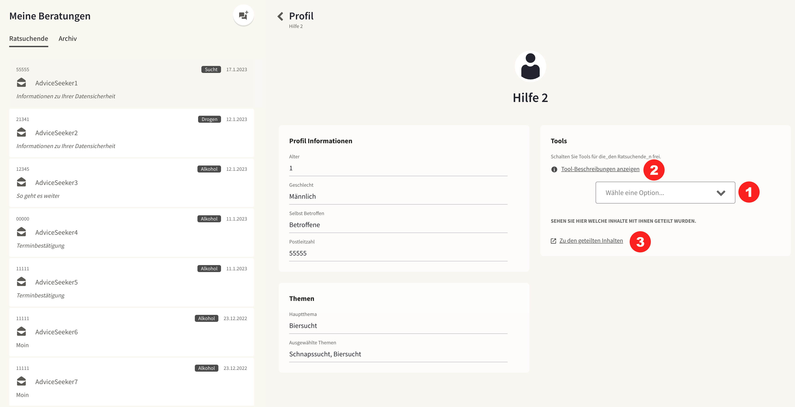

import { PrimaryNote } from '../../components.jsx';

Ist die Funktionalität Terminmanagement auf ihrer Plattform aktiviert, so können Berater_innen Ratsuchenden digitale Tools nutzen, um den Beratungsprozess zu begleiten und zu unterstützen. 

### 1.10.1 Freischalten von Tools 
Für zugewiesene Rastsuchende können Berater_innen Tools freischalten, sodass die Ratsuchenden diese auf der Onlineberatung nutzen können.

Auf dem Ratsuchenden Profil können die Tools ausgewählt werden <strong>(1)</strong>. (Das Profil ist über den Chat mit den Ratsuchenden erreichbar). Sobald die Tools ausgewählt sind sehen die Ratsuchenden diese in einem neuen Reiter “Tools”. 

Unter dem Link “Tool Beschreibungen” <strong>(2)</strong> können Berater_innen eine kurze Beschreibung der Tools einsehen. 

### 1.10.2 Nutzung der Tools
Ratsuchenden können nur Tools nutzen, die Ihnen von Berater_innen freigeschaltet werden. Nach der Registrierung sind zunächst keine Tools verfügbar. 

Berater_innen können über die Toolübersicht <strong>(3)</strong> zum einen einsehen zu welchen Tools von Ratsuchenden genutzt wurden, zum anderen können Sie auch die Einträge von Ratsuchenden sehen. 

Bei manchen Tools, wie z.B. dem Konsumtagebuch und der Motivationswaage müssen die Ratsuchenden den Berater_innen Erlaubnis geben ihre Einträge einzusehen, bevor diese gelesen werden können.