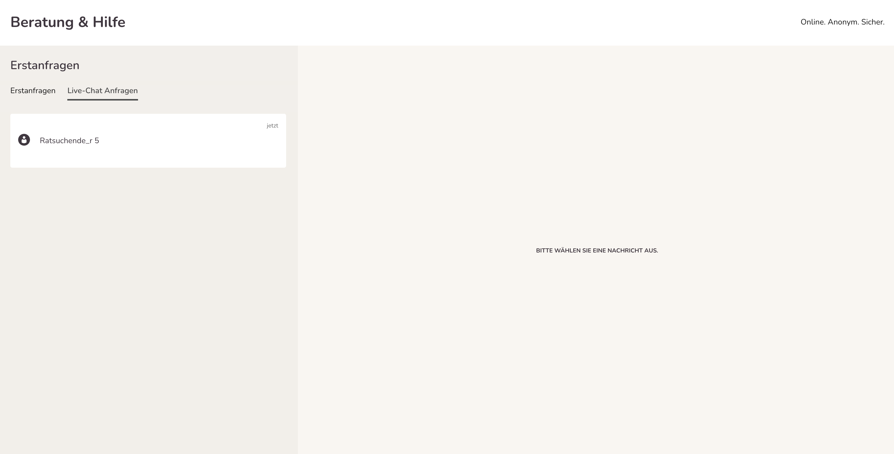
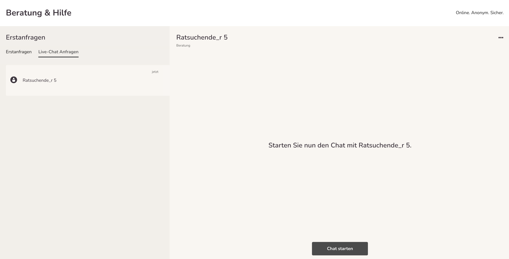
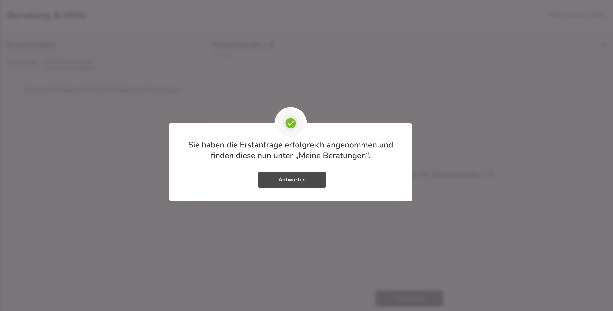
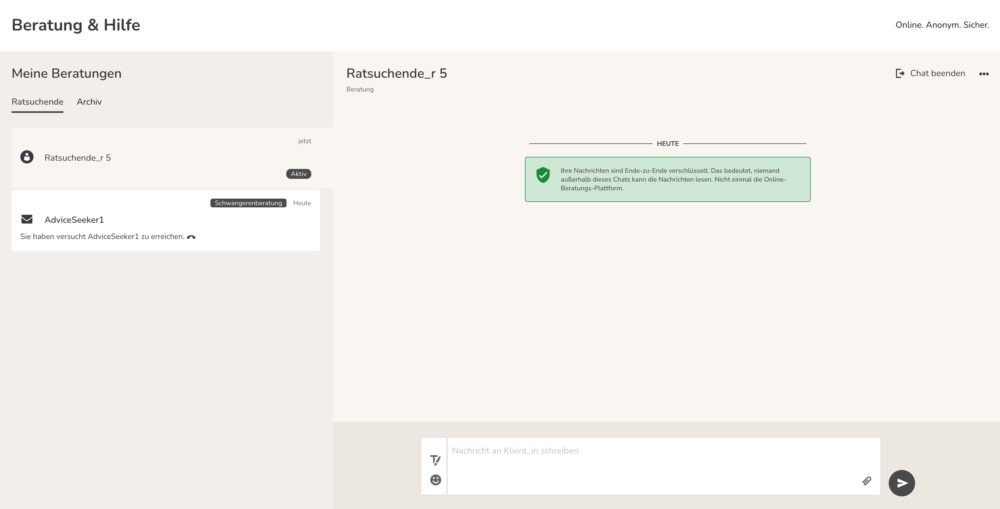
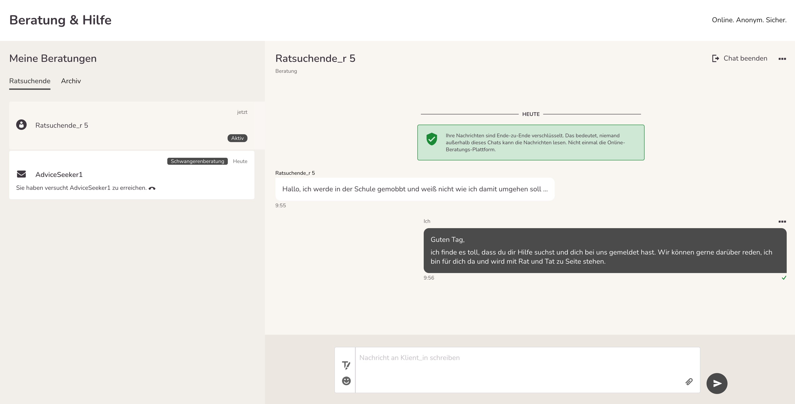
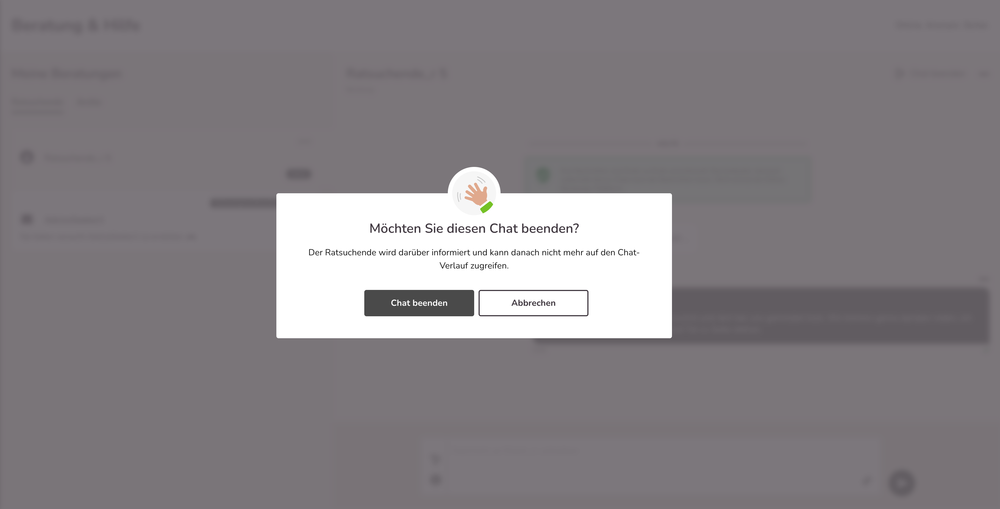
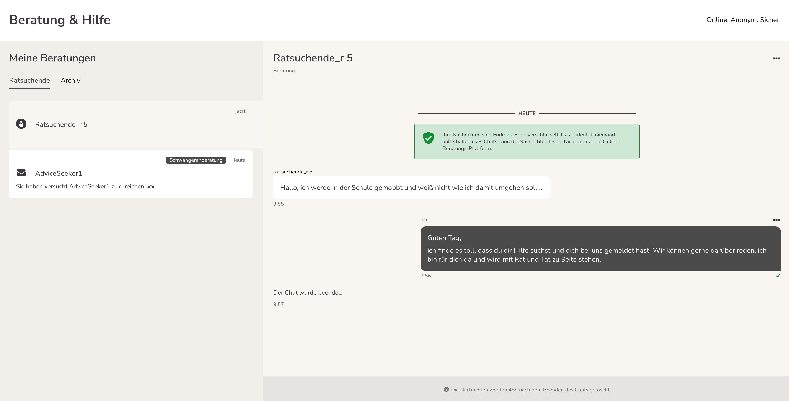

import { PrimaryNote } from '../../components.jsx';

Wenn der 1:1 Chat für nicht registrierte Ratsuchende geöffnet ist, dann finden Sie Anfragen von Ratsuchenden unter dem Menüpunkt „Erstanfragen“ und dort dann unter dem Tab „Livechat-Anfragen“.

Sie sehen dann, wie viele Anfragen vorliegen. Da die Ratsuchenden sich nicht registrieren müssen, tragen alle den Benutzernamen „Ratsuchende_r“ und werden einfach durchnummeriert, beispielsweise „Ratsuchende_r 5“. Wenn Sie den Ratsuchenden anklicken, wird die Anfrage geöffnet und Sie können die Anfrage annehmen.

Wenn Sie auf „Chat starten“ klicken, erhalten Sie folgenden Hinweis:

Wenn Sie nun „Antworten“ anklicken, werden Sie automatisch zum Menüpunkt „Meine Nachrichten“ übergeleitet und können dem Ratsuchenden nun schreiben.

<PrimaryNote>
    So lange Sie als Berater_in die Chatanfrage nicht angenommen haben, kann der Ratsuchende Ihnen keine Nachricht schreiben.
</PrimaryNote>

Anhand des Icons und des Benutzernamens können Sie sehen, ob es sich um einen 1:1 Chat oder eine Textnachricht handelt. Zudem gibt es beim 1:1 Chat den Hinweis „aktiv“, wenn dieser aktuell läuft. Wenn der Chat beendet wurde, entfällt der Hinweis „aktiv“.

Nun können Sie mit dem Ratsuchenden chatten.

Für den Chat stehen Ihnen alle Funktionen zur Verfügung, wie Sie es schon der Online-Beratung kennen: Textformatierung, Emojipicker und Austausch von Dateien (Word, Excel, PDF, PNG, JPG)

Der Chat kann sowohl von Ihnen als Berater_in als auch von dem Ratsuchenden beendet werden. Wenn Sie den Chat beenden möchten, bitte oben rechts auf „Chat beenden“ klicken.

Es erfolgt dann eine Sicherheitsabfrage:

Wenn Sie auf „Abbrechen“ klicken bleibt der Chat bestehen. Klicken Sie auf „Chat beenden“ wird dieser geschlossen.

Im Nachrichtenverlauf erscheint dann der Eintrag „Der Chat wurde beendet“.

Sobald der Chat beendet wird, wird der Ratsuchende umgehend ausgeloggt und er kann nichts mehr einsehen.

Für Sie als Berater_in bleibt der Chat noch für 48 Stunden unter „Meine Nachrichten“ einsehbar. Nach Ablauf der 48 Stunden wird er dann auch bei Ihnen gelöscht.