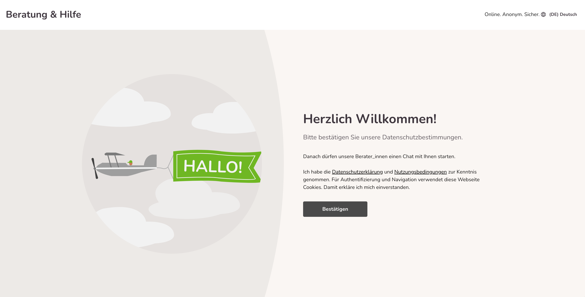
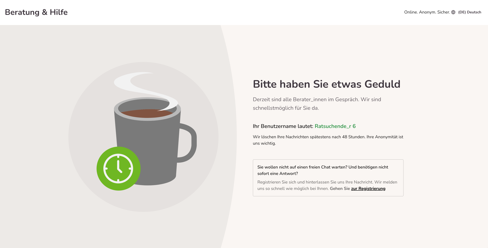
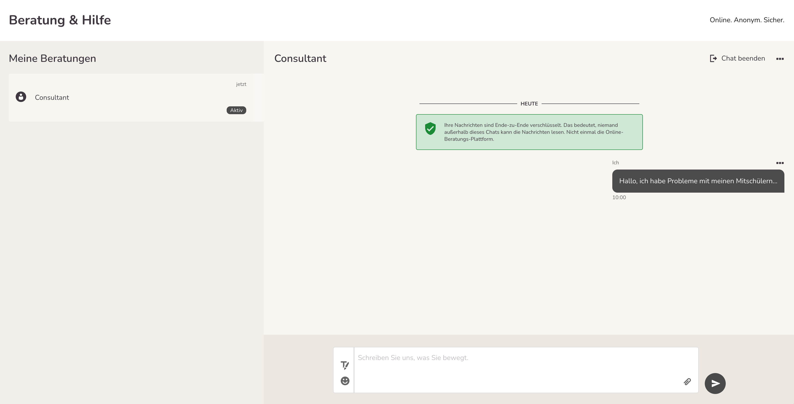

import { PrimaryNote } from '../../components.jsx';

Ratsuchende können beim 1:1 Chat ohne einen Registrierungsprozess durchlaufen zu müssen in Kontakt mit einer Berater_in treten.  

Wenn der Ratsuchende dort „Chat starten“ geklickt hat wird er in einen Warteraum geleitet, der wie folgt aussieht:

Wenn der Ratsuchende dann auf „Bestätigen“ klickt, bekommt er folgendes angezeigt:

Dieser Bildschirm wird so lange angezeigt, bis eine Berater_in den Chat annimmt. Eine zeitliche Begrenzung gibt es hier nicht! Falls die Wartezeit dem Ratsuchenden nach einer gewissen Zeit zu lange ist, wird ihm die Möglichkeit geboten, in die „normale“ Online-Beratung zu wechseln.

Dann hat der Ratsuchende noch einmal die Möglichkeit zu entscheiden, ob er in den Chat startet oder abbricht. Um zu starten, muss er „Jetzt chatten“ anklicken. Die Benutzeroberfläche des 1:1 Chats sieht genau gleich aus wie bei der Berater_in.

