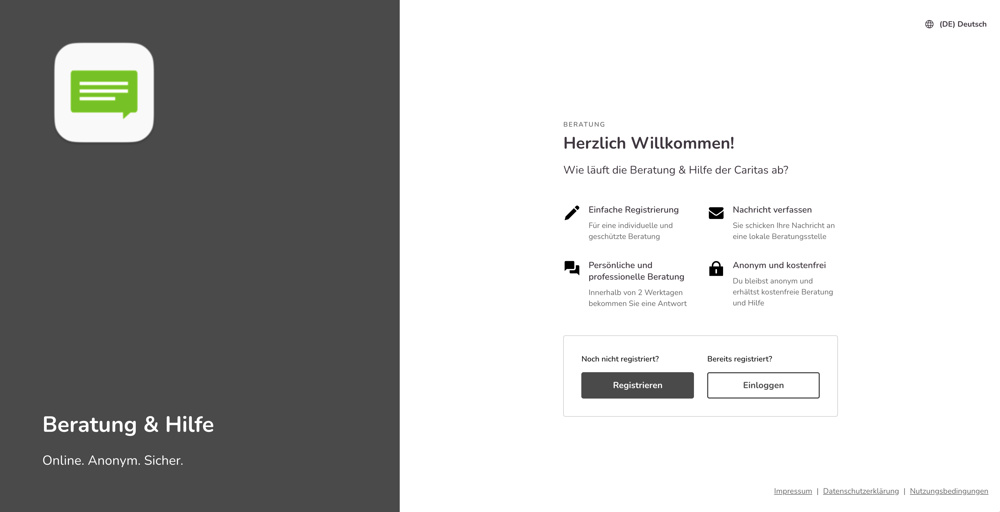
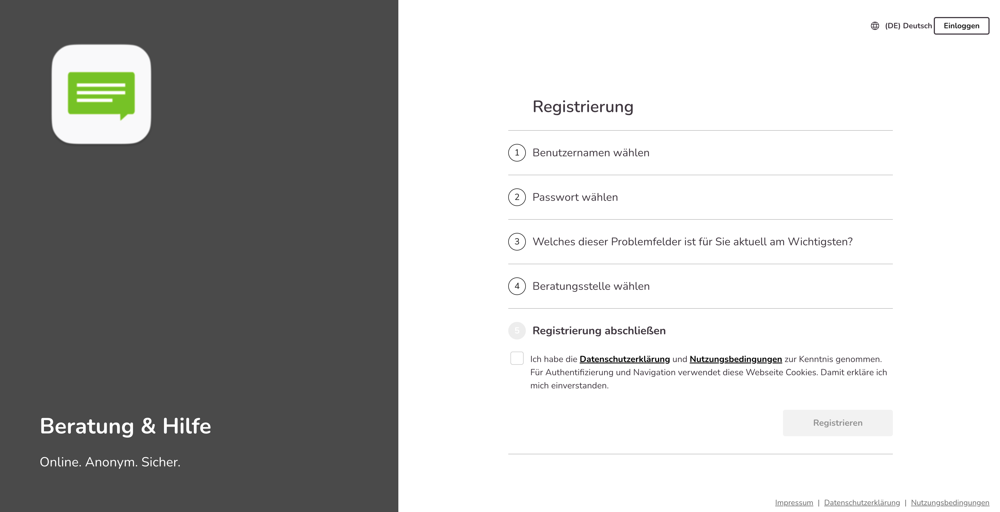
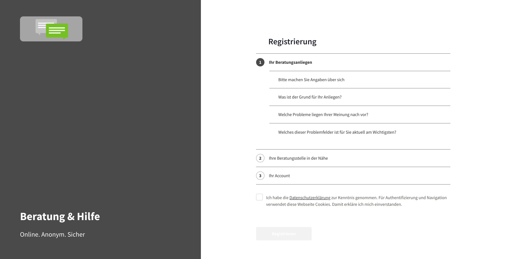
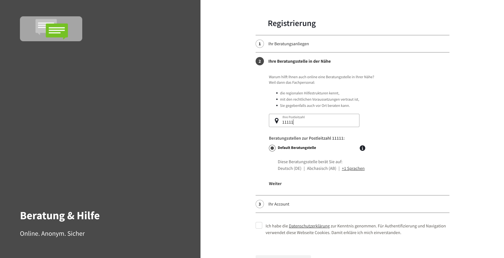
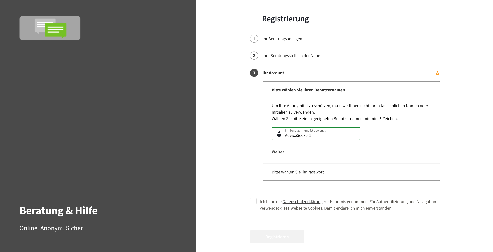

Die Willkommensseite enthält die wichtigsten Informationen über den Prozess und ermöglicht es auch, zum Anmeldebildschirm (wo sich sowohl der Ratsuchende als auch die Berater_in mit ihren Benutzernamen oder ihren E-Mail-Adressen anmelden können) oder zum Registrierungsbildschirm zu gelangen.

Das Registrierungsformular enthält 3 Bereiche:

- das Ausfüllen des <strong>Beratungsanliegens:</strong> 
    - Alter
    - Geschlecht
    - die Beziehung zur betroffenen Person (selbst betroffen ODER Angehöriger)
    - die Probleme und das Hauptproblem, für das die Ratsuchenden Beratung benötigen

- das <strong>Ausfüllen der Postleitzahl</strong> und die <strong>Auswahl der Beratungsstelle</strong> (auf der Grundlage der zuvor vorgestellten Informationen wird nur eine Teilmenge der Beratungsstellen angezeigt, die auf die Bedürfnisse der Ratsuchenden passt) 
    - der Ratsuchende muss alle Informationen in den vorherigen Punkten und die PLZ eingegeben haben, um die verfügbaren Beratungsstellen zu sehen:

- das Ausfüllen der <strong>Kontodaten</strong> (Benutzername und Passwort)
    - Die Angabe des Benutzernamens muss nach den entsprechenden Kriterien – mindestens 5 Zeichen – erfolgen. Es erscheint ein Warnhinweis mittels eines roten Dreiecks, wenn die Mindestanforderung nicht erfüllt wird. Der “Weiter”-Button wird erst dunkel grau und damit klickbar, wenn die Mindestanforderung erfüllt ist.
    - Die Kriterien zur Auswahl des Passwortes – Groß-Kleinschreibung, mindestens eine Zahl, mindestens ein Sonderzeichen, mindestens 9 Zeichen – sind für den Ratsuchenden jederzeit sichtbar. Nach Eingabe eines richtigen Kriteriums ändert sich die Farbe von grau auf grün und signalisiert damit die richtige Eingabe. Erst wenn alle Kriterien grün erscheinen, färbt sich auch das Feld “Ihr Passwort ist sicher” grün.

Erst wenn der Ratsuchende den Datenschutzerklärung und Nutzungsbedingungen zustimmt, das entsprechende Häkchen in der Checkbox setzt, ist der gesamte Registrierungsprozess abgeschlossen.

### Hinweise für die Nutzeracconuts
Verfassen Ratsuchende 24 Stunden nach der Registrierung keine Erstanfrage, dann wird ihr Account automatisch gelöscht.

### Hinweise für die Registrierung mit Direktlinks
Bei der Registrierung mit einem Direktlinks beachten Sie bitte die folgenden Hinweise: 

Bei Berater_innen Links:

- Die Eingaben der Ratsuchenden bei der Registrierung werden erfasst aber für die Anzeige der Beratungsstellen ignoriert. Es werden alle Beratungsstellen des Beraters angezeigt, welche als “in der Registrierung sichtbar” eingestellt sind (Einstellung der Beratungsstelle). 
    - Hinweis: Wenn die Berater keiner aktiven Beratungsstelle zugeordnet sind, dann wird die Berater_innenauswahl ignoriert, und den Ratsuchenden jede Beratungsstelle angezeigt, die ihren Kriterien entspricht – nicht aber die des Beraters, da hiervon mindestens eine aktiv sein muss. So verhindern wir, dass Ratsuchende keine Hilfe finden, falls z.B. Beratungsstellen oder Berater nicht (mehr) verfügbar sind. 

Bei Beratungsstellen Links:

- Die Eingaben der Ratsuchenden bei der Registrierung werden erfasst aber für die Anzeige der Beratungsstellen ignoriert. Es wird lediglich die eine, im Link vermerkte Beratungsstelle angezeigt, unabhängig davon, ob diese Beratungsstelle gerade in der Registrierung aktiv geschaltet ist oder nicht

### Hinweise für die Nutzung von URL Parametern
Die folgenden URL Parameter können für Links auf die Onlineberatung verwendet werden:

<table>
  <tr>
    <th>Was?</th>
    <th>Parameter</th>
    <th>Variablen</th>
    <th>Anmerkungen</th>
  </tr>
  <tr>
    <td>Sprache der Applikation einstellen</td>
    <td>lang</td>
    <td>Sprachkürzel, z.B “en”, “de”</td>
    <td>Es können nur die Sprachen angezeigt werden, die in der Applikation hinterlegt und aktiviert sind</td>
  </tr>
  <tr>
    <td>Thema in der Registrierung vorauswählen</td>
    <td>tid</td>
    <td>Thema ID oder Variablenname</td>
    <td>Die Themen ID steht in der URL der Admin Konsole, wenn dieses bearbeitet wird: https://app.onlineberatung.live/admin/topic/<strong>id</strong>. Der Variablenname wird im Thema selbst festgelegt. Die Software ignoriert Groß- und Kleinschreibung</td>
  </tr>
  <tr>
    <td>Beratungsstelle vorauswählen</td>
    <td>aid</td>
    <td>Beratungsstellen ID</td>
    <td>Die Beratungsstellen ID steht in der URL der Admin Konsole, wenn dieses bearbeitet wird: https://app.onlineberatung.live/admin/agency/<strong>id</strong></td>
  </tr>
  <tr>
    <td>Berater:in vorauswählen</td>
    <td>cid</td>
    <td>Berater:innen paramter</td>
    <td></td>
  </tr>
</table>

Die URL Parameter können wie folgt kombiniert werden:

<table>
  <tr>
    <th></th>
    <th>lang</th>
    <th>tid</th>
    <th>aid</th>
    <th>cid</th>
  </tr>
  <tr>
    <td>lang</td>
    <td>Nur der erste Parameter wird ausgelesen </td>
    <td>x</td>
    <td>x</td>
    <td>x</td>
  </tr>
   <tr>
    <td>tid</td>
    <td>x</td>
    <td>Nur der erste Parameter wird ausgelesen</td>
    <td>s. unten</td>
    <td>s. unten</td>
  </tr>
   <tr>
    <td>aid</td>
    <td>x</td>
    <td>Die Beratungsstelle ist fix, das Thema wird vorausgewählt und zugewiesen, unabhängig davon, ob es in der Beratungsstelle angeboten wird</td>
    <td>Nur der erste Parameter wird ausgelesen</td>
    <td>s. unten</td>
  </tr>
   <tr>
    <td>cid</td>
    <td>x</td>
    <td>Die Themenauswahl wird zwar angezeigt, allerdings bei der Registrierung nicht gespeichert</td>
    <td>Die Beratungsstellen ID wird in diesem Fall ignoriert und Ratsuchende direkt den ausgewählten Berater:innen zugewiesen</td>
    <td>Nur der erste Parameter wird ausgelesen</td>
  </tr>
</table>

Beispiel für eine URL mit mehreren Parametern: https://ihre.domain/beratung/registration?aid=2222&tid=sucht&lang=de