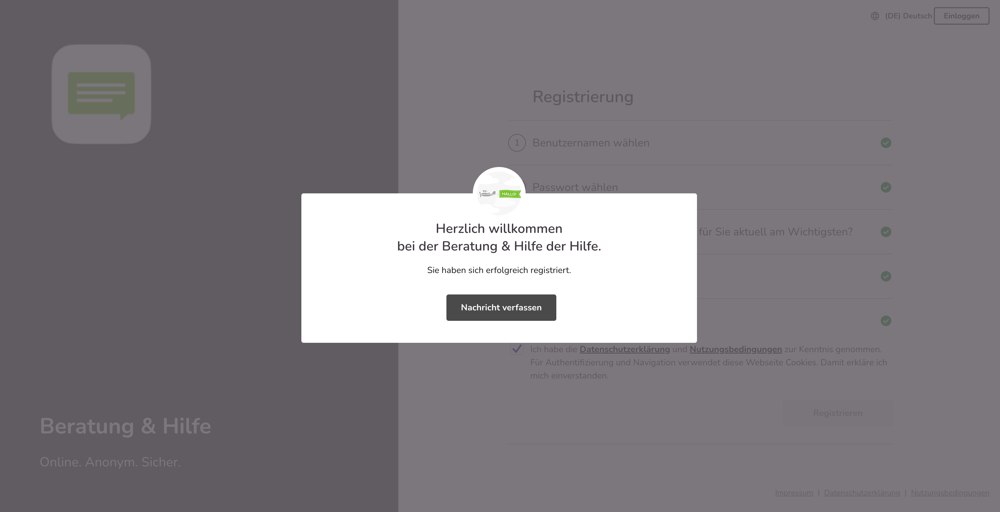
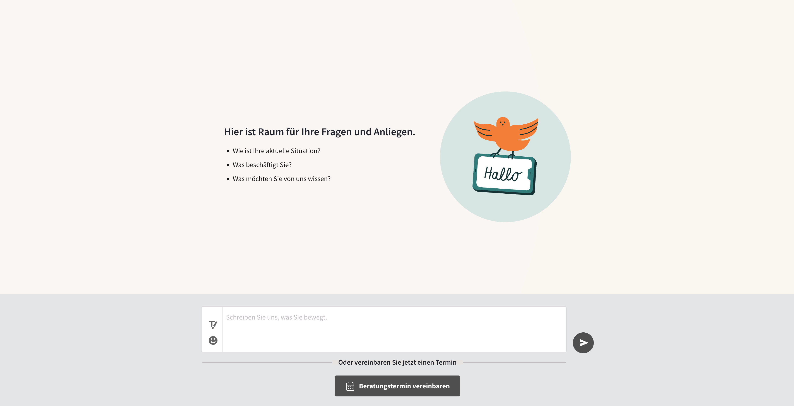
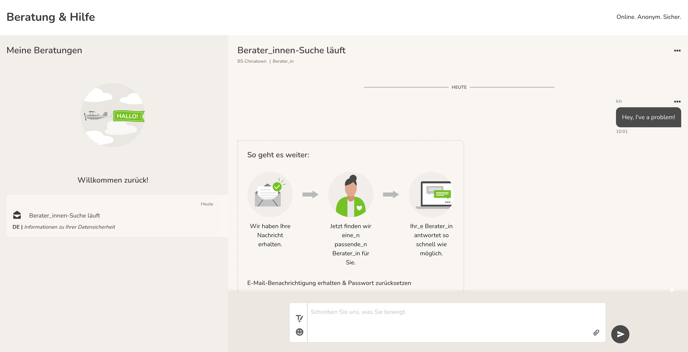
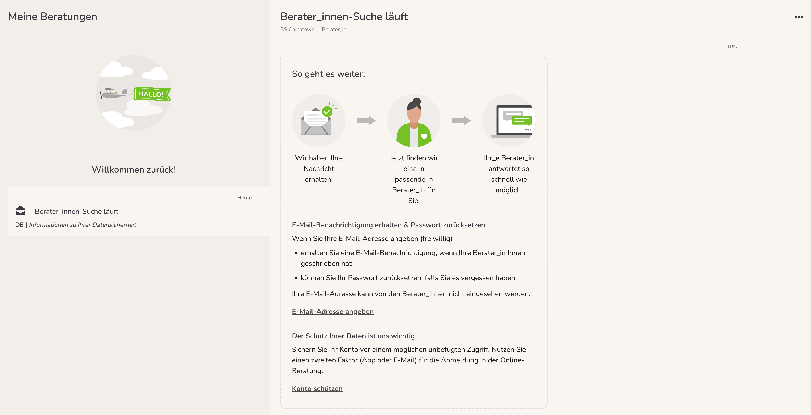
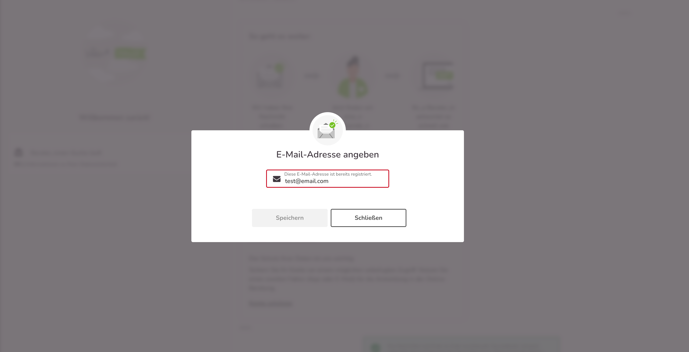
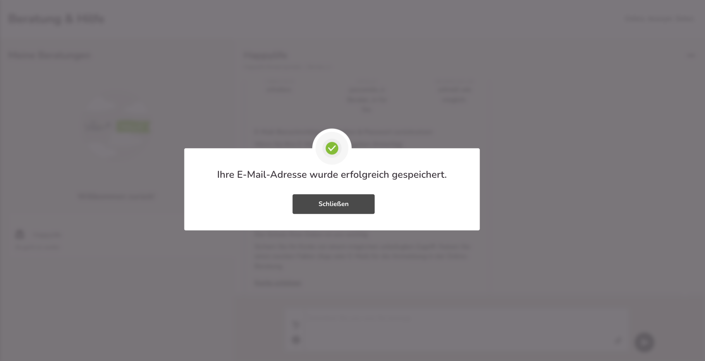

Der Gesamtprozess „Verfassen einer Erstnachricht” wurde angepasst, ist nun aufgeräumter und erleichtert dem Ratsuchenden die folgenden Prozessschritte zu gehen.

Zunächst erhält der/die Ratsuchende mittels eines Overlays die Bestätigung, dass er/sie sich erfolgreich registriert hat.

Eine automatisierte Nachricht zeigt den Ratsuchenden nun die nächsten Schritte auf. Der/die Ratsuchende kann nun seine Erstnachricht verfassen. Hier kann er zwischen den verschiedenen Sprachen, die in der zuvor ausgewählten Beratungsstelle angeboten werden, auswählen.

Mittels eines Overlays erfährt der/die Ratsuchende wie es nach Absenden der Erstanfrage weiter geht.

Wenn Sie Termine aktiviert haben, haben Ratsuchende die Möglichkeit einen Termin zur Erstberatung zu buchen. Die Zuordnung zu Berater_innen erfolgt hier automatisiert und die Ratsuchenden tauchen nicht mehr in den Erstanfragen auf, sobald sie einen Termin gebucht haben.

Sobald die Ratsuchenden eine_r Berater_in zugewiesen sind, können Sie mit diesen chatten

So sieht die/der Ratsuchende den Menüpunkt “Meine Nachrichten”.

Hier erfährt die/der Ratsuchende unter der verfassten und abgesendeten Erstnachricht stehend Schritt für Schritt, wie es weiter geht.

Um den eigentlichen Registrierungsprozess so einfach wie möglich für die Ratsuchenden zu halten, wird erst an dieser Stelle darum gebeten, die E-Mail zu hinterlegen. Nur bei Auswahl der Felder “E-Mail-Adresse angeben” öffnen sich die Eingabemasken wieder mittels eines Overlays.

Das Overlay zur Eingabe der E-Mail-Adresse

Die Eingabe der E-Mail-Adresse ist nicht korrekt und kann nicht gespeichert werden.

Die E-Mail-Adresse ist bereits registriert:

Nach korrekter Eingabe erfolgt der Hinweis, dass die E-Mail-Adresse erfolgreich gespeichert wurde.

