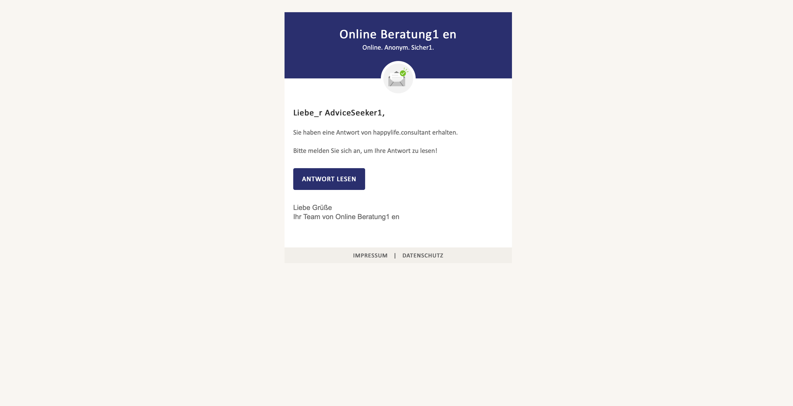
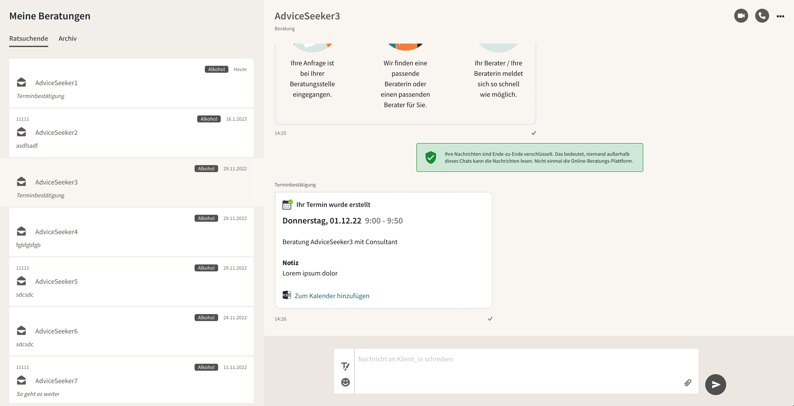

Nachdem Sie den Ratsuchenden eine Antwort gesendet haben, werden diese, falls sie eine Mailadresse angegeben haben, per E-Mail über den Eingang informiert:

Nach erneuter Anmeldung auf der Beratungsplattform sehen Ratsuchende folgende Übersicht und können erneut antworten. Wenn das Terminfeature genutzt wird, können sie hier auch Folgetermine mit dem/der zugewiesenen Berater_inn buchen und sehen hier Updates zu Terminen, z.B. eine Bestätigung des gebuchten Termins, Terminabsagen und Terminverschiebungen.

