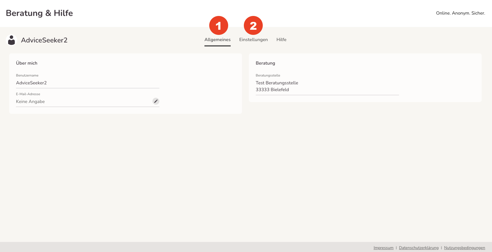
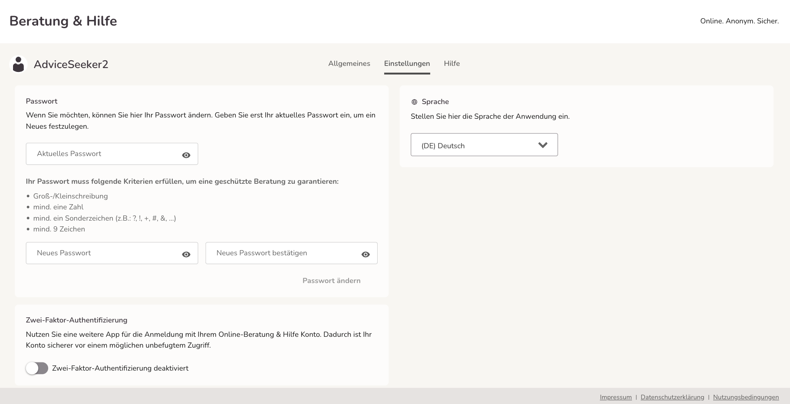
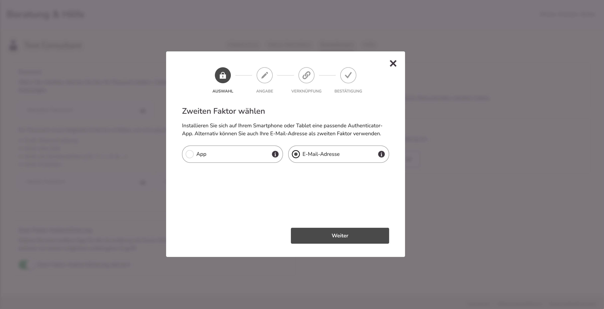
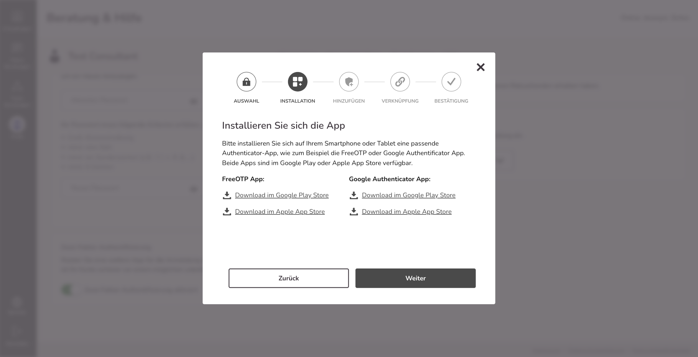
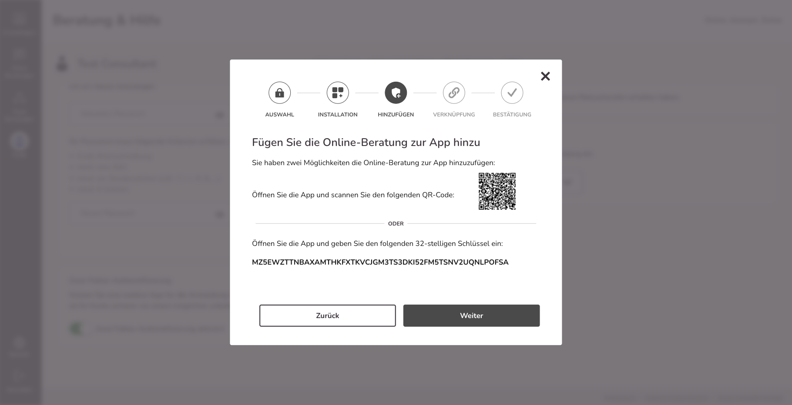
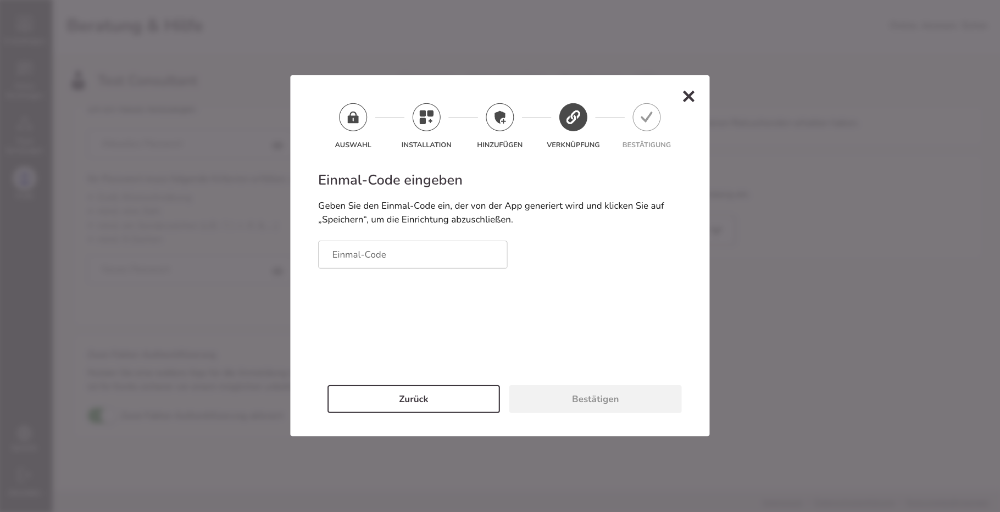
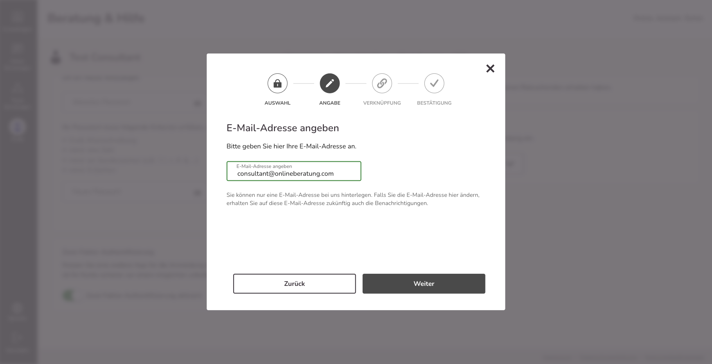
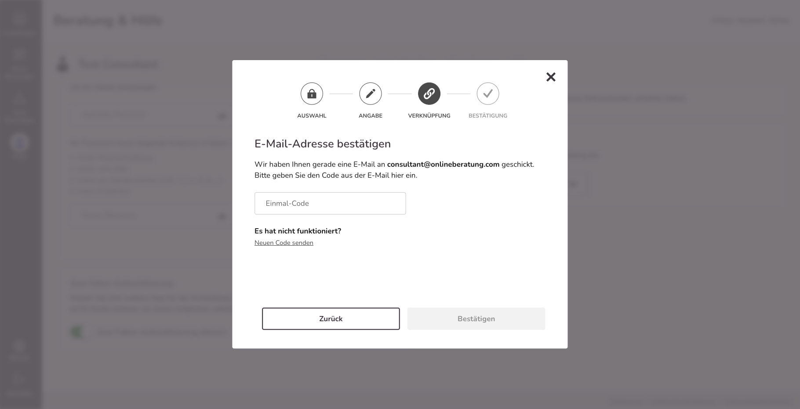
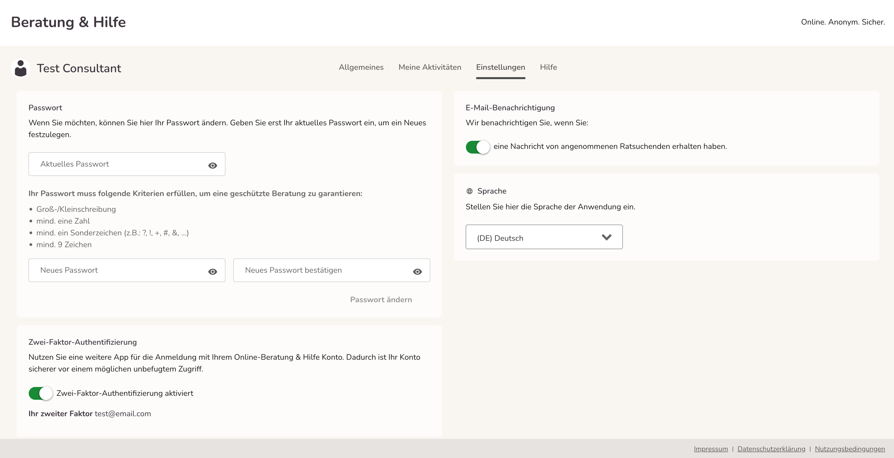

import { PrimaryNote } from '../../components.jsx';
import useBaseUrl from '@docusaurus/useBaseUrl';

### Allgemeines

In der persönlichen Profilansicht haben Ratsuchende weiterhin die Möglichkeit ihr Passwort zu ändern. Dies ist im Reiter „Einstellungen“ <strong>(2)</strong> möglich. Zusätzlich finden sie im ersten Reiter „Allgemeines“ <strong>(1)</strong> ihren Benutzernamen, die ausgewählte Beratungsstelle und, falls der Ratsuchende eine E-Mail-Adresse angegeben hat, ist diese ebenfalls hier hinterlegt.

### Einstellungen

Die Einrichtung der 2-Faktor-Authentifizierung erfolgt analog zum Beratungsprofil.  

Nach erfolgreichem Login wird Ihnen die Möglichkeit „Schützen Sie Ihr Konto“ als Popup angeboten. Drücken Sie entweder auf „Später erinnern“ um die 2-Faktor-Authentifizierung später einzurichten oder auf „Jetzt schützen“ um Sie sofort einzurichten.

Im nächsten Schritt haben Sie die Möglichkeit, den von Ihnen bevorzugten 2-Faktor auszuwählen.

Entweder eine App

Oder Sie hinterlegen Ihre E-Mail-Adresse

Wenn Sie sich für eine der Apps entschieden haben, laden Sie die App von Ihnen gewählte App.

Wenn Sie die App geladen haben, scannen Sie den QR-Code oder geben Sie den 32-stelligen Schlüssel manuell ein.

Im Anschluss wird ein Code generiert, den Sie eintippen und auf „Speichern“ klicken, um die Einrichtung abzuschließen.

Wenn Sie sich für die E-Mail-Adresse entschieden haben:

Nach erfolgreicher Aktivierung der 2-Faktor-Authentifizierung erscheint diese in „Sicherheit“ <strong>(3)</strong> grün. Dadurch ist Ihr Konto sicherer vor einem möglichen unbefugten Zugriff.

### Account löschen

Ratsuchende haben jederzeit die Möglichkeit ihren Account selbständig zu löschen. Dazu öffnen die Ratsuchenden in ihrem Account ihr Profil und klicken ganz unten auf „Account löschen“. Mit der Eingabe des selbstgewählten Passwortes wird der Account innerhalb der nächsten 48 Stunden endgültig gelöscht. Der gesamte Nachrichten- bzw. Chatverlauf ist dann auch für den/die Berater_in nicht mehr sichtbar. Der Vorgang kann anschließend nicht rückgängig gemacht werden. Sie werden als Berater_in über die Accountlöschung nicht informiert.

