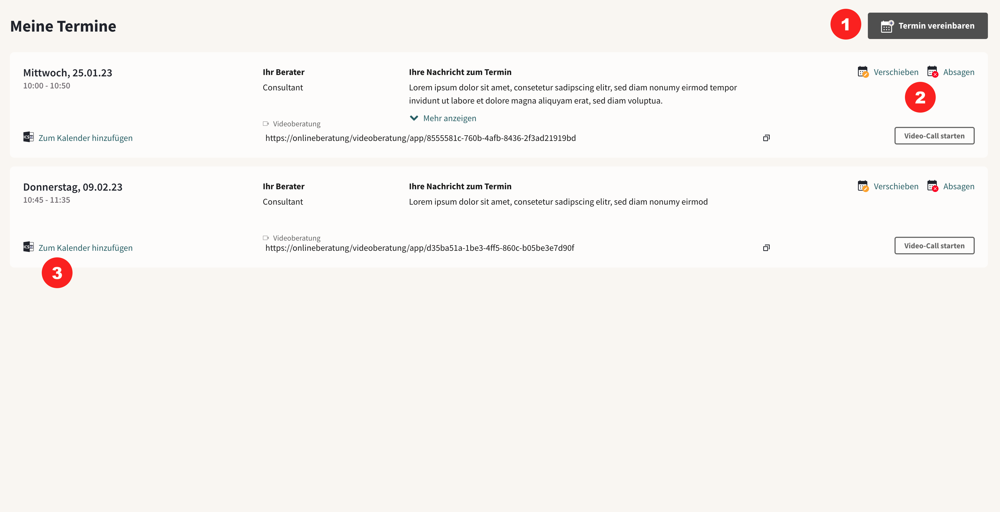
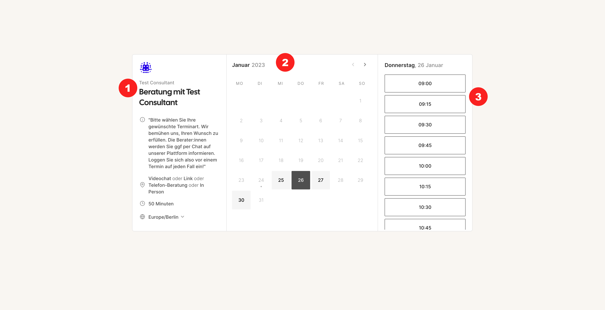
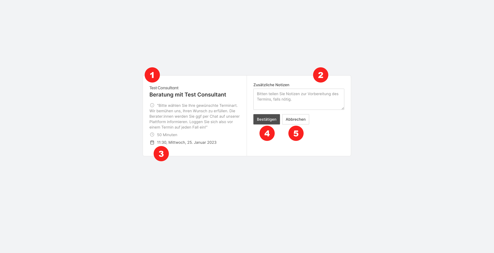

import { PrimaryNote } from "../../components.jsx";

Wenn das Terminfeature aktiviert ist, können Ratsuchende unter dem Reiter “Meine Termine” alle Termine, die mit Berater_innen gebucht sind einsehen. Neue Termine können ausschließlich mit zugewiesener_m Berater_in gebucht werden <strong>(1)</strong>.

Ratsuchende können Termine absagen oder auf einen verfügbaren Alternativtermin verschieben <strong>(2)</strong>. Berater_innen erhalten eine E-Mail-Benachrichtigung, wenn das geschieht.

Durch Klicken auf “Zum Kalender hinzufügen” können die Ratsuchenden eine .ics Datei mit den Termindetails herunterladen und den Termin so zum Kalender hinzufügen. Auf mobilen Geräten wird dieser Dateityp i.d.R automatisch erkannt und i.d.R direkt ein Hinzufügen zu dem Kalender vorgeschlagen.

Bei der Terminbuchung können Ratsuchende aus freien Terminslots der Berater_innen wählen. Sie können allerdings keine spezifischen Berater aussuchen, sondern werden entweder in der Erstberatung automatisch zugewiesen oder können einen Termin mit ihren zugewiesenen Beratern buchen. Das System zeigt automatisch nur freie Termine an. Ratsuchende können bei der Buchung eine Notiz hinzufügen. Diese Notiz ist nur in der Onlineberatung in der Terminübersicht einsehbar und ist nicht exportierbar und auch nicht Teil von Benachrichtigungsemails.

<strong>(1)</strong> Termininformationen, <strong>(2)</strong> Ratsuchende können
Tag mit freiem Termin wählen, und einen freien Termin and diesem Tag auswählen <strong>
  (3)
</strong>{" "}

<strong>(1)</strong>
<strong>(3)</strong> Ratsuchende sehen die Buchungsübersicht, <strong>
  (2)
</strong> Ratsuchende können Terminnotizen hinzufügen, <strong>
  (4)
</strong> Ratsuchende können den Termin bestätigen oder Abbrechen <strong>
  (5)
</strong>. Wenn sie die Buchung abbrechen, dann ist der Termin wieder für andere
frei verfügbar.
