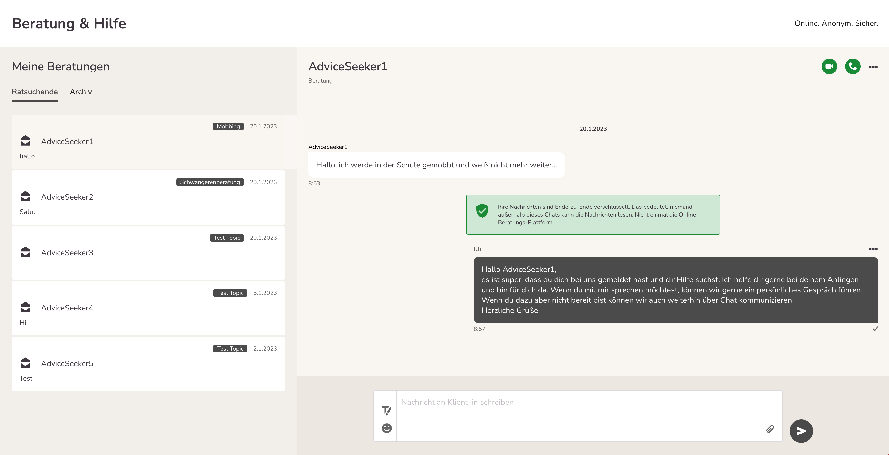

import { PrimaryNote } from "../../components.jsx";

  Um den Video-Call bestmöglich verwenden zu können, benötigen Sie einen der
  folgenden Browser:

- Google Chrome
- Mozilla Firefox
- Microsoft Edge Chromium
- Apple Safari

<PrimaryNote>
  Es muss immer die aktuelle Browserversion des jeweiligen Anbieters installiert
  sein. Prüfen sie daher Ihre Browser regelmäßig auf Updates.
</PrimaryNote>

Als Berater_in haben Sie die Möglichkeit einen Video-Call/Video-Beratung mit Ratsuchenden zu starten und durchzuführen. Ratsuchende können keinen Video-Call/Video-Beratung starten.

Voraussetzung ist eine entsprechende technische Ausstattung mit Kamera, Mikrofon und Lautsprecher.

Für eine Video-Beratung steht ein Zeitfenster von 180 Minuten offen, d.h. mit Starten der Video-Beratung läuft die Uhr und die Beratung wird nach drei Stunden automatisch geschlossen und der eingerichtet Videoraum geschlossen.

Es erfolgt keine Aufzeichnung der Beratung die z. B. später noch einmal angesehen werden kann. Wie in der face-to-face Beratung müssen Sie sich dann ggf. Notizen der Beratung anfertigen.

Wenn Sie im Menüpunkt „Meine Nachrichten“ einen Ratsuchenden ausgewählt und geöffnet haben, so als wollten Sie der Person eine Nachricht schreiben finden, Sie rechts oben auf Höhe des Benutzernamens des Ratsuchenden zwei grüne Symbole: Ein Kamerasymbol und einen Telefonhörer.
