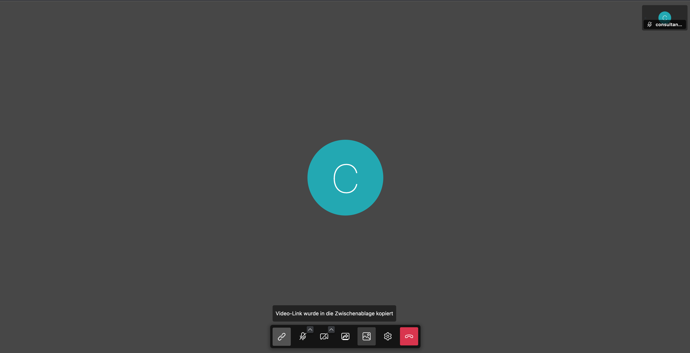

import { PrimaryNote } from '../../components.jsx';

Es gibt die Möglichkeit einen Video-Call mit mehreren Personen durchzuführen.

<PrimaryNote>
    Diese Funktion steht nur den Berater_innen zur Verfügung.
</PrimaryNote>

Die Vorgehensweise ist dann Folgende:

- Sie starten als Berater_in die Video-Call mit einem Ratsuchenden. Es öffnet sich das Fenster für die Video-Call und dann muss der Ratsuchende Ihre Anfrage annehmen.
- In der Mitte des Bildschirms finden Sie die sechs Symbole. Wenn Sie das linke Symbol anklicken, wird ein Link in den Zwischenspeicher kopiert.

- Diesen Link können Sie dann an weitere Personen per Mail verschicken. Um den Link bspw. in eine E-Mail einzufügen drücken Sie bitte die Tastenkombination „STRG“+“V“ oder rechte Maustaste und „Einfügen“.
- Die Person, welche den Link erhält benötigt keinen Account bei der Online-Beratung, kann auf diesen klicken und am Video-Call teilnehmen.
- Die Zahl weiterer Teilnehmer ist nicht begrenzt.
- Wenn die eingeladene Person dem Video-Call beitreten möchte, erhält die Berater_in einen Hinweis, dass eine Person anklopft. Sie kann entscheiden, ob sie die anklopfenden Personen in den Video-Call eintreten lässt oder nicht.

- Beendet die Berater_in den Video-Call, dann wird dieser komplett geschlossen, d.h. alle Teilnehmenden werden ausgeloggt.