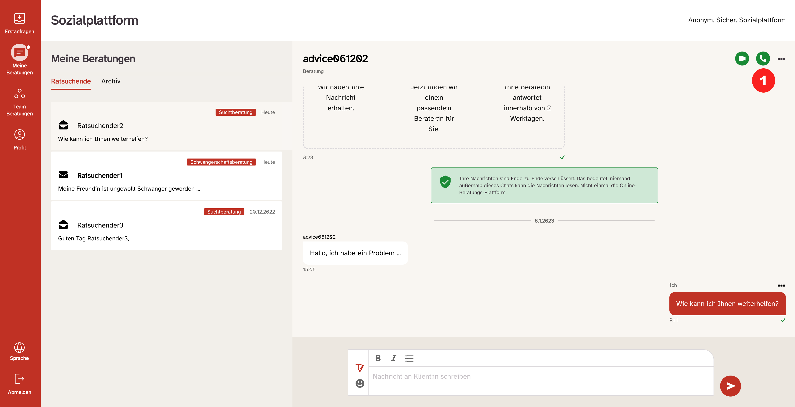
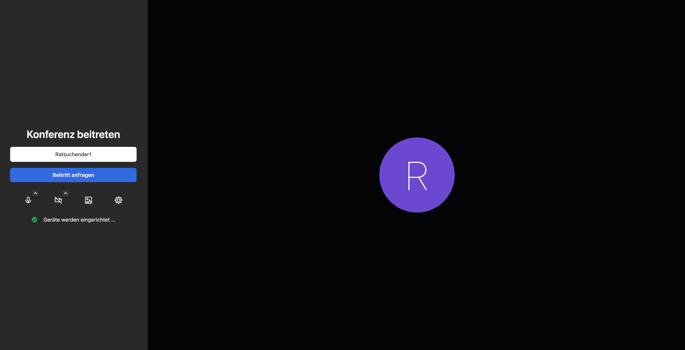

export const Highlight = ({ children }) => (
  
    {children}
  
);

Falls der Ratsuchende oder Sie keine Video-beratung wünschen, können Sie das System auch für eine Art „Telefon-Beratung“ nutzen, bzw. Video-Beratung ohne Bild. Auch hier ist es so, dass nur Sie als Berater_in diese Aktion starten können.

Dazu klicken Sie anstatt auf das Kamera-Symbol auf den Telefonhörer <Highlight>(1)</Highlight>.

Die Vorgehensweise ist gleich wie bei der Video-Beratung. Sie werden nun gefragt, ob Sie der Konferenz beitreten möchten.

Wenn Sie auf „Konferenz beitreten“ klicken wird der Ratsuchende angefragt, ob er die Anfrage annehmen und ebenfalls beitreten möchte. Das sieht bei ihm dann wie folgt aus:

Wenn der Ratsuchende den Anruf angenommen hat, können Sie Ihre Telefon-Beratung durchführen.

Während der Beratung steht es Ihnen als Berater_in wie auch dem ratsuchenden frei, die Kamera einzuschalten und so zu einer Video-Beratung zu wechseln.

Die Beratung beenden Sie wieder durch einen Klick auf das rote Symbol mit dem aufgelegten Telefonhörer.
