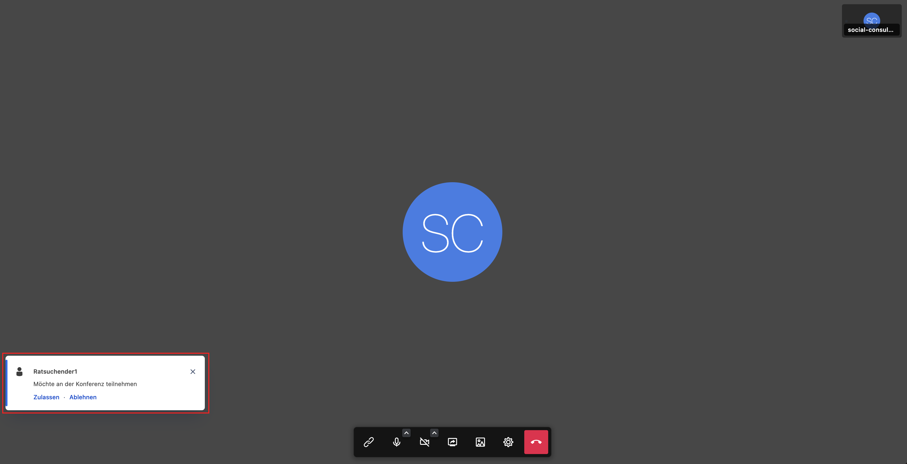

export const Boxed = ({ children }) => (
  

    &#9888; {children}
  

);

Es gibt die Möglichkeit, einen Video-Call mit mehreren Personen durchzuführen.

<Boxed>
  <strong>Wichtig:</strong> Diese Funktion steht nur den Berater_innen zur
  Verfügung.
</Boxed>

Die Vorgehensweise ist dann Folgende: 

- Sie starten als Berater_in die Video-Call mit einem Ratsuchenden. Es öffnet sich das Fenster für die Video-Call und dann muss der Ratsuchende Ihre Anfrage annehmen.
- In der Mitte des Bildschirms finden Sie die sechs Symbole. Wenn Sie das linke Symbol anklicken, wird ein Link in den Zwischenspeicher kopiert.
  
- Diesen Link können Sie dann an weitere Personen per Mail verschicken. Um den Link bspw. in eine E-Mail einzufügen, drücken Sie bitte die Tastenkombination „STRG“+“V“ oder rechte Maustaste und „Einfügen“.
- Die Person, welche den Link erhält, benötigt keinen Account bei der Online-Beratung, kann auf diesen klicken und am Video-Call teilnehmen.
- Die Zahl weiterer Teilnehmer ist nicht begrenzt.
- Wenn die eingeladene Person dem Video-Call beitreten möchte, erhält die Berater_in einen Hinweis, dass eine Person anklopft. Sie kann entscheiden, ob sie die anklopfenden Personen in den Video-Call eintreten lässt oder nicht.
  
- Beendet die Berater_in den Video-Call, dann wird dieser komplett geschlossen, d.h. alle Teilnehmenden werden ausgeloggt.
