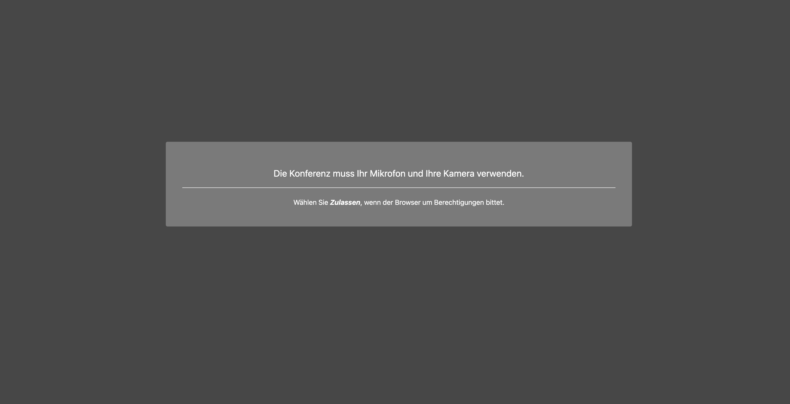
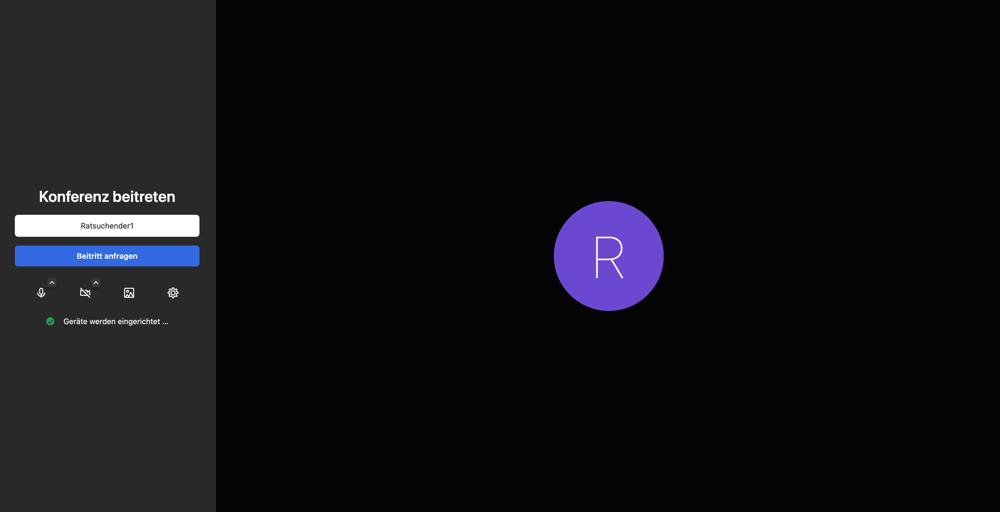
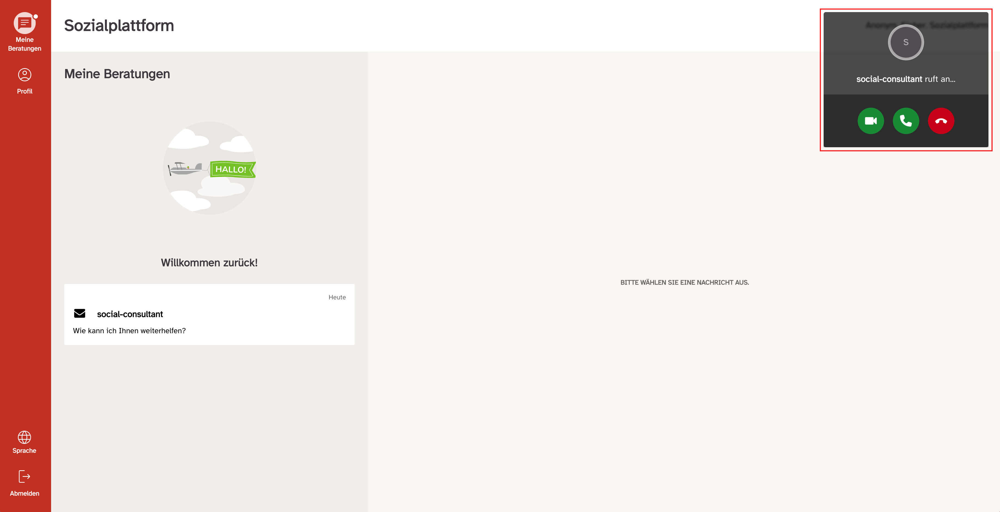
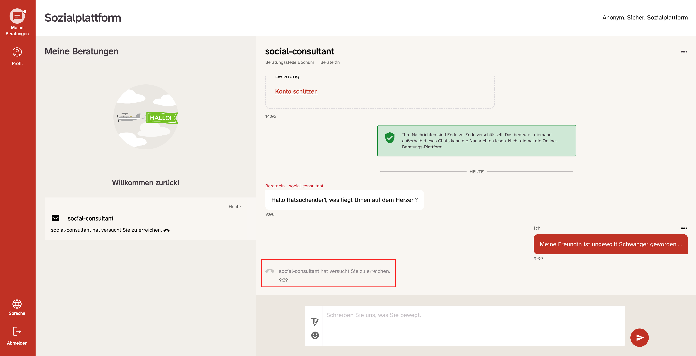
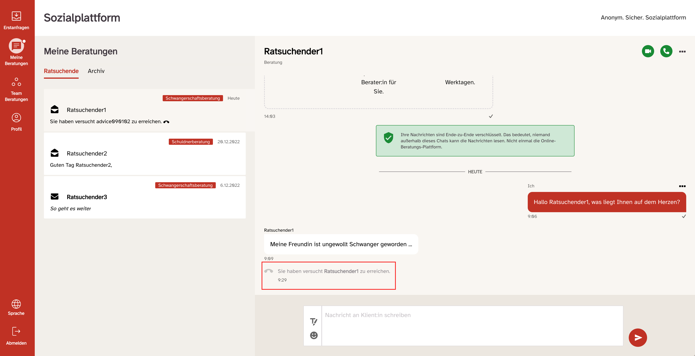
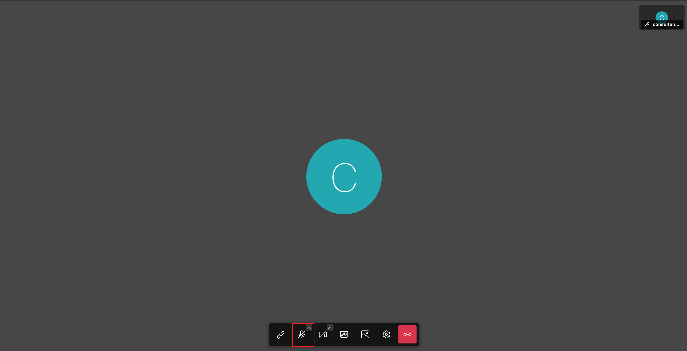
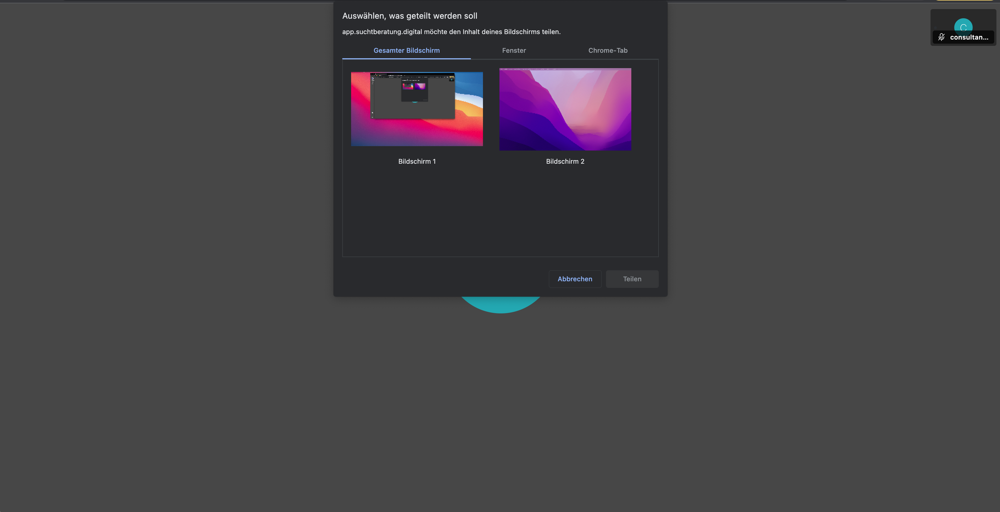
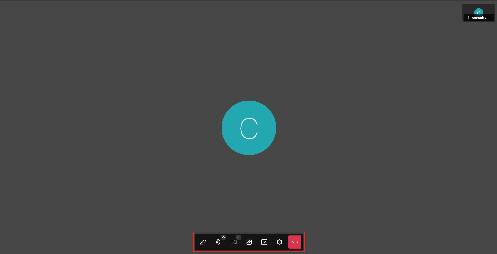

Die Video-Beratung starten Sie dadurch, dass Sie auf das Kamerasymbol klicken. Wenn Sie auf das Kamerasymbol geklickt haben, werden Sie gefragt, ob Sie den Zugriff des Systems auf Ihre Kamera und ihr Mikrofon erlauben möchten. Hier dann bitte auf „Zulassen“ klicken, sonst kann die Video-Beratung nicht gestartet werden!

Wenn Sie die Nutzung von Kamera und Mikrofon zulassen, öffnet sich ein neues Fenster und die Video-Beratung startet. Sie sehen dann sich selbst und werden dann gefragt, ob Sie der Konferenz beitreten möchten.

Dann bitte auf „Konferenz beitreten“ klicken.

Der Ratsuchende wird dann „angerufen“ und kann entscheiden, ob er ihre Anfrage zu einer Video-Beratung annehmen oder ablehnen möchte. Das sieht beim Ratsuchenden wie folgt aus:

Der Ratsuchende kann nun entscheiden, ob er die Anfrage zur Video-Beratung annimmt und seine Kamera freischaltet (klicken auf das grüne Kamera Symbol) oder ob er nur Mikrofon und Lautsprecher freigibt und dadurch ein Telefonat möglich wird (klicken auf das Symbol des Telefonhörers) oder ob er die Anfrage ablehnt und auf das Symbol des roten Telefonhörers klickt.

Sollte der Ratsuchende bei Ihrer Anfrage verhindert sein und an der Video-beratung nicht teilnehmen können, so wird ein Eintrag im Nachrichtenverlauf erzeugt, dass Sie als Berater_in versucht haben ihn zu kontaktieren.

Wenn der Ratsuchende Ihre Anfrage zur Video-Beratung ablehnt, wird das Fenster geschlossen und in den Nachrichten zu dem Ratsuchenden erscheint ein Eintrag „Sie haben versucht - Name des Ratsuchenden - zu erreichen.“

Wenn der Ratsuchende Ihre Anfrage zu einer Video-Beratung durch einen Klick auf das Kamera Symbol angenommen hat, erscheint bei Ihnen als Berater_in der Ratsuchende nun in Großdarstellung und sie sehen sich im kleinen Fenster. Beim Ratsuchenden ist es entsprechend umgekehrt.

Während der Video-Beratung können Sie einige Einstellungen vornehmen bezüglich: Kamera, Mikrofon und den Bildschirm teilen.

Wenn Sie auf das <strong>Kamera</strong> Symbol klicken, können Sie Ihre Kamera ein- und ausschalten. Wenn Sie ihre Kamera ausschalten sind Sie für den Ratsuchenden nicht mehr zu sehen. Das Symbol ist dann durchgestrichen. Klicken Sie wieder darauf, wird ihre Kamera eingeschaltet.

Die gleichen Funktionen wie bei der Kamera stehen beim <strong>Mikrofon</strong> zur Verfügung.

Wenn Sie auf das Mikrofon-Symbol klicken, können Sie Ihr Mikrofon ein- und ausschalten. Wenn Sie ihr Mikrofon ausschalten, sind Sie für den Ratsuchenden nicht mehr zu hören. Das Symbol ist dann durchgestrichen. Klicken Sie auf das durchgestrichene Mikrofon-Symbol, wird ihr Mikrofon wieder eingeschaltet und der Ratsuchende kann Sie wieder hören. Diese Funktionen stehen sowohl Ihnen als auch dem Ratsuchenden zur Verfügung.

Eine weitere Funktion die Sie, wie auch die Ratsuchenden nutzen können, ist <strong>das Bildschirm teilen</strong> (viertes Symbol von links). Dadurch haben Sie oder auch der Ratsuchende die Möglichkeit, dem jeweils anderen ein Dokument zu zeigen.

Wenn Sie den Bildschirm teilen wollen, klicken Sie bitte auf das Bildschirm (viertes von links) Symbol. Wenn Sie darauf geklickt haben, erscheint ein weiteres Fenster und Sie haben die Möglichkeit, ihren gesamten Bildschirm zu teilen oder nur einzelne Anwendungen. Wenn Sie ihren gesamten Bildschirminhalt mit dem Ratsuchenden teilen wollen, klicken sie bitte auf „Gesamter Bildschirm“ und anschließend auf „Teilen“.

Wenn Sie nur einen bestimmten Inhalt z. B. eine PDF oder Excel Datei dem Ratsuchenden zeigen möchten, dann wählen Sie bitte „Anwendungsfenster“. Es werden Ihnen dann alle geöffneten Dateien angezeigt und Sie können eine Auswahl treffen. Dann bitte auf „Teilen“ klicken.

Diese Funktion steht wie schon erwähnt auch den Ratsuchenden zur Verfügung und sie können Ihnen Bildschirminhalte oder Dateien anzeigen.

Um den Modus des Bildschirmteilens zu beenden, klicken Sie bitte wieder auf das Symbol „Bildschirm freigeben“ und danach dann auf „Abbrechen“. Dann kehren Sie in die "normale“ Ansicht für die Video-Beratung zurück.

Wenn Sie oder der Ratsuchende auf das rote Symbol mit dem aufgelegten Telefonhöher klicken wird die Video-Beratung beendet.

Das Fenster wird dann geschlossen und Sie kehren zur Ansicht des Ratsuchenden zurück, von dem Sie ausgegangen sind.

